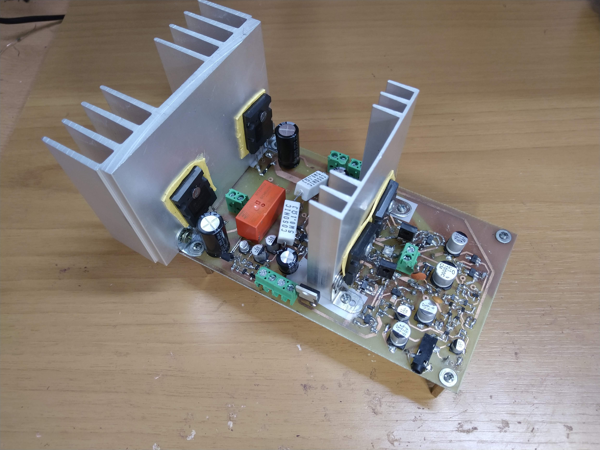
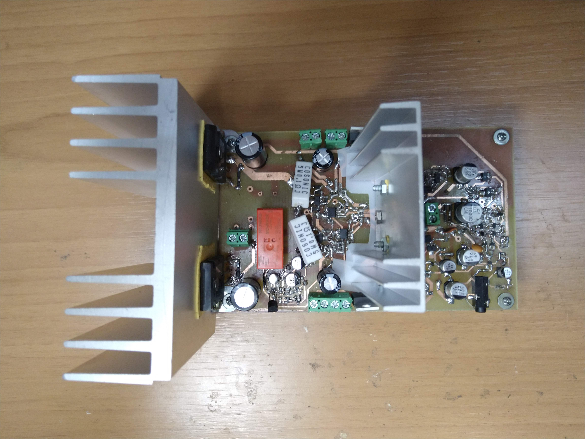

## Amplificador

Para comenzar con la lectura de la documentación del circuito ir a [Resumen_y_especificaciones.md](Resumen_y_especificaciones.md). Si bien se recomienda comenzar con este útimo archivo, el cual irá dirigiendo al lector hacia otros documentos que permitirán comprender cada vez con mayor profudidad el diseño del circuito, a continuación se listan todos los archivos contenidos en esta carpeta relacionados con el desarrollo del circuito:

- [Resumen_y_especificaciones.md](Resumen_y_especificaciones.md): contiene un resumen de las características del amplificador y lista sus especificaciones. 
- [descripcion_detallada_amplificador.md](descripcion_detallada_amplificador.md): describe las etapas del amplificador y otros subcircuitos que lo componen.
- [determinacion_valores_componentes.md](determinacion_valores_componentes.md): detalla los criterios y cálculos utilizados en la determinación de los valores y tipos de componentes empleados en el circuito.
- [explicacion_conmutadores.md](explicacion_conmutadores.md): describe el funcionamiento de los conmutadores y la utilidad y valor de cada uno de los componentes involucrados en ellos.
- [Mediciones_salida_audio_celular.md](Mediciones_audio_celular.md): este documento no se encuentra relacionado directamente con el diseño del amplificador, pero en él se detallan mediciones que se realizaron con el fin de establece la especificación de ganancia a lazo cerrado del circuito.

Por otra parte, a continuación se listan las subcarpetas asociadas al diseño del amplificador:

- [simulaciones_amplificador](./simulaciones_amplificador): se encuentran los archivos para simular el amplificador completo por medio de LTSpice. Además, en [Mediciones_parametros_simulacion.md](simulaciones_amplificador/Mediciones_parametros_simulacion.md) es posible ver los resultados de las mediciones llevadas a cabo a partir de la simulación. Se han incluido simulaciones específicas para estudiar cada especificación del amplificador. Se han agregado también los modelos necesarios para realizar las simulaciones. Para que estas se lleven a cabo correctamente basta con descargar la carpeta completa y ejecutar los archivos localizados allí adentro. 
- [pcb_amplificador](./pcb_amplificador): diseño del PCB del amplificador. 
- [mediciones_amplificador](./mediciones_amplificador): registro de las mediciones que se realizaron durante el armado del amplificador
- [imagenes_amplificador](./imagenes_amplificador): imágenes varias para la elaboración de documentos como [Resumen_y_especificaciones.md](Resumen_y_especificaciones.md) y [Mediciones_parametros_simulacion.md](simulaciones_amplificador/Mediciones_parametros_simulacion.md) .
- [datasheets_componentes_amplificador](./datasheets_componentes_amplificador): hojas de datos de los transistores y diodos utilizados en el diseño del amplificador.
- [disipadores_amplificador](./disipadores_amplificador): se encuentra la información de los disipadores utilizados y sus fundamentos.

## Resumen de especificaciones
En la siguiente tabla se comparan las especificaciones que se habían establecido como objetivos de diseño con los resultados de las simulaciones y las mediciones. En los titulos de cada columna se encuentra un link a los archivos donde se detallan las especificaciones, y la forma en la que fueron realizadas las simulaciones y las mediciones.

| Parámetro| [Diseño](Resumen_y_especificaciones.md) | [Simulación ](simulaciones_amplificador/Mediciones_parametros_simulacion.md)| [Medición](mediciones_amplificador/mediciones_finales.md) |
|----------------------------|--------|------------|----------|
| Eficiencia máxima          |     73%   |     75%       |    77%      |
| Alimentación               |+-30V/+-12V |  +-30V/+-12V |  +-30V/+-12V  |
| Resistencia de entrada  @1kHz   |    >20kΩ   |     26kΩ       |    25KΩ      |
| Resistencia de salida      |      0,04Ω  	|      0,001Ω      |    0,01Ω      |
| Máxima tensión de entrada  |    1,2V  |      1,2V  |    1,2V      |
| Ganancia de lazo cerrado   |   22,8   |     22,8       |   24  |
| Consumo sin señal          |    <2W   |      1,8      |    1,9     |
| Ancho de banda             |    10Hz-400kHz    |    0,8Hz-1,4MHz        |  2Hz-550kHz |
| Ancho de banda de potencia sin conmutación |    40kHz    |    150kHz        | 53kHz |
| THD (8Ω@1khz/10%potencia)  |   0,01%   |  0,0009% | 0.0009% |
| Factor de amortiguamiento (8Ω@1kHz)  |	200	| 8000 | 730 |

Como se puede ver en el archivo [mediciones_amplificador/mediciones_finales.md](mediciones_amplificador/mediciones_finales.md), la medición de la impedancia de salida (y en consecuencia la del factor de amortiguamiento) cuenta con una gran incertidumbre producto del multímetro. Sin embargo, en esta tabla se ha reportado el valor medio obtenido.

## Fotos del prototipo

  
