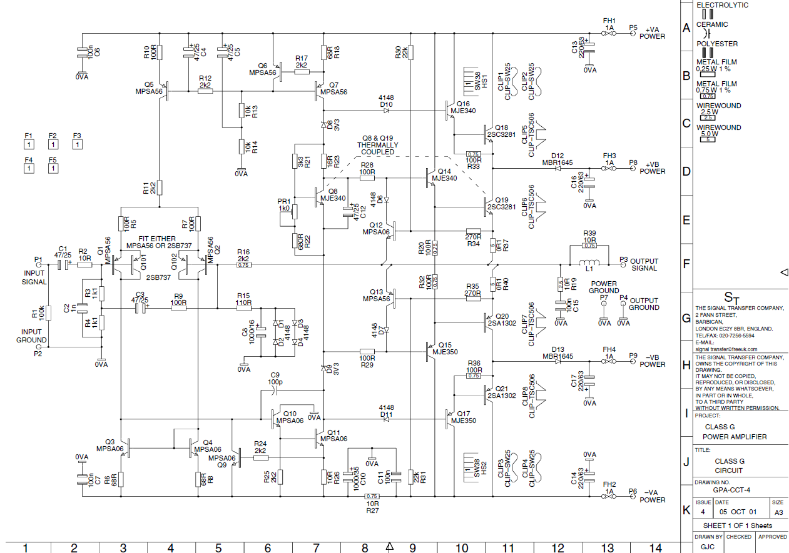
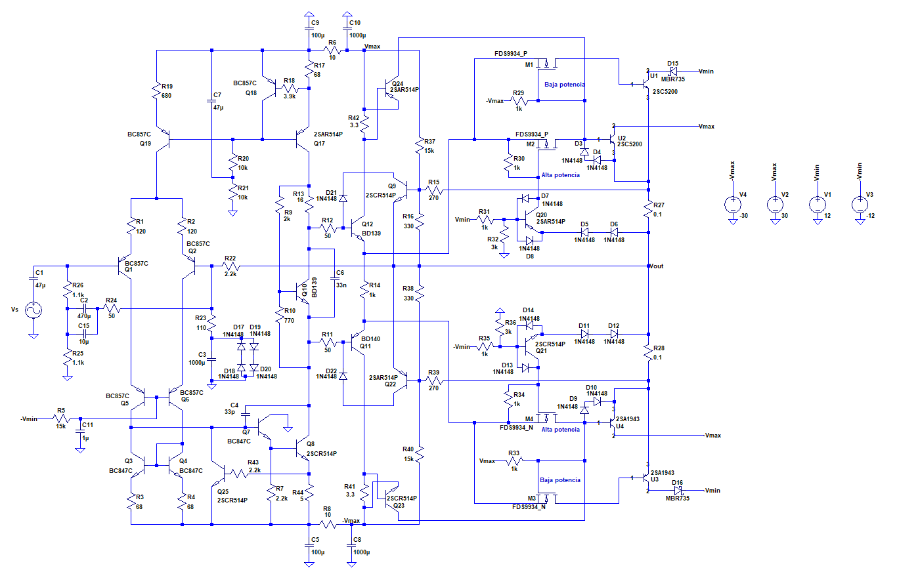

# Boceto de amplificador seleccionado y sus especificaciones

A continuación se hace una descripción del amplificador diseñado junto con sus especificaciones. Para ver las simulaciones en base a las cuales se fundamentan dichas especificaciones ir a [Mediciones_parametros_simulacion.md](simulaciones_amplificador/Mediciones_parametros_simulacion.md)

## Características generales del amplificador

 - Clase H con transistores de salida en paralelo y conmutación entre los drivers y los transistores de potencia realizada con transistores MOSFET.
 - Diseñado para recibir señal por medio de un celular o reproductor de música por medio de un plug de 3.5mm.
 - Carga de 4 u 8ohm (aunque especificado para tolerar cargas de 3 y 9 ohm por seguridad).

## Esquema
Se ha utilizado como punto de partida el amplificador clase G perteneciente a la página 307 del libro "Audio Power Amplifier Handbook" de Douglas Self.

En base a dicho amplificador se ha reemplazado la etapa de salida serie clase G por una etapa clase H con los transistores que operan en alta y baja potencia en paralelo. También se modificó al etapa diferencial y se la hizo cascode para mejorar la PSRR con respecto a la fuente de alimentación de -30V  (-Vmax en la imagen) .  El diagrama del amplificador diseñado se presenta a continuación (sin añadir la protección de DC, ni colocar la carga en el nodo de salida Vout):

## Especificaciones del amplificador
 - Máxima entrada de tensión: 1.2V. Se estima que la salida de audio máxima de un celular tiene un valor de 1V rms. Para realizar esta estimación se usaron las referencias en [5], [6] , [7] y [8] en el archivo [Referencias.md](../DOC/Referencias.md) y las mediciones en [Mediciones_salida_audio_celular.md](Mediciones_salida_audio_celular.md). En función de estos datos se decidió que el amplificador tendría una ganancia a lazo cerrado mayor a la necesaria para tener máxima excursión con 1Vrms a la entrada debido a la posibilidad de que algunos celulares no sean capaces de alcanzar este valor (ver el caso del Samsung Galaxy Note 4 en [Mediciones_salida_audio_celular.md](Mediciones_salida_audio_celular.md)).

 - Ganancia a lazo cerrado: 22.8.

 - Consumo sin señal: 0.25 W

 - Protecciones: 

      - Limitación de corriente de salida en función de la tensión máxima de salida. Esto protege a los transistores de potencia.
      - Contra la componente de continua en el nodo de salida. Esto protege a la los parlantes de una eventual tensión de continua en dicho punto en caso de una falla del amplificador. Tensión de DC a a partir de la cual actúa el limitador: aproximadamente 0.6 V. Velocidad de respuesta del limitador según simulación: al menos 100ms. A continuación se muestra un esquema de dicha protección, la cual se conecta al nodo de salida del amplificador:

 - Tensiones de alimentación:
	- V1 = 30 V
	- V2 = 12 V
	
 - Potencia nominal para distintas cargas:
    - 4ohm --> Pnom = 45 W
    - 8ohm --> Pnom = 85 W
    
 - Eficiencia máxima (carga de 4ohm): 73% (valor obtenido mediante simulación: 75%).

 - Factor de amortiguación (de 20Hz a 20kHz): 
   
     - 4ohm: 400 (valor simulado: 360)
     - 8ohm: 200 (valor simulador: 180).
     
 - Resistencia de entrada: al menos R_i = 20 kohm para frecuencias entre 20Hz y 20kHz (se simuló y se obtuvo este resultado).

 - Ancho de banda: f_i = 10Hz, f_h = 800KHz (valores simulados: f_i = 0.8Hz, f_h = 1.4MHz).

 - Ancho de banda de potencia: 170kHz  (valor simulado: al menos mayor a 100kHz. No es posible determinarlo con precisión por análisis de la FFT porque antes se presenta la distorsión por la conmutación de la etapa de salida).

 - TDH: valores simulados entre paréntesis. La simulaciones se realizaron con una corriente de colector de la etapa de salida Ic = 10mA. Se utilizaron los primeros 9 armónicos de 5 periodos consecutivos de la señal de salida.
	- 8ohm y 1kHz:
	  - 90% pot. nominal (V_i = 1.16V): 0,005% (0.001591%)
	  - 50% pot. nominal (V_i = 860mV): 0.005% (0.002027%) 
	  - 10% pot. nominal (V_i = 385mV): 0,005% (0.0009%) 
	- 8ohm y 10kHz:
	  - 90% pot. nominal (V_i = 1.16V): 0,04% (0.021011%) 
	  - 50% pot. nominal (V_i = 860mV): 0,06% (0.030388%) 
	  - 10% pot. nominal (V_i = 385mV): 0,02% (0.008930%) 
	- 4ohm y 1kHz:
	  - 90% pot. nominal (V_i = 1.12V): 0,005% (0.001918%) 
	  - 50% pot. nominal (V_i = 840mV): 0.005% (0.002363%) 
	  - 10% pot. nominal (V_i = 375mV): 0.005% (0.001492%) 
	- 4ohm y 10kHz:
	  - 90% pot. nominal (V_i = 1.12V): 0.05% (0.027886%) 
	  - 50% pot. nominal (V_i = 840mV): 0.08%  (0.039084%) 
	  - 10% pot. nominal (V_i = 375mV): 0.03%  (0.014913%)
	
 - Distorsión por intermodulación: 0,02 % a 1W/8ohm (valor medido: 0.0092% ; señales de prueba de 100Hz-182 mV y 5kHz-46mV)

 - PSNR simulada:  menor a -76dB para el rango de frecuencias medias. Este último valor se corresponde con el rechazo de ruido con respecto a la fuente de alimentación inferior suponiendo una resistencia nula en el cable que conecta la fuente de alimentación con el amplificador. Si se asume que dicha resistencia es de 1Ohm, la PSNR máxima es -79dB. El resto de las fuentes de alimentación reportan una PSNR menor a -90dB.

## Máximos valores de salida

Las máximas tensiones entregables a la carga en simulación sin filtrado de la alimentación son: 

- 4 ohm --> Vout_max = 27.1 V
- 8 ohm --> Vout_max = 27.8 V 

De modo que:	

- 4ohm --> Pmax = 91 W
- 8ohm --> Pmax = 48 W	

Corriente máxima a la carga en modo de operación normal (carga de 4ohm): I_out_max = 6,9 A.

## Transistores utilizados

- BC550/560: transistores de uso común de la línea BC, pero con la figura de ruido dentro de esa categoría. Se han utilizado para la etapa diferencial de entrada con el fin de reducir el ruido introducido por esta.
- 2SCR514P/2SAR514P: empleados en la VAS, los conmutadores y los limitadores. Transistores que permiten el paso de medianas corrientes (máximo 0,7 A). Se utilizaron por poseen un parámetro beta muy lineal (reduce la alinealidad de la VAS) y ser rápidos para las conmutación (útiles para los conmutadores).
- 2SC5200/2SA1943: empleados en la  etapa de salida. Fueron elegidos ya que son transistores especiales para audio que cuentan con un parámetro beta casi constante en el rango de corrientes que se manejan en este amplificador. Esto permite evitar alinealidades en la etapa de salida.
- BD139/BD140: empleados en el multiplicador de Vbe (por tener un encapsulado TO-220 que permite acoplarlos térmicamente con los transistores de baja potencia de salida) y en los drivers (por poder disipar la potencia necesaria como para alimentar a los transistores de salida en el peor caso). También poseen un parámetro beta lineal en comparación con otras alternativas consideradas.