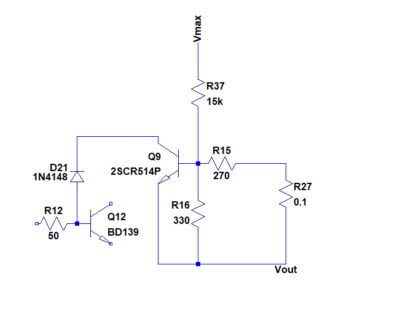

# Boceto de amplificador seleccionado y sus especificaciones

A continuación se hace una descripción del amplificador diseñado junto con sus especificaciones. Para ver las simulaciones en base a las cuales se fundamentan dichas especificaciones ir a [Mediciones_parametros_simulacion.md](simulaciones_amplificador/Mediciones_parametros_simulacion.md). Para una explicación más detalla de cada etapa y subcircuitos del amplificador ir a [descripcion_detallada_amplificador.md](descripcion_detallada_amplificador.md)

## Características generales del amplificador

 - Clase H con transistores de salida en paralelo y conmutación entre los drivers y los transistores de potencia realizada con transistores MOSFET.
 - Diseñado para recibir señal por medio de un celular o reproductor de música por medio de un conector de audio analógico de 3.5mm.
 - Apto para cargas de 4 u 8ohm. Los limitadores de corriente fueron diseñados para una carga de 3ohm como margen de seguridad para la correcta operación del amplificador.

## Esquema
Como base para el diseño se ha utilizado el amplificador clase G perteneciente a la página 307 del libro "Audio Power Amplifier Handbook" de Douglas Self.

A dicho amplificador se le ha reemplazado la etapa de salida serie clase G por una etapa clase H donde los transistores de salida que utilizan las tensiones de alimentación más baja y más alta operan en paralelo. También se modificó al etapa diferencial y se la hizo cascode para mejorar la PSRR con respecto a la fuente de alimentación de -30V  (-Vmax en la imagen) .  El diagrama original del amplificador diseñado se presenta a continuación (sin añadir la protección de DC, ni colocar la carga en el nodo de salida Vout):

## Especificaciones del amplificador
 - Máxima entrada de tensión: 1.2V. Se estima que la salida de audio máxima de un celular tiene un valor de 1V rms. Para realizar esta estimación se usaron las referencias en [5], [6] , [7] y [8] en el archivo [Referencias.md](../DOC/Referencias.md) y las mediciones en [Mediciones_salida_audio_celular.md](Mediciones_salida_audio_celular.md). En función de estos datos se decidió que el amplificador tendría una ganancia a lazo cerrado mayor a la necesaria para tener máxima excursión con 1Vrms a la entrada debido a la posibilidad de que algunos celulares no sean capaces de alcanzar este valor (ver el caso del Samsung Galaxy Note 4 en [Mediciones_salida_audio_celular.md](Mediciones_salida_audio_celular.md)).

 - Ganancia a lazo cerrado: 22.8.

 - Consumo sin señal: menor a 2 W (contemplando todas las corrientes consumidas por el circuito; incluyendo la polarización de los conmutadores de la etapa de salida y las protecciones).

 - Protecciones: 

      - Limitación de corriente de salida en función de la tensión máxima de salida. Esto protege a los transistores de potencia. En [Mediciones_parametros_simulacion.md](simulaciones_amplificador/Mediciones_parametros_simulacion.md) se presenta una análisis del comportamiento de estos limitadores. A continuación se presenta una esquema del limitador para los transistores de salida que operan con +12 y +30 V:
      
      
      
      - Contra la componente de continua en el nodo de salida. Esto protege a los parlantes de una eventual tensión de continua en dicho punto en caso de una falla del amplificador. Tensión de DC a a partir de la cual actúa el limitador: aproximadamente 0.6 V. Velocidad de respuesta del limitador: al menos 100ms. A continuación se muestra un esquema de dicha protección, la cual se conecta al nodo de salida del amplificador:

 - Tensiones de alimentación:
	- V1 = 30 V
	- V2 = 12 V
	
 - Potencia nominal para las cargas especificadas:
    - 4ohm --> Pnom = 45 W
    - 8ohm --> Pnom = 85 W
    
 - Eficiencia máxima (carga de 4ohm): 73% (valor obtenido mediante simulación: 75%).

 - Factor de amortiguación (en el rango de 20Hz a 20kHz): 
   
     - 4ohm: 400 (valor simulado: 360)
     - 8ohm: 200 (valor simulador: 180).
     
 - Resistencia de entrada: al menos R_i = 20 kohm para frecuencias entre 20Hz y 20kHz (se simuló y se obtuvo este resultado).

 - Ancho de banda: f_i = 10Hz, f_h = 400KHz (valores simulados: f_i = 0.8Hz, f_h = 1.4MHz).

 - Ancho de banda de potencia: 40kHz  (valor simulado: 150kHz. No es posible determinarlo con precisión por análisis de la FFT porque antes se presenta la distorsión por la conmutación de la etapa de salida). Ver nota al final de este archivo para ver los motivos de la diferencia entre la especificación y el valor obtenido por simulación.

 - TDH: valores simulados entre paréntesis. La simulaciones se realizaron con una corriente de colector de la etapa de salida Ic = 10mA. Se utilizaron los primeros 9 armónicos de 5 periodos consecutivos de la señal de salida.
	- 8ohm y 1kHz:
	  - 90% pot. nominal (V_i = 1.16V): 0,05% (0.001591%)
	  - 50% pot. nominal (V_i = 860mV): 0.02% (0.002027%) 
	  - 10% pot. nominal (V_i = 385mV): 0,01% (0.0009%) 
	- 8ohm y 10kHz:
	  - 90% pot. nominal (V_i = 1.16V): 0,2% (0.021011%) 
	  - 50% pot. nominal (V_i = 860mV): 0,08% (0.030388%) 
	  - 10% pot. nominal (V_i = 385mV): 0,05% (0.008930%) 
	- 4ohm y 1kHz:
	  - 90% pot. nominal (V_i = 1.12V): 0,05% (0.001918%) 
	  - 50% pot. nominal (V_i = 840mV): 0.02% (0.002363%) 
	  - 10% pot. nominal (V_i = 375mV): 0.01% (0.001492%) 
	- 4ohm y 10kHz:
	  - 90% pot. nominal (V_i = 1.12V): 0.25% (0.027886%) 
	  - 50% pot. nominal (V_i = 840mV): 0.16%  (0.039084%) 
	  - 10% pot. nominal (V_i = 375mV): 0.08%  (0.014913%)
	
 - Distorsión por intermodulación: 0,02 % a 1W/8ohm (valor medido: 0.0092% ; señales de prueba de 100Hz-182 mV y 5kHz-46mV)

 - PSNR:  menor a -75dB para el rango de frecuencias medias. 

     Las simulaciones reportaron un valor de al menos -76dB para este rango. Este último valor se corresponde con el rechazo de ruido con respecto a la fuente de alimentación inferior suponiendo una resistencia nula en el cable que conecta la fuente de alimentación con el amplificador. Si se asume que dicha resistencia es de 1Ohm, la PSNR máxima es -79dB. El resto de las fuentes de alimentación reportan una PSNR menor a -90dB.

## Notas sobre las mediciones hasta el día 26/7/19

Hasta el día 26/7/19 se han realizado mediciones que han llevado a modificar las especificaciones del amplificador para hacerlas más conservadoras frente a las elegidas en un principio en base a las simulaciones (que son las que se encuentran documentadas en [Mediciones_parametros_simulacion.md](simulaciones_amplificador/Mediciones_parametros_simulacion.md) y que fueron realizadas antes de comenzar con la mediciones). Los especificaciones afectadas hasta el día indicado en esta nota fueron:

- Ancho de banda: la presencia de oscilaciones inesperadas de frecuencias en el orden de 1 - 10 MHz al actuar los conmutadores de salida ha implicado la posible necesidad de aumentar el capacitor de compensación C4 para reducir la ganancia en dichas frecuencias. En consecuencia, el ancho de banda de señal se vería afectado. De tener que usarse C4 = 100p, la frecuencia de corte superior de la ganancia a lazo cerrado sería aproximadamente 420kHz.
- Ancho de banda de potencia: el incremento del valor de C4 también conlleva una reducción en el ancho de banda de potencia. Sin embargo el factor limitante podrían ser unos capacitores que se podrían colocar cortocircuitando la base y el colector de los drivers, y que permitirían reducir el ancho de banda, eliminando las oscilaciones que se comentaron en el ítem anterior. Mediante experimentación se determinó que el orden necesario de estos último sería de cientos de pF, por lo que el ancho de banda de potencia disminuiría a 30 - 50 kHz.
- Distorsión: hasta el día asociado a esta nota, se han realizado mediciones de distorsión que ha arrojado los siguientes resultados:
  - El piso de THD medible (es decir, la mínima THD obtenida con un generador de señal para realizar las mediciones de distorsión) ha sido 0,005%. 
  - El menor valor de distorsión medido ha sido aproximadamente 0,011% para una carga de 8ohm, 1kHz y 10% de la potencia nominal de salida. Por lo tanto, se han llevado todas las especificaciones de distorsión que antes de encontraban por debajo de 0.01% a este nivel. Esto se ha debido en parte al alto piso de distorsión de las mediciones, al igual que al desconocimiento sobre si será posible disminuir aun más la distorsión sin comprometer otros parámetros del amplificador.
  - La distorsión armónica comienza a incrementarse a partir de una entrada Vin > 1,7Vpp sin un motivo claro hasta el momento. De esta forma, la THD alcanza el 1.3% para Vin = 2,12Vpp, lo cual no se condice con lo esperado ni de forma teórica, ni en las simulaciones. Todavía no se ha determinado el origen de este tipo de distorsión, que se caracteriza por un aumento de los armónicos impares. Por lo tanto, se han multiplicado por dos las especificaciones iniciales de distorsión para el  50% de la potencia nominal, al igual que por 5 las especificaciones iniciales de distorsión para 90% de la potencia nominal. Se espera remover esta fuente desconocida de distorsión, pero aun así se han modificado las metas por si se presentan otras limitaciones en el proceso de disminuir la distorsión.
