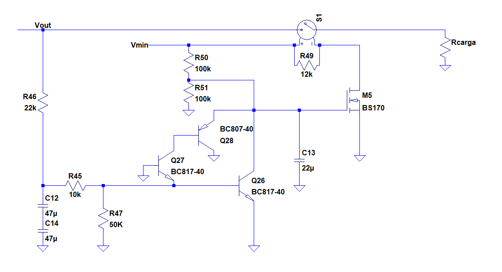

# Descripción de las etapas y subcircuitos del amplificador

En este archivo se realiza una descripción más detallada y cualitativa de cada una de las etapas del amplificador y sus funciones. La justificación de los valores de los componentes del circuito llevadas a cabo tanto desde la teoría como desde la simulación puede verse en [determinacion_valores_componentes.md](determinacion_valores_componentes.md)

## Etapas

#### Etapa diferencial

La etapa diferencial constan de un par cascode PNP con degeneración de emisor (mediante R1 y R2) para reducir la alinealidad de la etapa, disminuyendo la distorsión. Dicho par posee una carga espejo simple con emisores degenerados (mediante R3 y R4). 

Se eligió un par cascode debido a que se caracteriza por una mejor PSNR a bajas frecuencias con respecto a las alimentación de -30V.

La corriente de cola del par diferencial es de aproximadamente 1mA y no mayor (lo que permitiría mejorar, por ejemplo, la velocidad de crecimiento) para reducir los ruidos originados en la etapa.

#### Etapa de amplificación (VAS)

Para esta etapa se eligió emisor común (Q7) seguido por un colector común (Q8) con carga activa (Q17). Esta configuración permite incrementar la ganancia a lazo abierto, ya que la relación entre la tensión  del nodo de salida de la VAS y la corriente de salida de la etapa diferencial es proporcional a la resistencia que ve esta última etapa hacia Q7. Entonces, la presencia de este último transistor, que incrementa dicha resistencia, logra aumentar la ganancia a lazo abierto. Además, esta configuración logra una baja alinealidad (frente una etapa sin un emisor común antecediendo al Q8, o sin tener carga activa) ya que consigue una alta ganancia de lazo en la realimentación negativa creada por C4.

#### Drivers

Los drivers (Q11 y Q12)  poseen resistencias de base de 50ohm que permite reducir la variación de Vbe con la temperatura y protegen las bases de sobrepico de tensión, sin ser lo suficientemente grandes como para reducir la ganancia a lazo abierto por las caídas generadas por las corriente de base de Q11 y Q12.

#### Etapa de salida

Para la etapa de salida se eligió una clase H con los transistores de salida en paralelo. En esta configuración, dos llaves conmutan redirigiendo el camino de la señal a la base un transistor conectado a 12V en su colector o a otro conectado a 30V según la excursión de salida. De esta forma, se optimiza el consumo en señal ya que se logra que esta se dirija solamente a la base del transistor alimentado con 30V cuando se requiera una excursión de salida mayor a 12V aproximadamente.

Las llaves de conmutación fueron realizadas por medio de transistores MOSFET de baja resistencia Rds, que a diferencia de los TBJ posee un caída despreciable entre source y drain al activarse. Esto permite maximizar la excursión con los valores de alimentación disponibles y minimizar la disipación de potencia en las llaves. El circuito de comparación se realizó un transistor TBJ, que satura cuando se excede un valor de tensión ligeramente inferior a 12V, el cual está ajustado por el divisor resistivo que se encuentra en su base.

Los conmutadores emplean diodos rápidos 1N4148 para conseguir las diferencias de potencial Vgs suficientes (aproximadamente 2V) como para lograr que los transistores MOSFET conduzcan completamente.

Se eligió una salida paralelo ya que posee una máxima excursión mayor a la que brinda una salida serie. Esto se debe a que en esta última, la máxima excursión esta limitada por la saturación de 2 transistores. Estos, por la relación de corrientes entre su base y su colector requerida por la etapa de salida, saturan con una tensión Vce del orden de los 1,5V. En consecuencia, la máxima excursión obtenible con 30V de alimentación serían aproximadamente 27V (si considerar las caídas en resiistencias en el camino de la señal y la saturación/corte de otros transistores). Con una salida paralelo la limitación está impuesta por la saturación de un solo transistor, por lo que la máxima excursión ronda los 28,5V (con carga de 8ohm).

Los diodos Schottky D15 y D16 separan las alimentaciones de +12  y -12V respectivamente cuando los conmutadores comienzan a actuar, evitando un cortocircuito de las fuentes, y que los transistores U1 y U3 conduzcan equivocadamente cuando debieran encontrarse desactivados. Se han elegido diodos Schottky ya que su baja caída al encontrarse activados reduce la disipación de potencia.

Los resistores de degeneración de emisor de 0.1ohm fueron elegidos siguiendo la guía presentada por Douglas Self en la página 153 de "Audio Power Amplifier Handbook". Allí se realizaron mediciones que demuestran que para este valor, con transistores de salida de similares características a los empleados en este trabajo, la alinealidad es minimizada.

Una explicación del funcionamiento de los conmutadores se encuentra en el archivo [explicacion_conmutadores.md](explicacion_conmutadores.md).

## Subcircuitos

#### Fuente de corriente

La VAS cuenta con una fuente de corriente definida por Q18 y Q17 , la cual crea una corriente de polarización de la etapa de 9,5mA aproximadamente. El resistor R18 permite reducir las variaciones de dicha corriente con la temperatura, mientras que R20 y R21 polarizan a Q18.

R17 define el valor de la corriente de reposo de la VAS (9,5 mA) ya que esta es aproximadamente VbeQ18/R17. Además, la relación entre R17 y R19 define la corriente de cola del par diferencial.

El capacitor C7 logra reducir la PSNR del amplificador con respecto a +30V, ya que en señal funciona como un componentes de baja impedancia que hace que la base y el emisor de Q19 y Q17 aumenten y disminuyan a la par con las variaciones de +30V.

#### Filtros de ruido de las fuente alimentación

Se han incorporado filtros para reducir la PSNR. Esto son C9 y R6 para +30V y C5 y R8 para -30V. R6 y R8 valen 10ohm y no poseen un valor mayor (mejorando el filtro) debido a que limitarían la máxima excursión obtenible por la VAS, la cual, en esta topología, es el factor limitante de la máxima excursión de todo el amplificador. Para una mejor justificación de los valores de estos componentes ver [determinacion_valores_componentes.md](determinacion_valores_componentes.md)

#### Multiplicador de Vbe

El multiplicador de Vbe elegido ha sido uno de tipo convencional, donde se ha incorporado R13 para aumentar la linealidad de este bloque con la excursión. También se añadió C6 para eliminar el pico en altas frecuencias de la impedancia equivalente del multiplicador.

#### Ayudas de corriente de los conmutadores

Los transistores Q23 y Q24 actúan durante la conmutación, donde los transistores alimentados con +30V y -30V requieren de cargas en un corto intervalo de tiempo para polarizarse y transmitir señal. Dichas cargas que deben ser entregadas de forma rápida se traducen en picos de corriente que exceden los máximo permitidos por los drivers. En consecuencia Q23 y Q24 aportan parte de esta corriente para compartir los picos de corriente con los drivers y reducir el estrés que estos puedan sufrir.

#### Entrada bootstrap

El uso de resistores de pequeño valor para la realimentación (R22 y R23) con el fin de minimizar el ruido inducido por estos lleva a que se tenga una resistencia entrada muy baja si se desea que las base de Q1 y Q2 vean la misma resistencia para reducir las disparidades por las corrientes por las corrientes de base de reposo. En consecuencia, se ha incorporado un "bootstrap" a la entrada, constituido por C2 y C15 (este último para mejorar la respuesta en altas frecuencias por ser cerámico) y R24. Este se aprovecha de que la diferencia de tensiones entre las bases de Q1 y Q2 es muy pequeña, incrementando la resistencia que se ve desde R26. De este modo, se logra que la impedancia vista desde la entrada del amplificador sea aproximadamente la de la entrada del par diferencial.

#### Capacitor de la realimentación y sus protecciones

A la capacidad de la realimentación C3, que genera realimentación unitaria en continua, se le ha dado un valor de 1000u con el fin de que la frecuencia de corte inferior a lazo cerrado sea aproximadamente 1Hz. De esta forma, el giro de fase asociado a esta frecuencia de corte llega hasta los 10Hz, sin afectar la región de frecuencias audibles, que comienza en 20Hz. 

A este capacitor se le han colocado protecciones con diodos rápidos 1N4148 para anclar la tensión en el nodo compartido con R23 en caso de que haya un problema en el amplificador, el lazo de realimentación se corte, y hayan 30V o -30V en el nodo de salida (lo cual dañaría definitivamente al capacitor sin estar protegido).

#### Limitadores de corriente de salida

Compuestos por Q9 y Q22, evitar que la corriente y la tensión Vce de los transistores de potencia exceda la permitida por su SOA. La red de resistores conectada a la base de los transistores (R15, R16 y R37) para el caso de Q9 garantiza el límite de corriente admisible en función de la Vce de los transistores de salida.

Los limitadores obtienen información de las corrientes y de la Vce a partir de los resistores de degeneración de emisor de la etapa de salida R27 y 28.

Por otra parte, los diodos D21 y D22 evitar la activación indeseada de los limitadores de corriente basados en Q9 y Q22 respectivamente, durante el semiciclo de salida opuesto a aquel en el que circula señal por la rama que deben proteger. Por ejemplo, si se observa el limitador de Q9, se verá que para cualquier señal de salida la tensión Vbe de Q9 será siempre mayor que cero sin importar el semiciclo. Por otra parte, la tensión Vce de Q9 debiera ser negativa y no activarse durante el semiciclo negativo. Sin embargo, debido a la presencia del multiplicador de Vbe (que hace que la base de Q12 posea una tensión de más de 2V mayor a la de Q11), la tensión Vce de Q9 sin el diodo D21 sería positiva para parte del semiciclo negativo, y esto podría llevar a la activación de los transistores. El diodo incrementa entonces la diferencia de potencial que debe existir entre la base de Q12 y la salida para que el transistor Q9 se active. Todo lo explicado anteriormente aplica también para el limitador de corriente del semicilo negativo

Una caracterización de los limitadores de corriente puede encontrarse en  [Mediciones_parametros_simulacion.md](simulaciones_amplificador/Mediciones_parametros_simulacion.md).

#### Limitador de corriente de la VAS

Compuesto por Q25 y R43, evitar un exceso de corriente en la VAS cuando se disparan los limitadores de la etapa de salida.  R43 limita la corriente que circula por la base de Q25 para que este no sufra daños.

#### Protección contra DC en el nodo de salida

Su entrada se encuentra constituida por un filtro pasa bajos conformado por R46, C12 y C14, de forma que solamente se active la protección para la componente de DC o para frecuencias por debajo del rango audible. La componente de DC filtrada de dirige al nodo que conecta R45 con R47, activando a Q27 y Q28 si es negativa y  menor a aproximadamente  -900mV, o a Q26 si es positiva y mayor a aproximadamente 900mV. En cualquiera de los casos, esto coloca a tierra el nodo de base de M5, llevándolo a corte y desactivando el relé, que acto seguido desconecta la carga de la salida del amplificador.

Los resistores R45 y R46 limitan la corriente que circula por Q26 y Q27, así como la tensión en ese nodo (ya que la salida del amplificador, fuera de la operación normal, podría llegar a los +30V o -30V).

Una caracterización de la protección dee DC puede encontrarse en  [Mediciones_parametros_simulacion.md](simulaciones_amplificador/Mediciones_parametros_simulacion.md).
