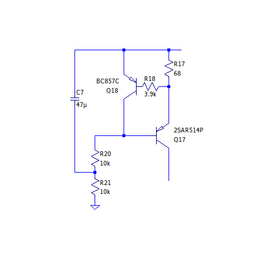
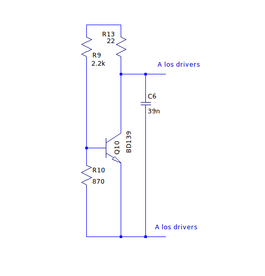
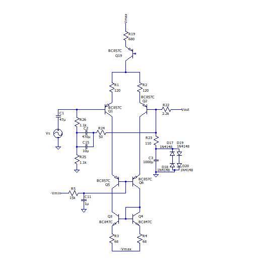
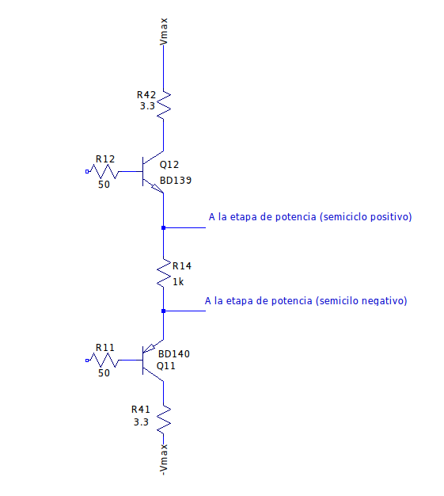
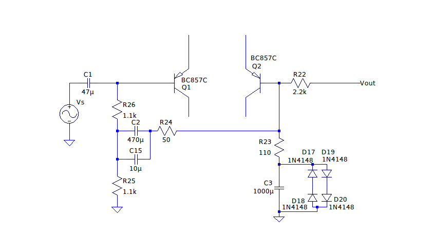

#Determinación de los valores de los componentes
En este documento se procede a explicar los valores adoptados para los componentes utilizados. De esta forma, constituye una profundización de lo expuesto en [descripcion_detallada_amplificador.md](descripcion_detallada_amplificador.md). Algunos valores han sido determinados de forma teórica, mientras que otros han sido especificados suponiendo un valor aproximado apropiado y luego realizando un ajuste fino mediante simulación con el programa *LTSpice*.

A lo largo del archivo se irán determinando los componentes a partir las especificaciones que se deseó alcanzar, las cuales se encuentran en el archivo [Resumen_y_especificaciones.md](Resumen_y_especificaciones.md). A cada una de ellas se les ha asociado una sección correspondiente, las cuales, a medida que se las recorra, iran derivando en los valores finales.

A continuación de presenta un esquema del ampificador sin la protección de DC del parlante:

### Potencia nominal a la carga
Uno de los objetivos iniciales del proyecto fue diseñar un amplificador que pudiera entregar más de 40W a una carga de 8ohm. Con el fin de poseer un margen que permitiera cumplir con esta meta mínima en la práctica (en caso de que, una vez armado el circuito, asuntos imprevistos en la teoría redujeran la máxima potencia obtenible en la carga alterando, por ejemplo, la máxima excursión de salida obtenible) se especificaron 45W. Sabiendo que la potencia promedio entregada a la carga para una armónica senoidal es:

) 

Con una carga de 8ohm esto implica que se requiere una máxima excursión de salida de:

 

Dado que las fuentes de laboratorio disponibles para la puesta a prueba del amplificador durante su armado pueden proveer hasta 30V, se logra (en un principio, y despreciando caidas internas del amplificador) cumplir con la anterior excursión requerida. Debido a que el amplificador no será capaz de alcanzar una excursión de salida igual a su alimentación por los motivos que se verán a contiuación, se decidió alimentar al amplificador con los 30V de la fuente.

Por otra parte, para una potencia nominal de 85W con una carga de 4ohm se requiere de una excursión máxima de:

 

Habiéndose adoptado una etapa de salida con los transistores de potencia en paralelo, drivers constituidos por solo un transistor en cada rama y una VAS donde el transistor que genera la ampificación de señal es NPN como en la siguiente figura:

La limitación en la excursión está dada por al saturación de Q8 en el semiciclo negativo de señal ya que, como se verá más adelante, se eligió una corriente de reposo de la VAS que fuera suficiente como para evitar la entrada en corte de este transistor para la excursión máxima de salida.

La corriente máxima a la carga (y que circulará por lo tanto por el emisor de los transistores) para el peor caso (carga de 4ohm) será, aproximando 30V de excursión máxima:

 

Observando la hoja de datos de los transistores de potencia complementarios 2SC5200 (NPN) y FJL4315 (PNP) elegidos para la etapa de salida (ver su justificación al final de [descripcion_detallada_amplificador.md](descripcion_detallada_amplificador.md)), se llega a que para esa corriente, la tensión base-emisor es aproximadamente Vbe = 0,9V.
Por otra parte, el valor de su Beta es aproximadamente Beta = 50. Entonces, la corriente pico máxima que deben proveen los drivers es aproximadamente 7,5A/50 = 150mA. Según la hoja de datos de los transistores utilizados como drivers (BD139 y BD140) esto implica una tensión base-emisor máxima de 750mV.  Además, con 7,5A de corriente a la salida y resistores de degeneración de emisor de los transistores de potencia (R27 y R28) de 0,1ohm (este valor, como se explica en [descripcion_detallada_amplificador.md](descripcion_detallada_amplificador.md), optimiza la linealidad de la etapa de salida), la caída en ellos es 750mV. Finalmente, la tensión de saturación del transistor 2SCR514P empleado para Q8 es típicamente 100mV. En consecuencia, la excursión máxima viene dada por:

Este peor caso para la excursión máxima excede los valores mínimos requeridos para alcanzar las potecias nominales con 4 y 8ohm según se determinó anteriormente. Es entonces que se conservan los 30V como la tensión de alimentación de la etapa diferencial y VAS (para poder alcanzar la amplificación deseada) y también como la alimentación alta (Vmax) de los transistores de salida (es decir, que se conecta a los colectores de U2 y U4).

Dado que se buscó diseñar un amplificador clase H, se incorporó una seguda tensión de alimentación de la etapa de salida, cuyo valor es menor que el de Vmax. Este resultó ser 12V ya que optimiza las figuras de distorsión obtenidas para el tanto el 10% como el 50% de la potencia nominal a la carga. De poseer una valor mayor, lo quiebres generados en la senoidal por las conmutaciones se dan en zonas cercanas a los pico de la señal, aumentando la distorsión para el 50% de la potencia nominal. Si se hace que la conmutación ocurra para un valor bajo de excursión, los quiebres se darán en una zona más cercana a la base de la senoidal en el 50% de la excursión, con lo que la distorsión disminuirá. Por otra parte, 12V como tensión de alimentación baja es suficiente como para que la conmutación se dé para excursiones mayores a las correspodientes a 10% de la potencia nominal a la carga, con lo que la comutación no afectará con distorsión a esta especificación.

Por otra parte, siendo la corriente pico máxima en el emisor de los drivers de 150mA, y teniendo estos un parámetro Beta para dicha corriente de Beta = 140, su corriente de base pico será Ib_max_pico = 1mA.

Dado esto, se decidió otorgarle a la VAS una corriente de polarización de aproximadamente 10mA.

Se eligió la fuente de corriente de la siguiente imagen:

Donde se supone que Q18 está polarizado de forma que Vbe_Q18 = 0,7V. Entonces, con un resistor R17 de 68ohm se consigue una corriente en la VAS de:

 

Donde, asumiendo además que Vbe_Q17 = 0,7V, la corriente en el colector de Q8 es:

Utilizando R20 = R21 = 10kohm, de forma que Ic_Q8 tenga un valor normal para un transistor de baja potencia con el BC860. 

En la práctica, las corrientes de base de Q17 y Q18 disminuirán el valor de I_VAS, hasta hacerlo de aproximadamente 9,5mA, aunque este es un valor suficiente como para garantizar alimentar a la base de los drivers y, como se verá más adelante, que la excursión no se vea limitada por el corte de Q8, sino su saturación.

###Polarización y consumo sin señal
Embebido en la VAS se colocó un multipicador de Vbe, el cual se muestra a continuación:

El objetivo fue polarizar los transistores de potencia de salida U1 y U3 con una corriente de reposo de aproximadamente 10mA. Si bien este no es el valor óptimo para reducir la distorsión, se lo propuso ya que permite obtener un bajo consumo sin señal. 

La tensión colector-emisor del mutiplicador (sin contemplar el resistor de linealizacion R13) es:

)

Donde se asume Vbe = 0.7V para realizar una primera aproximación a la Vce que se obtendrá.
Habiendo elegido R10 = 2,2kohm, colocando un preset de 2kohm en el lugar de R9 se consigue suficiente excursión como para confgurar el multiplicador en la práctica de forma que la corriente de colector de U1 y U3 sea aproximadamente 10 mA. En la simulación, se llegó a que este preset debería ser colocado con un valor de 870ohm para obtener una corriente de aproximadamente 7,3mA en R27/R28 y de 12mA en los emisor de U1 y U3. El hecho de que la corriente de emisor de los transistores de potencia sea mayor que la de los resistores de linealizacion reside en que los diodos conectados entre la base y el emisor de los transistores U2 y U4 (y que forman parte de los conmutadores) consumen una corriente del orden de los miliamperios. 

El resistor R13 tiene como finalidad linealizar la variación de la tensión Vce con la corriente de la VAS. Esta linealidad se manifiesta a la hora de hacer funcionar al amplificador en señal. El valor elegido para R13 fue de 22ohm ya que, según las simulaciones, optimiza dicha linealidad. A continuación se muestra una captura de Vce en función de la corriente de la VAS obtenida por simulación para distintos valores de R13. La curva roja representa R13=15ohm, la curva celeste R13=22ohm, y la curva violeta R13=27ohm:

Por otra parte, el capacitor C6 sirve para atenuar el pico que experimenta la impedancia equvalente del multiplicador para altas frecuencias ocasionado por sus comportamientos inductivos y capacitivos según el espectro. Por medio de simulaciones se probaron distintos valores comeriales de C6 y se llegó a que el punto óptimo se encontraba en 39nF. A continuación se muestra una captura de la simulación donde se realizó un barrido en frecuencia de la impedancia equivalente del multiplicador para distitnos valores de C6 (verde: 33nF, azul: 39nF, rojo: 47nF):

###Ganancia a lazo abierto
Para saber la ganancia a lazo abierto apropiada se tomó como criterio aquella empleada por Douglas Self en el diseño en base al cual se desarrolló este amplificador. Mediante esta ganancia a lazo abierto se consigue una ganancia de lazo lo suficientemente alta como para alcanzar las especificaciones de distorsión deseadas.

La ganancia a lazo abierto viene dada por el producto de las ganancias de las tres etapas del circuito: entrada diferencial, VAS y etapa de salida. Se comienza entonces con el análisis de la etapa diferencial de entrada.

####Etapa diferencial de entrada
Se incluye a continuacioń una imagen de la etapa diferncial de entrada elegida con su copia espejo de corriente generando la corriente de cola:

La etapa diferencial constituye un ampificador de transconductancia. La corriente de salida en función de la entrada diferencial es:

=0,0057A/V)

Donde se ha supuesto que las corrientes de ambas ramas del par son aproximdamente iguales, así como también R1 = R2 y R3 = R4.

A R1 y R2 se les asoció el valor de 120ohm ya que este es lo suficientemente pequeño como para no reducir demasiado la amplificación de la etapa (y en consecuencia la ganancia total a lazo abierto), pero a su vez permite linealizar lo suficientemente la etapa diferencial (intoduciendo una realimentación en Q1 y Q2 que tiende a igualar la corrientes del par). R3 y R4 fueron también elegidas de forma de forma de favorecen la igualdad de las corrientes del par, ya que en una copia espejo simple como la conformada por Q3 y Q4, al ser R3 y R4 lo suficientemente grandes se tiene que las corrientes de una rama y otras de las carga activa están aproximademente relacionadas por:

Entonces, es posible ajustar la diferencia de las corrientes del par mediante la dispersión entre R3 y R4 (cuya cota se puede determinar al comprar los componentes), en vez de dejar que esto dependa de las diferencias en los Vbe y Beta de los transistores. Se eligió R3 = R4 = 68ohm ya que permiten que esto último se cumpla si intruducir demasiado ruido termico en la etapa de entrada. Esto último se incrementa cuanto mayor sea el valor de los resistores, y es indeseable ya que, por el teorema de Frii, si la primer etapa posee una ganancia lo suficientemente grande (que es el caso) el ruido introducido a la señal por todo el sistema es aproximadamente el creado por la etapa de entrada. R1 y R2 también se tomaron en el orden de los cientos de ohm y no mayores por este motivo.

Por otra parte, se decidió utilizar una corriente de cola de aproximadamente 1mA. Esto garantiza una ganancia  lazo abierto lo suficiemente grande, y a su vez reduce los ruidos introducidos en la etapa diferencial por la corriente de reposo de los transistores. Entonces, por el mismo motivo que con la carga activa, la relación entre la corriente de cola del par diferencial y la corriente de la VAS es:

De este modo, eligiendo R19 = 680ohm, se obtiene aproximadamente Icola = 1mA.

####VAS
A continuación se muestra una imagen de la VAS:

Esta etapa posee una ganancia de transresistencia, la cual amplifica la corriente entrante a la base de Q7. Dicha ganancia viene dada aproximdamente por:

]]R_{cVAS}g_{m-Q8}/[1+g_{m8}\(R44+R8\)]})

Donde Rcvas es la resistencia equivalente de carga que ve Q8.

Allí puede verse que el parámetro Beta de Q7 es directamente proporcional a la ganancia a lazo abierto. Por lo tanto, maximizarlo permite máximizar a su esta última. Por ello es que se eligió un transistor BC860C para este dispositivo, ya que posee el parámetro Beta más alto dentro de la familia BC.

R44, que es el resistor de sensado del limitador de corriente definido por Q25 y R43, se mantuvo con un valor bajo (5 ohm), ya que reduce la ganancia a lazo abierto al introducir una realimentación de emisor en Q8. Los mismo se realizó con el resistor R8 del filtro pasabajos para la tensión de alimentación Vmax, cuyo valor adoptado fue 10ohm.

Debido a que la corriente en la VAS es de aproximadamente 10mA, la tensión de reposo en el emisor de Q7 es:

I_{VAS}+V_{BE-Q8}=-30V+0,15V+0,7V=-29,2V)

Entonces, siendo R7 = 2,2kohm, la corriente emisor de Q7 es Ie_Q7 = Vbe_Q7/R7 = 0,3mA. Dicha corriente es suficiente como para polarizar correctamente a Q7, manteniéndose lo suficientemente baja como para no inducir ruidos en la etapa.

Por otro lado, la resistencia de carga de la VAS, suponiendo que la excursión es lo suficientemente grande como para que la etapa de salida opere en clase B y no A, es:

]]//[r_{\pi-Q12}+\beta_{Q12}r_{\pi-U2}+\beta_{Q12}\beta_{U2}R_{27}]=24,3k\Omega)

Donde se ha despreciado la impedancia equivalente del multipicador de Vbe por ser del orden de las decenas de ohm y, en consecuencia, mucho menor a la resistencia de entrada de la tercer etapa y de la carga activa de la VAS. También se ha asumido que la etapa de salida actua en baja excursión y puede utilizarse el modelo linealizado para obtener su resistencia de entrada.
 
Con dicha RcVAS se obtiene:

Entonces, aproximando la ganancia de la etapa de salida en 0,99 se obtiene que la ganancia a lazo abierto de todo el sistema es:

####Drivers

La resistencia R14 fue elegida con un valor de 1kohm debido a que este minimiza los valores simulados de distorsión. Con esta resistencia, siendo la tensión en el nodo de salida aproximadamente 0V y las tensiones base emisor de U1 y U3 aproximadamente 0,7V, se tiene que la corriente de colector de Q11 y Q12 es 1,4mA.

###Ganancia a lazo cerrado
En la siguiente figura se incluye una imagen del realimentador, definido por R22 y R3 junto con el *bootstrap* a la entrada:

 

Entonces, sin considerar el *boostrap* en la entrada, el factor de realimentación viene dado por:

)

Empleando R22 = 2,2kohm y R23 = 110 se obtiene f = 0,048. De esta forma, sabiendo del apartado anterior que a >>1 se llega a que la ganancia a lazo cerrado es:

\simeq1/f=21)

Este valor es menor al objetivo de las especificaciones, que es 23. Sin embargo, al actuar el *boostrap* en señal, R25 queda en paralelo con R23, teniendose entonces:

/[R_{22}+(R_{23}//R_{25}\)]=0,043)

De modo que:

Obteniéndose el valor deseado.

Por otra parte, el orden de lo resistores R22 y R23 pudiera ser aumentado o reducido ya que el divisor resistivo queda definido por la relación entre ellos. Empero, de ser aumentados, el ruido térmico creado en la realimentación se ve incrementado. Por otra parte, de ser reducidos los valores de R22 y R23, la impedancia de entrada en señal de verá reducida. Lo que es más, de por sí R22 y R23 son lo suficientemente pequeños como para requerir un boostrap para lograr que la impedancia de entrada sea del orden de las decenas de kiloohm, de forma que R22 y R23 no deberían ser reducidos aun más.

###Estabilidad
Por medio de simulación se determinó que, siendo C4 = 33p, el margen de fase es 81°. El resultado se muestra a continuación:

Si bien, en un principio, dicho margen de fase se asociaría con un sistema sobrecompensado (lo optimo sería 60°), se ha decidido utilizar dicho valor de capacitor de compensación para atenuar las oscilaciones que podrían originarse en la práctica en el amplificador producto de las conmutaciones.

###Slew rate
En el semiciclo positivo de señal se tiene que la velocidad de crecimiento viene dada por (despreciando las capacidades parásitas sobre todo de Q7):

Donde  I_cola_diferencial es la corriente por R19.

Por otra parte, dada la topología del circuito,  se espera que la velocidad de decrecimiento (SR-) sea similar o superior a la de crecimiento. De esta forma, el ancho de banda potencia es:

=170kHz)

donde se tomó Vomax = 27,8.

Las simulaciones realizadas e incluidas en [Mediciones_parametros_simulacion.md](simulaciones_amplificador/Mediciones_parametros_simulacion.md) demuestran este razonamiento.

El valor de ancho de banda de potencia obtenido para este caso es mucho mayor al mínimo requerido por el circuito para poder funcionar a máxima excursión de salida entro de la banda de frecuencias audibles sin distorsionar por limitaciones en la velocidad de crecimiento.

###Ancho de banda
La frecuencia de corte superior de la ganancia a lazo cerrado está dada por la frecuencia de corte determinada por el polo introducido por el capacitor de compensación, multiplicada por el factor (1 + af). Entonces, el polo dominante en altas frecuencias a lazo cerrado es:

)

Donde el polo a lazo abierto es:

]\times(Rout1//Rin2\))

Donde Rout1 es la resistencia de salida de la etapa diferencial:

Y Rin2 es la resistencia de entrada de la VAS vista desde la base de Q7:
]\simeq715k\Omega)

Siendo entonces:

De forma que la frecuencia de corte superior es:

De la simulación fue posible obtener el siguiente resultado en pequeña señal:

De forma que la frecuencia de corte superior resultó ser aproximadamente una década superior a la estimada teóricamente. La causa podría encontrarse en la influencia del capacitor de compensación, que crea un lazo de realimentación dentro de la VAS influencia sobre su impedacia de entrada y su ganancia. Sin embargo, el ancho de banda obtenido en un principio por medio de la teoría resulta ser suficiente para el amplificador en cuestión debido a que se se extiende por encima de las frecuencias de audio. 

Por otra parte, se busca que la frecuencia de corte inferior a lazo cerrado, determinada por aquella en la que la realimentación comienza a volverse unitaria, no afecte a las frecuencias audibles ya que se convierte en una fuente de distorsión. Suponiendo que el polo del capacitor de entrada C1 es mucho menor al de C3, la base de Q1 se encuentra aproximadamente puesta a tierra en la frecuencia de corte del segundo. Entonces, por la realimentación la base de Q2 también lo está. Entoces, la resistencia vista por el capacitor C3 es aproximadamente R23. Entonces, la frecuencia de corte asociada a C3 (suponiendo que C2//C15 es un corto en dicha frecuencia) es:

=1,4Hz)

Sin embargo, el capacitor C15 es del mismo orden que C3. Por lo que el boostrap influye en la frecuencia de corte antes mencionada. Es entonces que en la simulación la frecuencia de corte es 0,8Hz, según puede verse en la siguiente imagen:

Con una frecuencia de corte inferior en el orden del Hertz, se garantiza que el giro de fase creado por el polo asociado a este termine de darse en el orden de los 10Hz. De esta forma, dicho giro de fase no afecta a las frecuencias audibles.

Por otra parte, el capacitor de entrada C1 posee un valor de 47uF ya que de esta forma el polo creador por este se halla en el orden del Hertz y coincide con un cero creado por el boostrap en dicha frecuencia. De este modo, la frecuencia de corte inferior resulta ser aproximadamente la de la realimentación.

###Impedancia de entrada
Los resistores R25 y R26 valen 1,1kohm para poder igualar las corrientes de base de Q1 y Q2 en continua y evitar desapareamientos en el punto de reposo. Debido a esto, de no utilizarse el *boostrap* se tendría una impedancia de entrada del orden de los kiloohms (debido a que la impedancia de entrada del par diferencial en el sistema a lazo cerrado es mucho mayor a ese orden y se encuentra en paralelo a (R25+R26), si despreciamos la resistencia del generador de señal solo para fines de analizar la situación cualitativamente). 
El boostrap, en un principio, aprovecha el hecho de que la realimentación hace que la tensión en la base de Q2 sea ligeramente menor a la de Q1 ya que:

]\simeq\\\V_{B-Q1}[a/(1+af\)])

Y entonces:
]f<V_{B-Q1})

En consecuencia, al convertirse (C2//C15) en un corto en señal, se fuerza una diferencia de potencial pequeña entre los extremos de R25,  teniendo esta una resistencia equivalente mucho mayor a su valor real.

El valor de (C2//C15) determina la frecuencia inferior a partir de la cual actuará el *bootstrap*. 

Por otro lado, en la práctica el boostrap, de no colocarse R24, tendrá un Q que hará que la resistencia de entrada alcance un pico para una frecuencia dada, y luego decaiga para valores inferiores y superiores de freecuencia. Cuanto mayor es R24, menor es la resistencia equivalente que crea el *boostrap*. Sin embargo, al crecer, R24 convierte el pico ates mencionado en una zona de frecuencias medias para la cual la impedancia de entrada tiene un valor constante, que es lo deseado. 

Es entonces que utilizando C2//C15 = 470uF y R24 = 50ohm se obtiene la respuesta en frecuecia deseada según las especificaciones para la impedacia, tal como se muestra en la siguiente figura:

Por último, vale aclarar que se han utilizado dos capacitores en paralelo (C2 y C15), ya que C2, al ser cerámico, no ve deteriorado su valor al aumentar la frecuencia tanto como el electrolítico (C15).

###Impedancia de salida
La impedancia de salida a lazo abierto viene dada por (suponiendo que solamente se activa una rama de las de salida, funcionando el amplificador en clase B):

+\Big(r_{o-Q8}[1+g_{m-Q8}(r_{\pi-Q8}//(R_{44}+R_8\)\)]//[r_{o-Q17}[1+g_{m-Q17}(r_{\pi-Q17}//R_{17}\)]/(\beta_{U1}\beta_{Q12}\)\Big\)\simeq5,9\Omega)

Entonces, la ganancia a lazo cerrado es:

=0,26m\Omega)

Este valor es mucho menor al mínimo requerido por las especificaciones (20mohm). Sin embargo, en la simulación se observa que los valores de impedancia son mucho mayores y del orden de los 20ohm, tal y como se puede ver en la siguiente imagen para una carga de 8ohm por ejemplo:

Es posible que esto se deba al hecho de que la ganancia de lazo experimenta cambios de ordenes de mágnitud a frecuencias bajas, de forma que la impedancia de entrada se ve afectada por este comportamiento y sufre variaciones imprevistas en los cálculos teóricos realizados. 

###PSNR
####Vmax
El capacitor C7 fue agregado con el fin de mejorar la PSNR en bajas frecuencias, tal y como se adelantó en [descripcion_detallada_amplificador.md](descripcion_detallada_amplificador.md). Se eligió su valor deseando obtener una PSNR menor a -100dB con respecto a Vmax en todo el rango de frecuencias audibles. 
A continuación se muestra ua imagen de la PSNR sin C7:

Y otra con C7:

Por otro lado, C9 y R6 constituye un filtro pasabajos para remover componentes de alta frecuencias del ruido de la fuente de alimentación. Si bien este filtro no es del todo necesario para esta fuente ya que el rechazo de ruido propio del circuito con C7 incluido ya es mayor a los -100dB; se ha decidio incluir a C9 y R6 por motivos de simetría con el filtro de -Vmax, el cual si es relevante para la PSNR

####-Vmax
El filtro compuesto por R8 y C5 fue determinado suponiendo que los cables de alimentación cuentan con una resistencia propia de aproximadamente 1ohm, de modo que el capacitor C8 de 1000u actua como un filtro en sí (aunque ese no sea su fin inicial). Esto peritió reducir el valor de C5 a 100uF, así como también de R8 a 10ohm para evitar una reducción o despreciable en la máxima excursión de salida.

Bajo la suposición anterior de los cables de alimentación, la PSNR con respecto a -Vmax sin el filtro de R8 y C5 obtenida por simulación sería:

Y con el filtro:

###-Vmin
En un principio no resulta de interés filtrar Vmin y -Vmin ya que estas solamente alimentan a la etapa de salida para bajas excursiones. Además, el ripple en estas alimentaciones puede ser controlado por medio del diseño de las fuentes de swiching; mientras que el ruido será filtrado por los capacitores de  C16 y C17 y las resistencia de los cables que comunican las fuente de switching con el amplificador. 

Sin embargo, un buen filtrado es de interés para -Vin, ya que esta polariza el cascode la etapa diferencial. Para ello se ha armado un filtro entre el resistor de base R5 = 15kohm (cuya funcionalidad es también limitar la corriente por la base de Q5 y Q6 en caso de problemas con las fuentes o fallas en el circuito) y el capacitor C11. Se eligió C11 de 1uF para que pudiera ser cerámico, con una consiguiente mejor respuesta en frecuencia.

A continuación se muestra una imagen de la PSNR con respecto a -Vmin sin el filtro:

Y con el filtro:

###Criterios para la determinación de otros componentes
El resistor de base de Q18 (R18) fue elegido para evitar las variaciones de la polarización de este último con la temperatura. Sin embargo, se limitó su tamaño a 3,9kohm para evitar que generase un cambio no despreciable en la corriente por R17.

R11 y R12 se encuentran incluidos con ese mismo fin, al igual que también protegen a las bases de los transistores de picos de sobrecorriente que podrían generarse por, por ejemplo, un cortocircuito a la salida. Su valor de limitó a 50ohm para que la caída generada en ellos altere despreciableente a la ganancia a lazo abierto (ya que de otro modo se comprometerían aspectos como la distorsión a lazo cerrado)

Por otra parte, los capacitores C8, C10, C16 y C17 fueron incluidos para almacenar cargas que puedan se provistas a la salida rápidamente cuando la excursión de salida lo requiera. Esto se debe a que la resistencia finita de los cables de alimentación daría lugar a caídas en la tensión de alimentación real del amplificador al pedir este grandes pico de corriente para la carga. En estas cirunstancias, dicha corriente povendrá de los capacitores, en lugar de la propia fuente de alimentación.

Finalmente, los resistores R41 y R42 fueron obtenidos por simulación observando para que valores, a máxima excursión de salida, se obtenía una respuesta por parte de Q23 y Q24 que evitase exigir a los drivers con picos de corriente por encima de los tolerables durante la conmutación.

##Transistores utilizados
Por último, se listan los transistores utilizados en el circuito y el criterio empleado en su selección.

- BC850/860C: transistores SMD de uso general de la línea BC, pero con la menor figura de ruido dentro de esa categoría. Se han utilizado para la etapa diferencial de entrada con el fin de reducir el ruido introducido por esta.  Se ha elegido el tipo C ya que posee el mayor parámetro beta dentro de la gama, mejorando la paridad del par diferencial e incrementando la resistencia de entrada del amplificador y de la etapa VAS. Si bien en las simulaciones y esquemas presentados en los documetos se muestran transistores BC547/557C, se ha hecho esto ya que el software *LTSpice* cuenta con los modelos de estos componentes. Además, la principales diferencias entre los dos tipos de componentes son la figura de ruido, y el hecho de que los BC547/557C son *through hole*, aspectos que no influyen en la simulación.
- 2SCR514P/2SAR514P: empleados en la VAS, los conmutadores y los limitadores. Transistores que permiten el paso de medianas corrientes (máximo 0,7 A). Se utilizaron por poseen un parámetro beta muy lineal (reduce la alinealidad de la VAS) y ser rápidos para las conmutación (útiles para los conmutadores).
- 2SC5200/2SA1943: empleados en la  etapa de salida. Fueron elegidos ya que son transistores especiales para audio que cuentan con un parámetro beta casi constante en el rango de corrientes que se manejan en este amplificador. Esto permite evitar alinealidades en la etapa de salida.
- BD139/BD140: empleados en el multiplicador de Vbe (por tener un encapsulado TO-220 que permite acoplarlos térmicamente con los transistores de baja potencia de salida) y en los drivers (por poder disipar la potencia necesaria como para alimentar a los transistores de salida en el peor caso). También poseen un parámetro beta lineal en comparación con otras alternativas consideradas.
- FDS9934: transistores NMOS y PMOS complementarios empleados en los conmutadores. Se han elegido por su baja Rds, que minimiza la caída de señal y la disipación de potencia en ellos. También se los ha seleccionado por ser complementarios, de forma de evitar disparidades en las ramas del semiciclo positivo y negativo.
- BC817 y BC807: transistores de uso común empleados en las protección de DC. Se han elegido estos modelos ya que no se requiere de ninguna característica especial por su parte.
- BS170: transistor MOS de uso común utilizado en la protección de DC. Al igual que para los BC817 y BC807, ha sido elegido por no requerirse de ninguna característica particular derivada de la funcionalidad que cumplirá este transistor.

