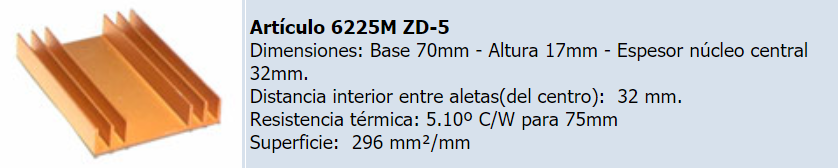
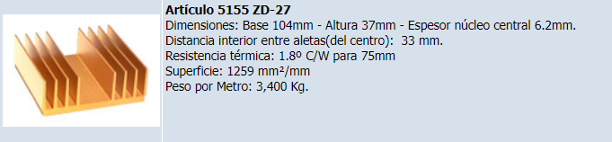

## Disipadores del amplificador

Los disipadores fueron elegidos en función de los valores de máxima disipación en los transistores hallados a partir de la simulación en [Mediciones_parametros_amplificador.md](../simulaciones_amplificador/Mediciones_parametros_amplificador.md). De allí se obtuvo:

- Pot_max_U1 = 3,3W (transistores alimentados con +12V y -12V)
- Pot_max_U2 = 17W (transistores alimentados con +30V y -30V)

La resistencia térmica juntura-encapsulador de los transistores elegidos es 0,8°C/W y la máxima temperatura de juntura tolerable es 150°C. En consecuencia, los valores mínimos de resistencia térmica de un disipador para cada transistor deben ser:

- Res_U1 = 36 °C/W
- Res_U2 = 5,5 °C/W

Utilizando un solo disipador en común para los dos transistores alimentados con +12V y -12V (ya que deben ir acoplados térmicamente con el multiplicador de Vbe para evitar su embalamiento), se debe dividir la resistencia térmica por 2. De este modo, se requiere un disipador de como mínimo 18 °C/W.

Haciendo lo mismo para los transistores alimentados con +30V y -30V ya que se decidió darles un único disipador a los dos por motivos de espacio en el PCB a la hora de montarlos, se llega a que se requiere un disipador de como mínimo 2,75°C/W.

Analizando las opciones comerciales disponibles, se decidió optar por la siguientes alternativas:

###### Disipador baja potencia

Con ello, la máxima temperatura alcanzada en los transistores de baja potencia será:

T = 3,3W x (0,8 °C/W + 2 x 5,1 °C/W) = 36°C

Se eligió este disipador ya que sus dimensiones a lo ancho permiten colocar los dos transistores de baja potencia y el del multiplicador de Vbe uno al lado del otro para mayor acoplamiento térmico.

###### Disipador alta potencia

Con ello, la máxima temperatura alcanzada en los transistores de alta potencia será:

T = 17 W x (0,8 °C/W + 2 x 1,8 °C/W) = 75 °C