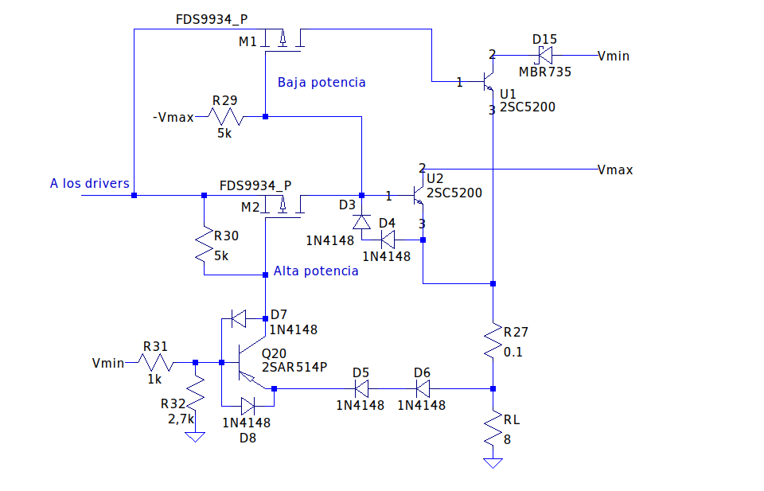
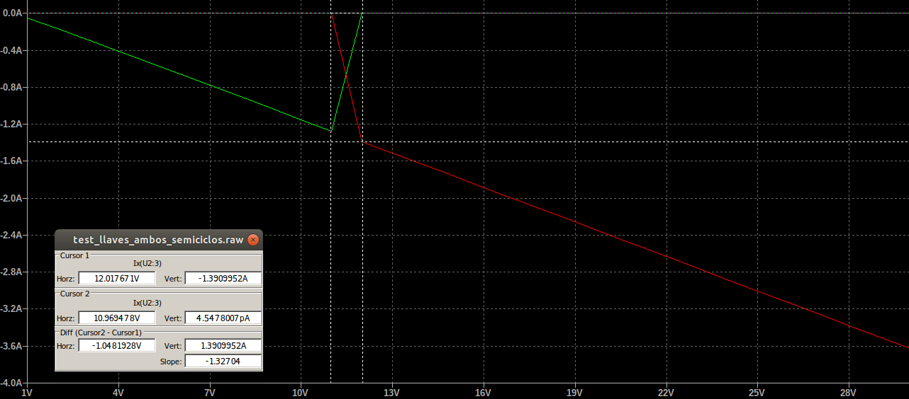

# Funcionamiento de los conmutadores
La finalidad de este documento es explicar el funcionamiento de los conmutadores de la etapa de salida del amplificador. Una introducción sobre su funcionamiento de encuentra en [descripcion_detallada_amplificador.md](descripcion_detallada_amplificador.md), pero aquí se muestra en detalle el proceso de conmutación.

A continuación se muestra el esquema del conmutador de la rama que funciona durante el semiciclo positivo:

 

El transistor Q20 tiene como finalidad comparar la tensión que se encuentra en su base y la del nodo de salida. Cuando la tensión del nodo de salida menos tres caídas de diodo (la tensión en el emisor de Q20) es mayor a la tensión en la base de Q20, entonces este satura y la tensión en su colector (el gate de M2) pasa a ser aproximadamente Vout - 2,1V. Se dice que la salida "menos tres caídas de diodo" debe ser mayor a la tensión en el nodo de base debido a que se tienen dos diodos 1N4148 entre el emisor y Vout (que totalizan aproximadamente 1,4V de caída) y, a su vez, la tensión base-emisor de Q20 debe ser aproximadamente -0,7V para que el transistor pueda saturar. 

Mientras Q20 no haya saturado, la tensión en el gate de M2 dependerá no de la salida, sino de aquella en el source de este transistor. Debido a que en este caso Q20 se encuentra en corte, no circula corriente por R30 y, por lo tanto, la tensión en el gate de Q20 es igual a la del source. Entonces, la tensigón Vgs de M2 es nula y este no conduce corriente. Debido a esto, la tensión en su source dependerá de la rama compuesta por -Vmax, R29, los diodos D3 y D4 y la salida. Como el amplificador se encuentra en el semiciclo positivo de salida (porque estamos tratando el conmutador de los transistores que actuan en este semiciclo), Vout es necesariamente mayor a -Vmax. de esta forma, circulará una corriente a través de los diodos y pasando por R29 hasta -Vmax. Además, U2 se encontrará en corte, ya que su tensión Vbe será menor a cero por la diferencia de potencial inducida por los diodos. Por otra parte, la tensión en el gate de M1 será la tensión del nodo de salida menos dos diodos (aproximadamente 1,4V). A su vez, suponiendo que U1 se encuentra conduciendo porque M1 está activado (que es lo que se desea cuando todavía Vout no ha superado el umbral de conmutación), la tensión en el nodo de salida será aproximadamente 0,7V menor a la del source de M1, ya que al estar este último conduciendo, su diferecia de potencial drain-source será aproximadamente nula y U1 induce una diferencia de potencial de aproximadamente 0,7V entre su base y su emisor (el nodo de salida) al conducir. Entonces, la tensión Vgs de M1 será de -2,1V, de forma que se asegura que este entrará en modo de conducción (como se lo había supuesto inicialmente).

El valor elegido para R29 depende de una relación de compromiso entre la corriente consumida por el conmutador (y la potencia disipada por este) cuando el amplificador se encuentra en reposo y la velocidad con la que pueden actuar los conmutadores. A menor valor de R29, mayor será la corriente por ella y mayor el consumo y disipasión en reposo del amplificador. Sin embargo, al forzarse más corriente por los diodos D3 y D4, la tensión entre estos será mayor, por lo que la tensión Vgs de M1 tenderá a ser mayor cuando se desee que este transistor conduzca, lo que acelerará la conmutación; y cuanto más rápida sea la conmutación, menor tenderá a ser la distorsión generada en la señal de salida. En base a esta relación de compromiso se adoptó R29=5kohm ya que garantiza los valores de distorsión deseados en las especificaciones, al igual que mantiene la disipación en ella por debajo de los 0,25W en reposo, y conseva el consumo de todo el amplificador en reposo por debajo de los 2W. 

Volviendo sobre el transistor Q20 que actua como comparador, cuando este sature porque la salida menos 2,1V haya sobrepasado la tensión en su base, la tensión en el gate de M2 será Vout - 2,1V. Suponiendo ahora que M2 y U2 conducen porque se ha producido la conmutación, se tiene que la tensión Vgs de M2 será -2,1V ya que su tensión de Vds es nula y recorriendo la malla desde el drain hasta el gate de M2 se tienen tres caídas de diodo (la Vbe de U2 y los dos diodos D5 y D6). Como la tensión Vgs es -2,1V, se comprueba que M2 debe conducir (y además habrá una corriente por R30). Además, como se supuso que U2 conduce, los diodos D3 y D4 no lo harán y puede establecerse el camino de señal que comunica los drivers con el nodo de salida a través de U2.

El valor de R30 establece cuanta corriente circulará desde el colector de Q20 al source de M2 cuando el comparador sature. Si esta corriente es muy baja, la corriente por los diodos D5 y D6 también lo será, de forma que, del mismo modo que para D3 y D4, la tensión de los diodos en directa no crecerá con la suficiente rapidez y se introducirá distorsión en la señal de salida. Si, en cambio, la corriente es muy alta, esta influye sobre la que circula por el canal de M2 hacia U2 y afecta considerablemente al camino de señal, introduciendo nuevamente distorsión. Por lo tanto, el punto adecuado para el valor de R30 se encuentra entre estos dos casos, y por simulación se llegó a que este se da para R30=1kohm. Por lo tanto, ese fue el valor que se le dió a esa resistencia.

Dado que cuando Q20 no se encuentra saturado está, en cambio, en corte y su base no conduce corriente, el divisor compuesto por R31 y R32 define el umbral que el comparador contrastará con la salida. Para los valores R31=1kohm y R32=2,7kohm, este umbral se encuentra en 9V aproximadamente. Si bien este valor es 3V menor a la tensión de alimentación inferior, la conmutación de los transistores M1 y M2 se completará para valores de excursión de salida mayores a 9V porque algunos componentes de los conmutadores (por ejemplo, lo diodos D5, D6) se polarizan totalmente para una excursión de salida algo mayor a la necesaria para que Q20 sature. Entonces, la activación/desactivación de los transistores U1 y U2 tendrá lugar para el rango de tensiones entre 11V y 12V de salida. En la siguiente imagen se muestran las corrientes de emisor de U1 (verde) y U2 (rojo) en función de la tensión de salida para una simulación realizada sobre los conmutadores:

 
 
Las corrientes son negativas ya que la referencia de las corrientes de emisor se considera entrante al terminal.

Por último, el diodo D8 protege la juntura base-emisor de Q20 de la ruptura cuando la salida se encuentra en el semiciclo negativo. D7, en cambio, ha sido colocado ya que se determinó por simulación que mejora la distorsión para amplitudes de salida de valores cercanos a los correspondientes a la potencial nominal sobre la carga.
 