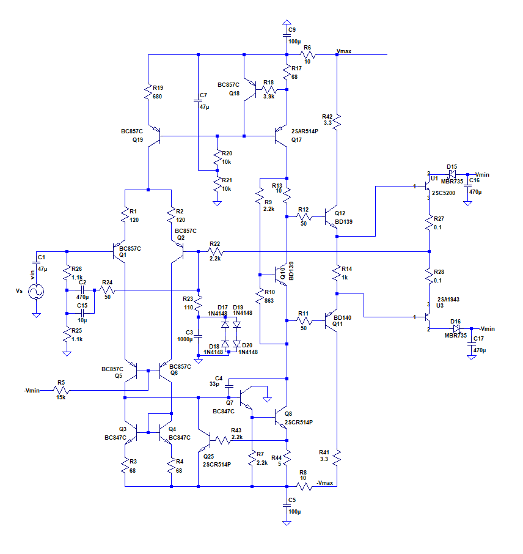
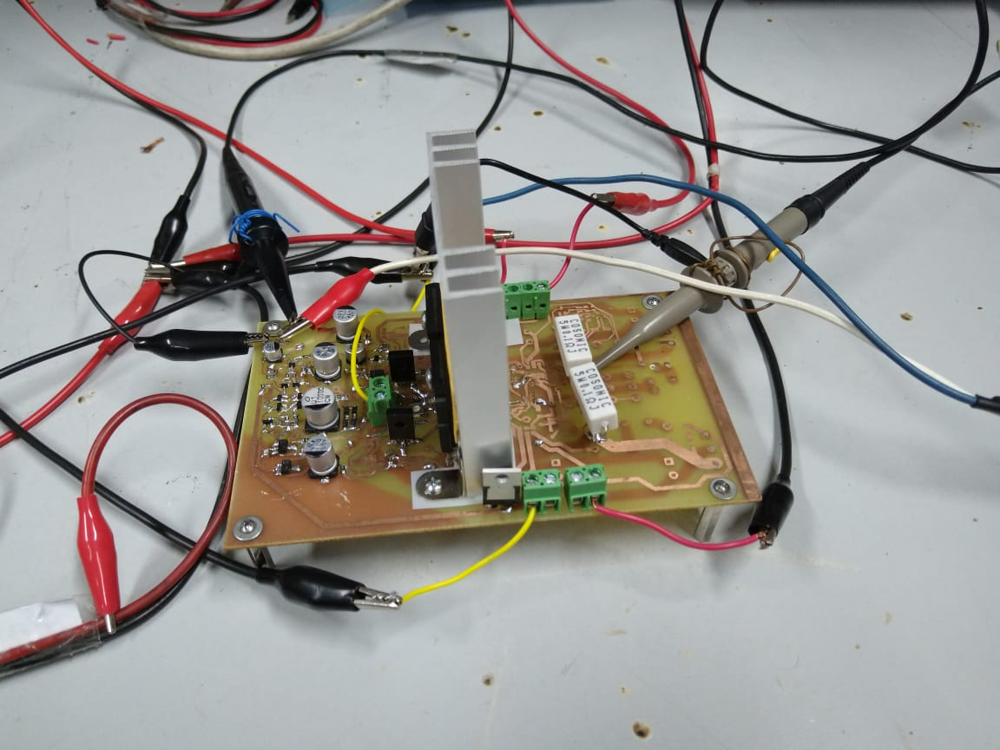
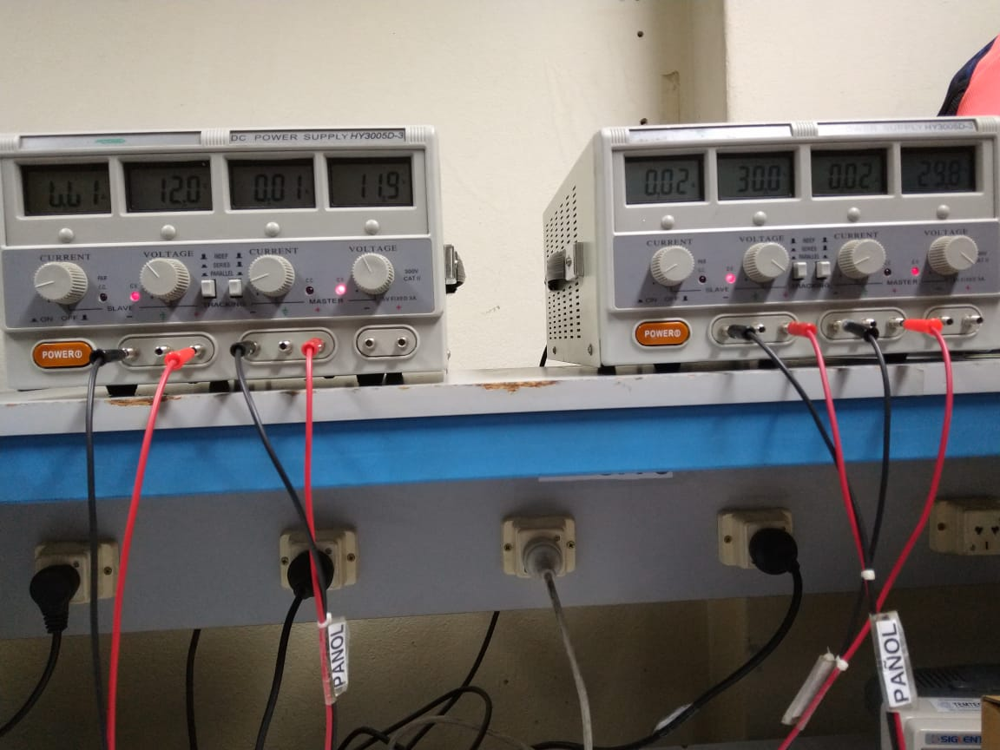
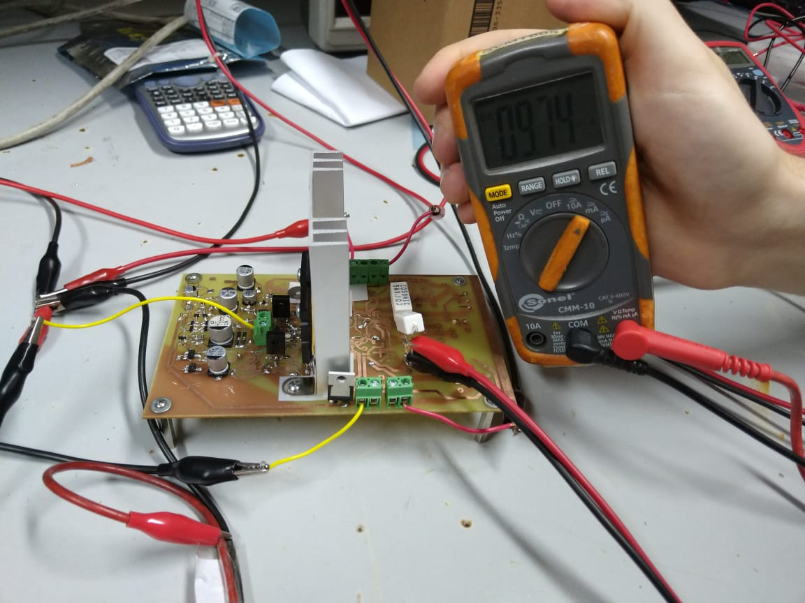
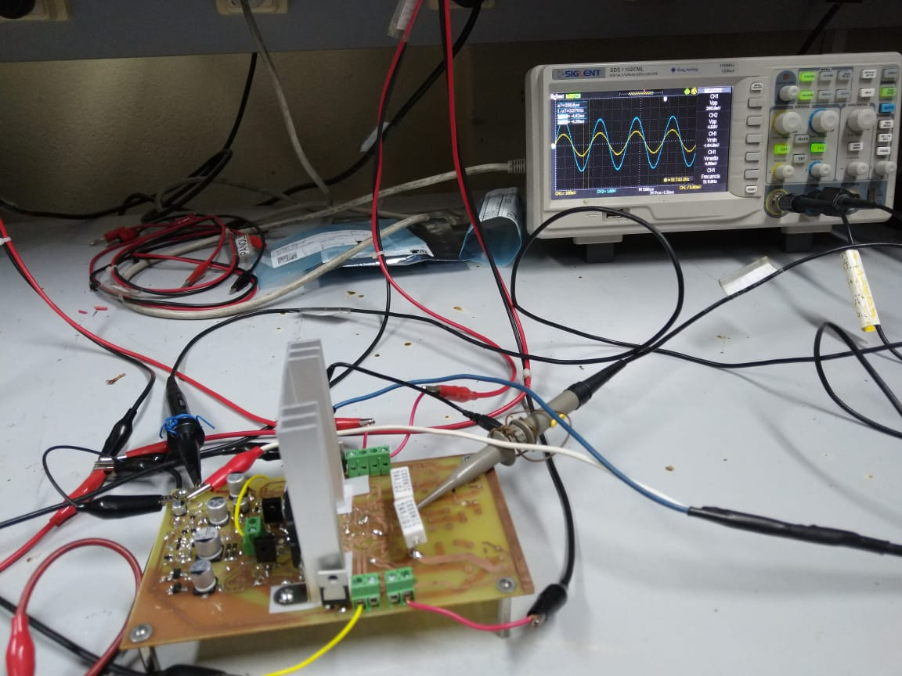
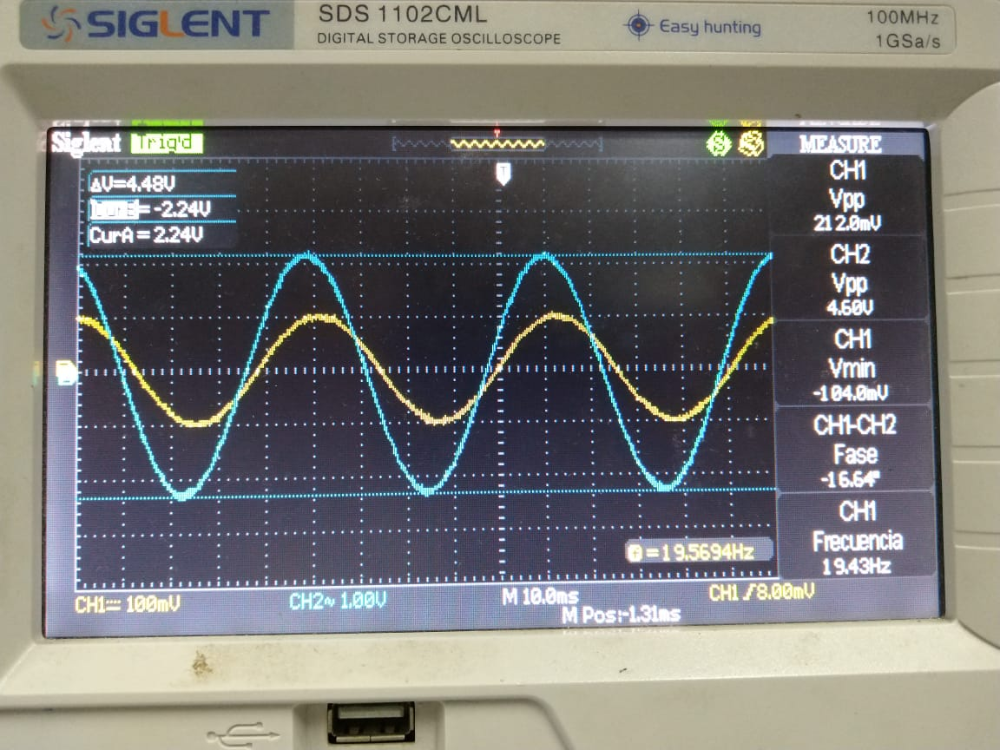
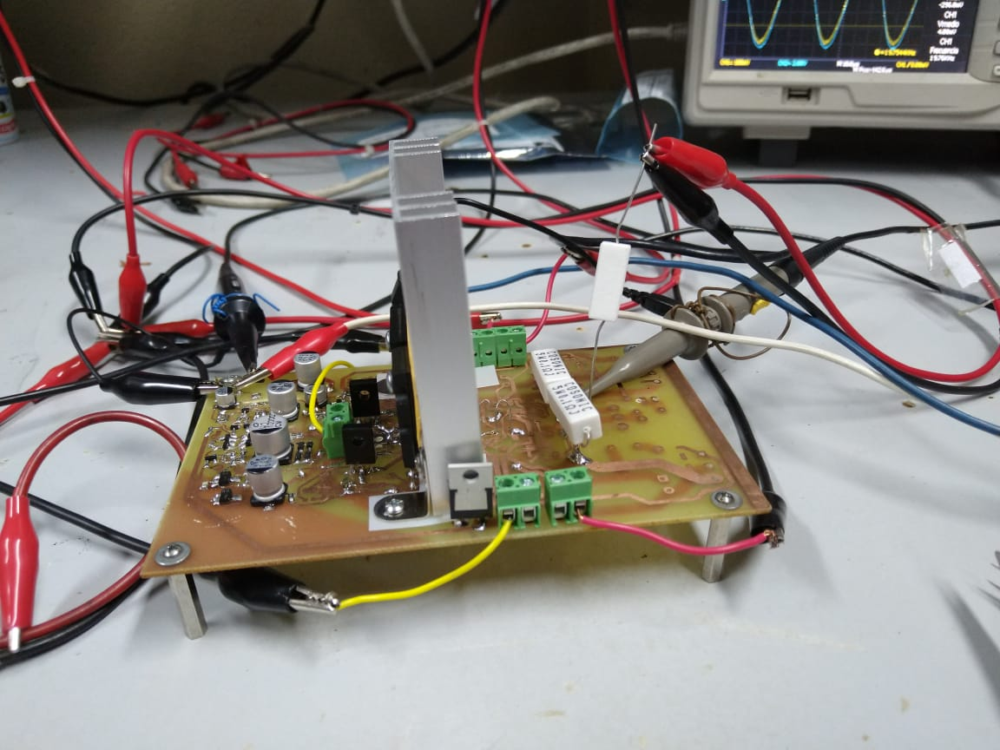
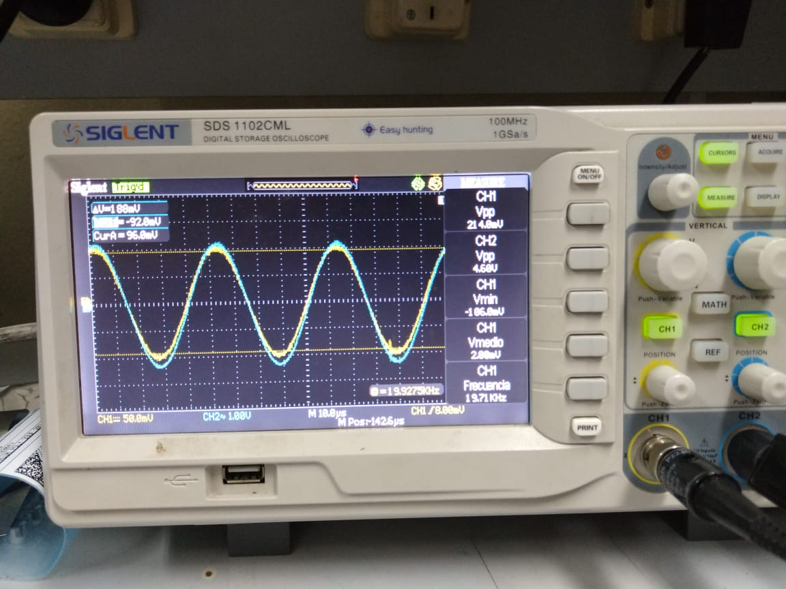
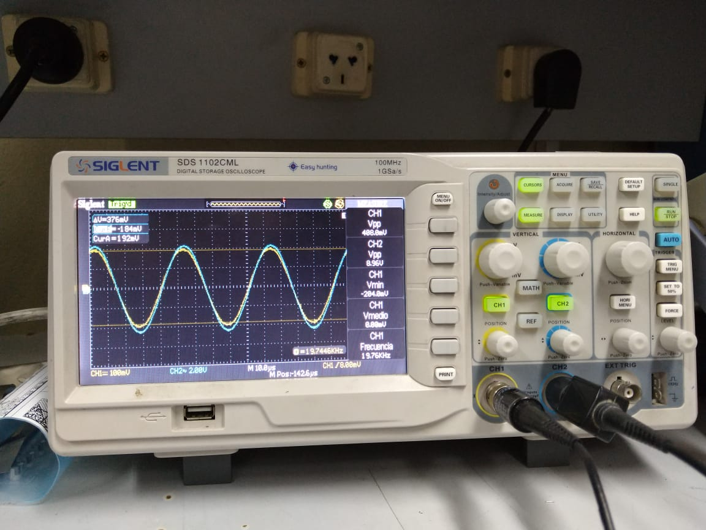
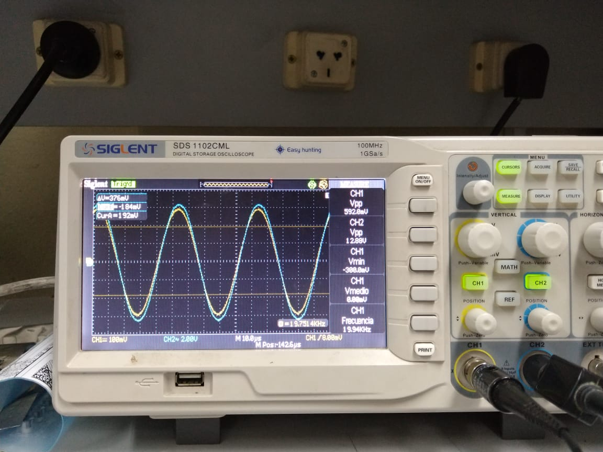

### Mediciones 12/7/19

- Progreso en el armado: se agregaron los transistores alimentados con +Vmin y -Vmin a la etapa de salida. De esta forma, armó un clase B para probar el funcionamiento del sistema sin la conmutación y calibrar el punto de reposo para obtener una corriente de continua en la etapa de salida de aproximadamente 10mA.

  A continuación, se muestra un esquema del circuito armado hasta la fecha:

  

  Y otra de la placa armada:

###### Banco de trabajo

- Instrumental:
  - Multímetros: UNI-T UT33-A, Sonel CMM-10.
  - Osciloscopio: Siglent SDS 1102CML.
  - Fuentes de tensión alta y baja (fuente doble para proveer Vmax y -Vmax): Protomax DC Power Supply HY3005D-3.
  
  En la siguiente foto se muestran los valores de las tensiones de alimentación:
  
  
  
  De ella se extrae que:

Vmax = 29,8V

-Vmax = 30V

Vmin = 11,9V

-Vmin = 12V

###### Punto de reposo

- Se midió la tensión en el nodo de salida y se obtuvo un valor de pocos milivolts para una entrada de 0V, lo cual era esperable.
- Se modificó el potenciómetro del multiplicador de Vbe hasta obtener una corriente de reposo en la etapa de salida de 9.7mA. No se pudo ajustar con mayor precisión a 10mA (como se pretendía en un principió) debido a que el potenciómetro posee pasos discretos. En consecuencia, al desplazarlo al siguiente paso, la corriente obtenida era mayor y mucho más lejana de los 10mA que para 9.6mA.

A continuación, se muestra una imagen del proceso de calibración:

###### Ganancia

Se llevó a cabo un barrido en frecuencia de la ganancia a lazo cerrado del sistema sin carga. El banco de medición se puede ver en la siguiente figura:

Los resultados del barrido se muestran en la siguiente tabla:

| Vin[mVpp] | Vout[Vpp] | Frecuencia | Ganancia | Desfase[°] |
| --------- | --------- | ---------- | -------- | ---------- |
| 204       | 4,48      | 19,5       | 22       | 15         |
| 204       | 4,6       | 47,6       | 22,5     | 7          |
| 190       | 4,52      | 124        | 23,8     | 1          |
| 190       | 4,4       | 485        | 23,2     | 0          |
| 190       | 4,4       | 1k         | 23,2     | 0          |
| 190       | 4,4       | 5k         | 23,2     | 0          |
| 190       | 4,4       | 9,8k       | 23,2     | 0          |
| 190       | 4,4       | 19,7k      | 23,2     | 0          |

Se pudo observar un desfase no despreciable entre las señal de entrada y la salida para frecuencias cercanas a los 20Hz. Esto se deba posiblemente a un desplazamiento de la frecuencia de corte inferior a lazo cerrado hacia frecuencias más altas que la simulada. De este modo, para el rango bajo de frecuencias audibles comienza a apreciarse la rotación de fase y una caída en la ganancia. Sin embargo, el error propio del osciloscopio a la hora de medir la amplitud de la señal podría haber influido en los valores de ganancia medidos. 

A continuación se incluyen una captura del osciloscopio mostrando el desfase de las señales para una frecuencias de aproximadamente 20Hz. El valor del desfase reportado en la tabla anterior fue el calculado automáticamente por el osciloscopio.

barrido-20Hz_12_7_19

###### Prueba con carga

Se conectó una carga de 5,6ohm, 5W a la salida del amplificador y se probó entregarle distintos valores de potencia. El banco de trabajo se muestra en la siguiente imagen:

Se entregaron las siguientes potencias con una señal de 19.7kHz:

- 0,5W

Vin = 214mVpp

Vout = 4,6Vpp

Av = Vout/Vin = 21,5

- 1,8W

Vin = 404mVpp

Vout = 8,96Vpp

Av = 22,2

- 3,7W

Vin = 592mVpp

Vout = 12,88Vpp

Av = 21,8

Captura del osciloscopio:

