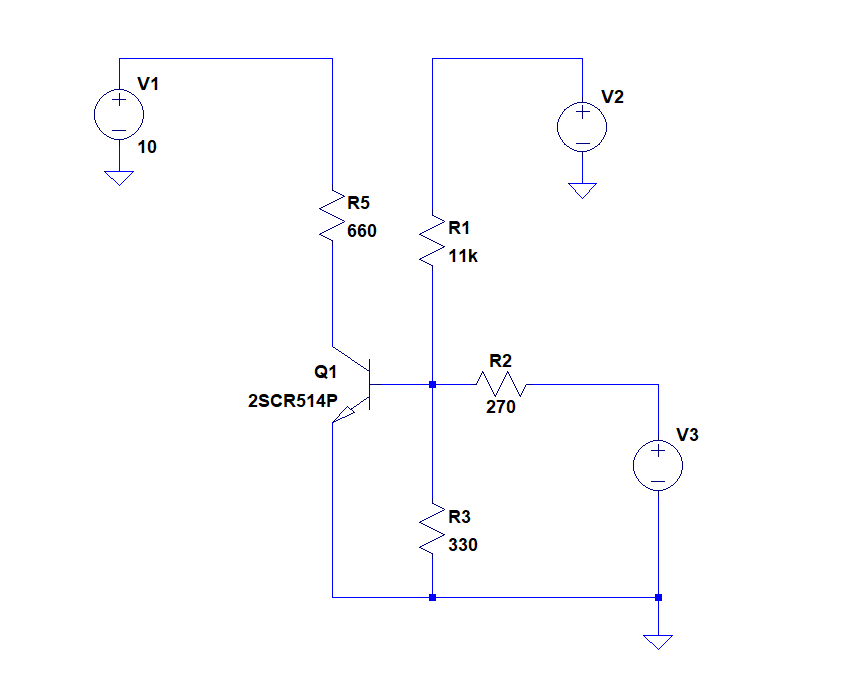
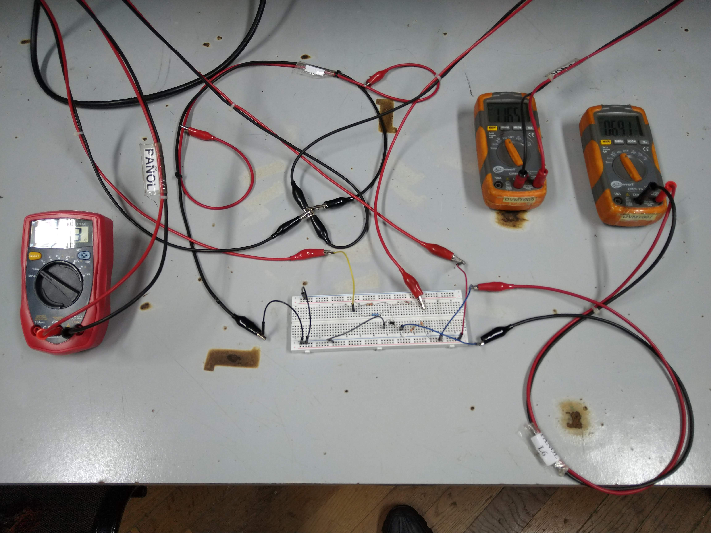
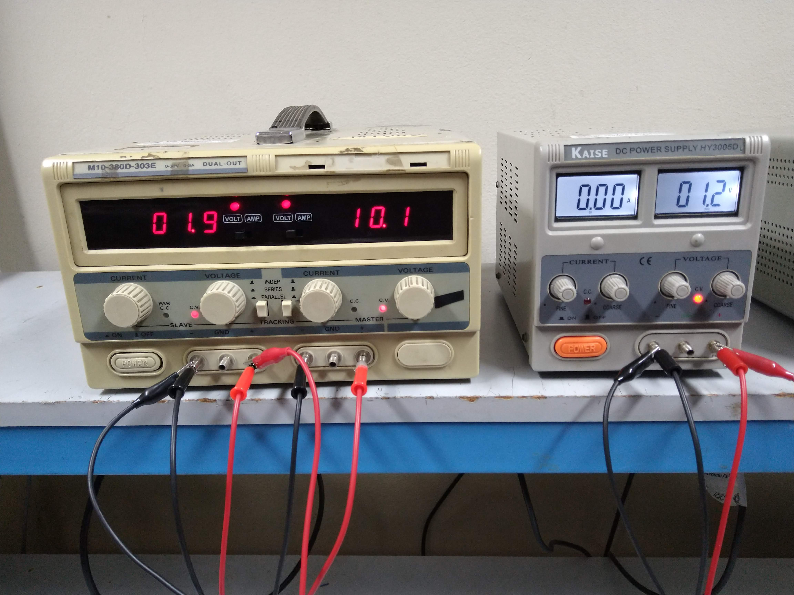
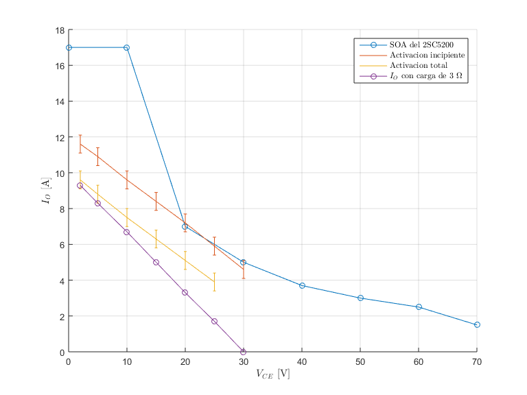

## Caracterización de los limitadores por sobrecorriente

Se procedió a caracterizar la respuesta de los limitadores de sobrecorriente en función de la corriente y la tensión en la carga de la etapa de salida. Para ello se utilizó la misma configuración que la empleada en la simulación que se muestra en [Mediciones_parametros_simulacion.md](../simulaciones_amplificador/Mediciones_parametros_simulacion.md). El circuito fue el siguiente:

Se puede ver que se reemplazó la resistencia de 0,1ohm y el generador de corriente por un generador de tensión equivalente que representa la caida en la primera. Además, la resistencia R5, por ser la disponible en el momento de la medición, fue de 660ohm y no de 750 como en la simulación.

###### Banco de trabajo

- Instrumental:
  - Multímetros: dos múltimetros Sonel CMM-40 y un multímetro UNIT UT33A.
  - Fuentes de tensión V1 y V2:M10-380D-303E.
  - Fuente de tensión V3: Kaise DC Power Supply HY3005D.

###### Mediciones

Se procedió a medir los valores de V3 (según un valor fijo de V2) para el cual se producía la activación incipiente y la activación total del limitador. Esto último estaba indicado por una corriente de 100uA y 10mA en el colector de Q1 respectivamente. Para reconocer esta situación se midió en todo momento la caída en R5=660ohm. De este modo, se buscaron los puntos de Vr5=66mV (activación incipiente) y Vr5=6,6V (activación total). 

Para medir esta última tensión se utilizó el multímetro Sonel CMM-40, cuyo error para las magnitudes medidas es: 1,2% v.m. + 0,002V (v.m. = valor medido). De esta forma, para las mediciones bajo consideración, la cota del error del dispositivo fue de 0,02V. Sin embargo, debido a la tolerancia de la resistencia (5%), la deriva térmica del transistor por su calentamiento y los errores sistemáticos de la medición (sobre todo al buscar los valores Vr5 deseados para notar el resultado de V3), se ha decidido tomar como cota para el error de la medición 0,05V. 

Luego, se procedió a pasar el valor obtenido de V3 a la corriente que circularia por al resistencia de 0,1ohm, que sería I = V3/0,1ohm. Realizando propagación de errores se llega a que el error de medición de dicha corriente es de 0,5A. Este podría ser considerado de una gran magnitud, pero no evita que las mediciones permitan corroborar el funcionamiento del limitador dentro de la región deseada. Se incluido una columna con la corriente que consumiría una carga de 3ohm para el valor de V2 dado con el fin de comporarla con Iactivación, observando que para todo caso la primera es mayor que la segunda, lo cual es apropiado. A continuación se presentan los resultados en una tabla:

| V2[V]     | Error absoluto V2[V] | V3incipiente[V] | Error abs. V3incipiente[V] | V3activacion[V] | Error abs. V3activacion[V] | Iincipiente[A] | Error abs. Iincipiente[A] | Iactivacion[A] | Error abs. Iactivacion[A] | I_3ohm[A] |
| --------- | ---- | --------- | ---- | --------- | ---- | --- | --- | ------ | --- | --- |
| 30        | 0,3  | 0,39      | 0,05 | 0,46      | 0,05 | -   | 0,5 | 4,6    | 0,5 | 0   |
| 25        | 0,3  | 0,51      | 0,05 | 0,59      | 0,05 | 3,9 | 0,5 | 5,9    | 0,5 | 1,7 |
| 20        | 0,2  | 0,63      | 0,05 | 0,72      | 0,05 | 5,1 | 0,5 | 7,2    | 0,5 | 3,3 |
| 15        | 0,2  | 0,75      | 0,05 | 0,84      | 0,05 | 6,3 | 0,5 | 8,4    | 0,5 | 5   |
| 10        | 0,1  | 0,88      | 0,05 | 0,96      | 0,05 | 7,5 | 0,5 | 9,6    | 0,5 | 6,7 |
| 5         | 0,1  | 0,96      | 0,05 | 1,09      | 0,05 | 8,8 | 0,5 | 10,9   | 0,5 | 8,3 |
| 1,96      | 0,02 | 1,16      | 0,05 | 1,16      | 0,05 | 9,6 | 0,5 | 11,6   | 0,5 | 9,3 |

Por otro lado, se ha elaborado un gráfico con los datos de la tabla anterior comparando los resultados obtenidos con la SOA del transistor de potencia y la curva de la corriente consumida por una carga de 3ohm según V2:

Se observa como los valores medios obtenidos tanto de activación incipiente como total se encuentran aproximadamente contenidos dentro de la SOA y son, a su vez, superiores a la recta de la carga de 3ohm. Sin embargo, si se consideran los errores de medición (representados por las barras verticales), esto no se cumple para todo caso. De todas formas, según los criterios expuestos en [Mediciones_parametros_simulacion.md](../simulaciones_amplificador/Mediciones_parametros_simulacion.md) (en la sección relacionada con los limitadores de corriente), esto no comprometería el correcto funcionamiento de las protecciones.

Comparando la anterior imagen con la de las simulaciones, se observa que los resultados han sido similares, corroborándose el funcionamiento de las protecciones según lo previsto. A continuación se muestra la imagen elaborada a partir de las simulaciones:

