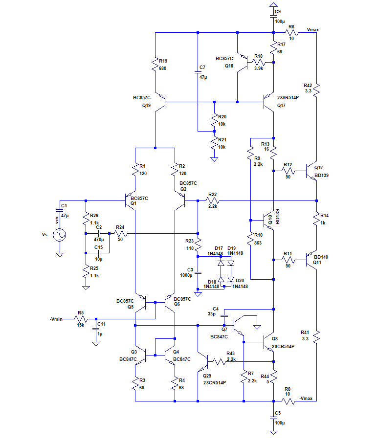
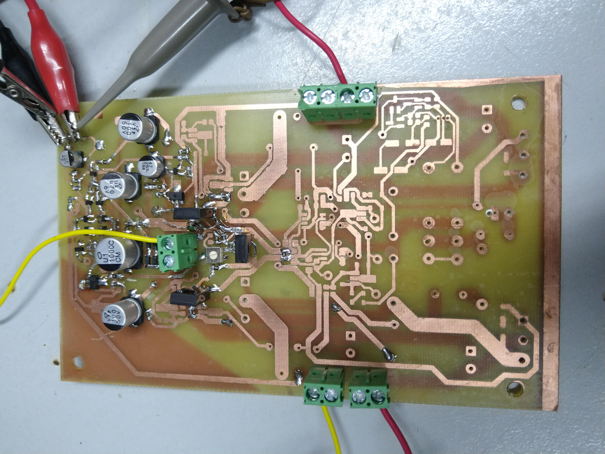
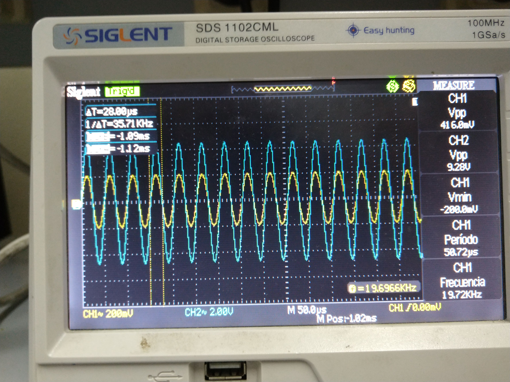

### Mediciones 10/7/19

- Progreso en el armado: se incorporó el "bootstrap" que permite incrementar la impedancia de entrada del amplificador. También se incorporó la etapa de los "drivers" (compuesta por Q11 y Q12) y se la realimentó para observar el comportamiento a lazo cerrado.

  A continuación, se muestra un esquema del circuito armado hasta la fecha:

  

  Y otra de la placa armada:

###### Banco de trabajo

- Instrumental:
  - Multímetro: UNI-T UT33-A.
  - Osciloscopio: Siglent SDS 1102CML.
  - Fuente de tensión baja: Kaise DC Power Supply HY3005D.
  - Fuente de tensión alta (fuente doble para proveer Vmax y -Vmax): Protomax DC Power Supply HY3005D-3.

La configuración del banco de trabajo (salvo para medir la impedancia de entrada), fue la misma que para las mediciones del [5/7/19](Mediciones_amplificador_5_7_19.md).

La fuente de tensión baja (para alimentar el cascode) fue configurada en -12 V (el verdadero valor que se obtendrá de la fuente de switching). 

Las fuente de tensión altas fueron 27,4V y 27,7V respectivamente.

###### Mediciones solo agregando el "bootstrap" y sin los drivers

Una vez colocado el "bootstrap" se procedió a verificar que la polarización del circuito se mantuviera. Esto se corroboró al medir las mismas tensiones en R1 y R2 que cuando no se había colocado el "bootstrap" en la entrada (ver mediciones del [5/7/19](Mediciones_amplificador_5_7_19.md)).

Por otro lado, se realizó un barrido en frecuencia de la impedancia de entrada entre 20 Hz y 20 kHz con el fin de corroborar que esta fuera mayor a 20kohm en todo este rango, ya que esto constituye una de las especificaciones del amplificador. Para ello se colocó en serie con la entrada un resistor de 10kohm nominal (valor medido: 9.6kohm), y se midieron los valores de tensión pico-pico en sus extremos para cada frecuencia. Luego, se determinó la impedancia de entrada del amplificador deshaciendo el divisor resistivo que formaban esta y el resistor de 10kohm.  Los resultados se muestran en la Tabla a continuación:

| Amplitud generador [mVpp] | Frecuencia [Hz] | Entrada [mVpp] | Zin [kohm] |
| ------------------------- | --------------- | -------------- | ---------- |
| 412                       | 20              | 284            | 21,3       |
| 400                       | 48              | 296            | 27,3       |
| 400                       | 78              | 300            | 28,8       |
| 400                       | 191             | 296            | 27,3       |
| 400                       | 484             | 292            | 26         |
| 400                       | 786             | 292            | 26         |
| 404                       | 1k              | 292            | 25         |
| 404                       | 2k              | 292            | 25         |
| 404                       | 5k              | 292            | 25         |
| 408                       | 15k             | 292            | 24,2       |
| 404                       | 20k             | 288            | 23,8       |

Por otra parte, se midió la ganancia a lazo cerrado introduciendo una armónica de 20kHz y 404mVpp a la entrada, obteniéndose 9,2 Vpp a la salida. Entonces, la ganancia a lazo cerrado con el "bootstrap" es de 22,77. En esta ocasión, la ganancia medida coincide con la predicha por la simulación y la especificada.

###### Mediciones con "bootstrap" y "drivers"

Una vez soldados los drivers, se procedió a medir la amplificación del sistema a lazo cerrado. Nuevamente, se introdujo una entrada armónica de 20kHz y 416mVpp. Amplitud a la salida (nodo de la VAS donde se conecta el realimentador en este caso) resultó ser 9.28Vpp. De esta forma, la ganancia a lazo cerrado se redujo a 22.3. Sin embargo, la presencia de R14 introduce asimetrías en el circuito que pueden alterar la ganancia a lazo cerrado. Por lo tanto, esta debería volver a ser la obtenida solamente con el "bootstrap" una vez que se incorporen las etapas de potencia. 

A continuación se muestra una captura del osciloscopio con la medición realizada:

