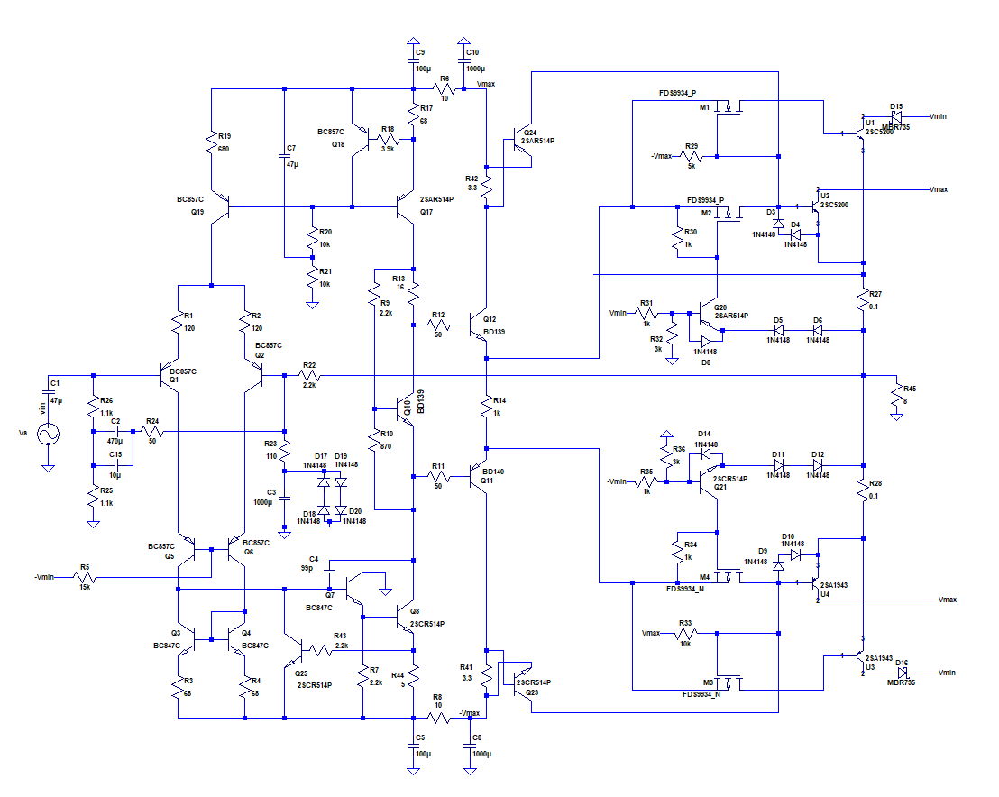
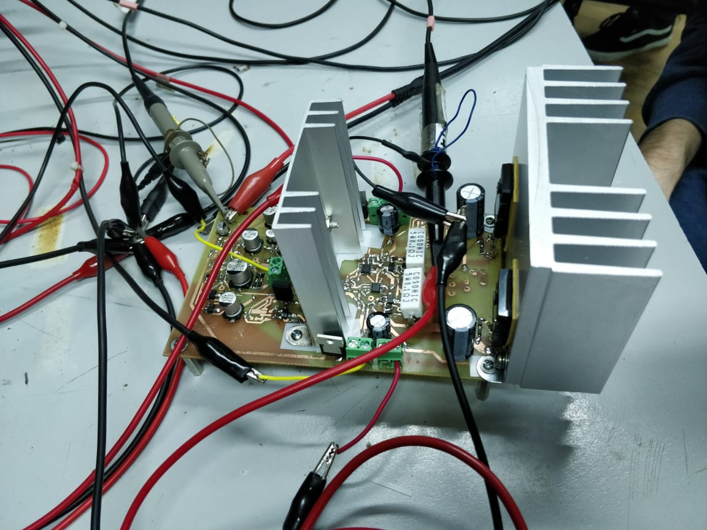
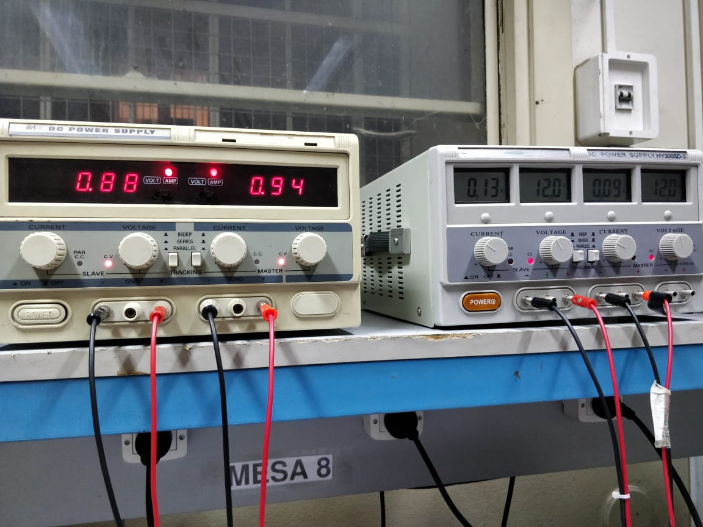
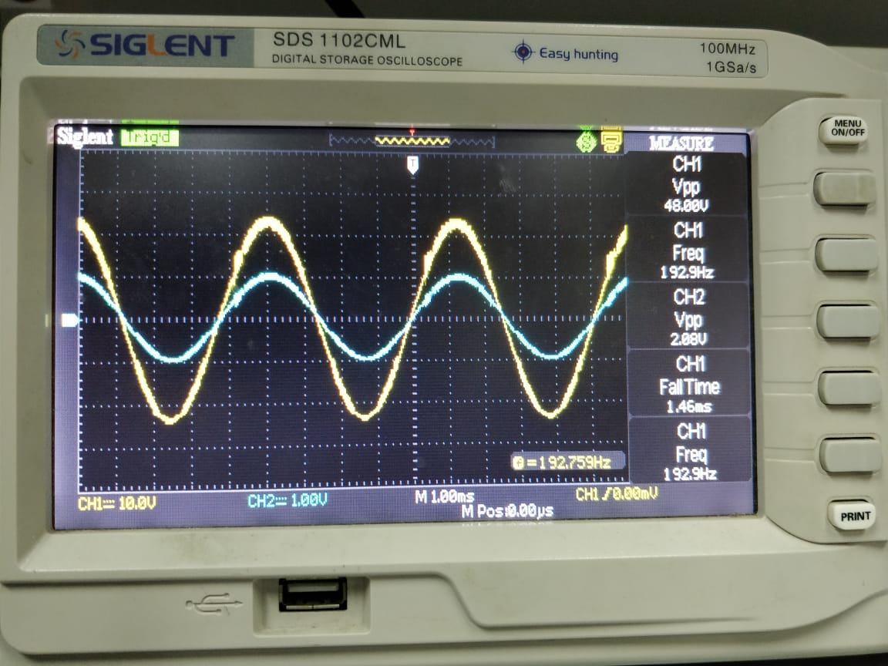
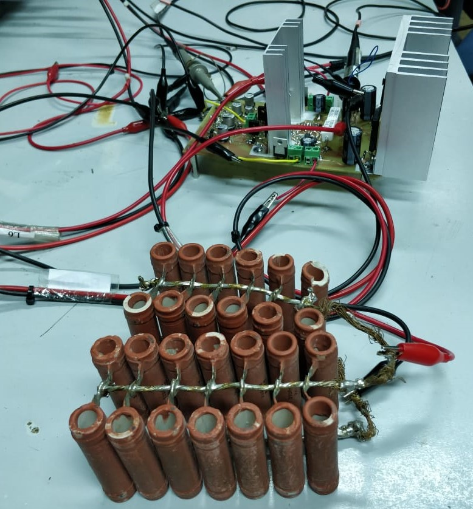
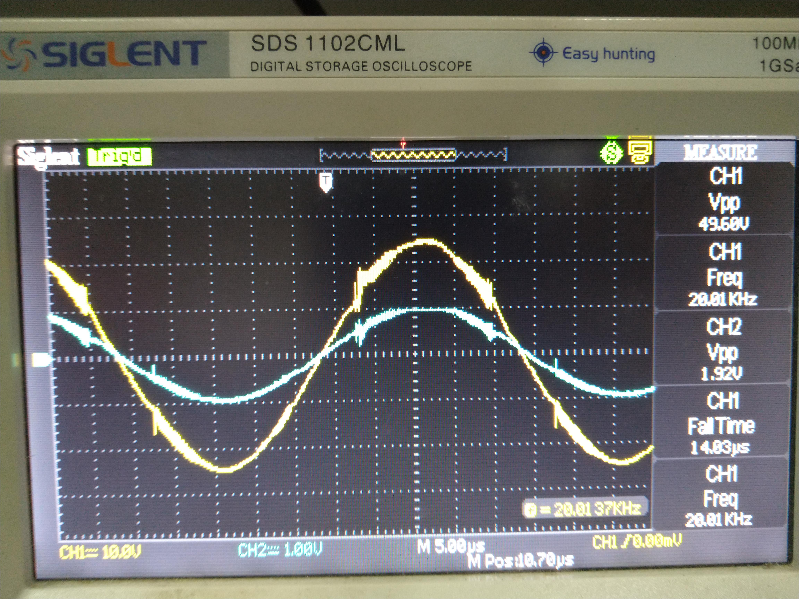

### Mediciones 19/7/19

- Progreso en el armado: se armo la etapa de salida clase H con los conmutadores y se hicieron pruebas para corroborar su funcionamiento.

  A continuación, se muestra un esquema del circuito armado hasta la fecha:

  

  Y otra de la placa armada:

###### Banco de trabajo

- Instrumental:
  - Multímetros: Sonel CMM-10.
  - Osciloscopio: Siglent SDS 1102CML.
  - Fuentes de tensión baja: Protomax DC Power Supply HY3005D-3. No se pudo obtener el modelo de la fuente utilizada para la tensión alta.
  - Generador de señales: Topward Function Generator 8140.
  
  En la siguiente foto se muestran los valores de las tensiones de alimentación:
  
  
  

###### Punto de reposo

- Se midió la tensión en el nodo de salida y se obtuvo un valor de pocos milivolts para una entrada de 0V, lo cual era esperable.

###### Comportamiento

Se probó la respuesta del circuito a señales de salida con valores pico superiores a los 12V y se observaron oscilaciones no despreciables montadas sobre la armónica principal. Dichas oscilaciones se incrementaban a medidas que la frecuencia o la carga aumentaban y se hacían presentes en la parte del semiciclo correspondiente a la operación de los transistores de salida alimentados con +Vmax y -Vmax. 

A continuación se muestra un ejemplo de la oscilaciones con una carga de 1,1kOhm y una señal de 190Hz:

En un  principio, con un capacitor dominante de compensación de 33pF (el del diseño original del circuito) se tenían oscilaciones que generaban picos excesivos de corriente que podían llegar a hace que las fuentes de alimentación externa limitasen la corriente de salida. Al incrementar dicho capacitor a 99pF las oscilaciones se redujeron y se pudo utilizar las fuentes externas sin correr el riesgo de que limitasen la corriente. Sin embargo, dichas oscilaciones, al día de la fecha de este reporte, deben ser eliminadas. 

###### Pruebas con carga de 8ohm

Una vez montados los disipadores de los transistores alimentados con Vmax y -Vmax, se realizaron pruebas con la señal de salida para una carga de 8ohm. A continuación se muestra una imagen del banco de trabajo:

Se introdujo una señal de 20kHz (en el límite superior del rango audible, por lo que dentro de este último es el caso en el que tendrían que generarse las oscilaciones de mayor amplitud y duración en el tiempo) y 950mV pico. Se obtuvieron oscilaciones en toda la región del semiciclo de salida donde operan los transistores alimentados con +Vmax y -Vmax. En la siguiente foto puede ver una captura del osciloscopio midiendo bajo este caso:

