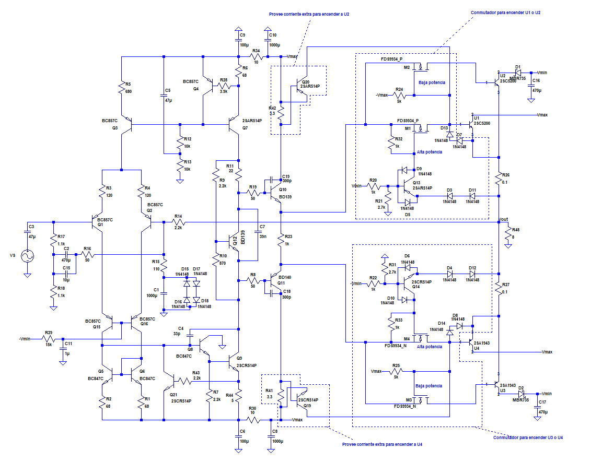
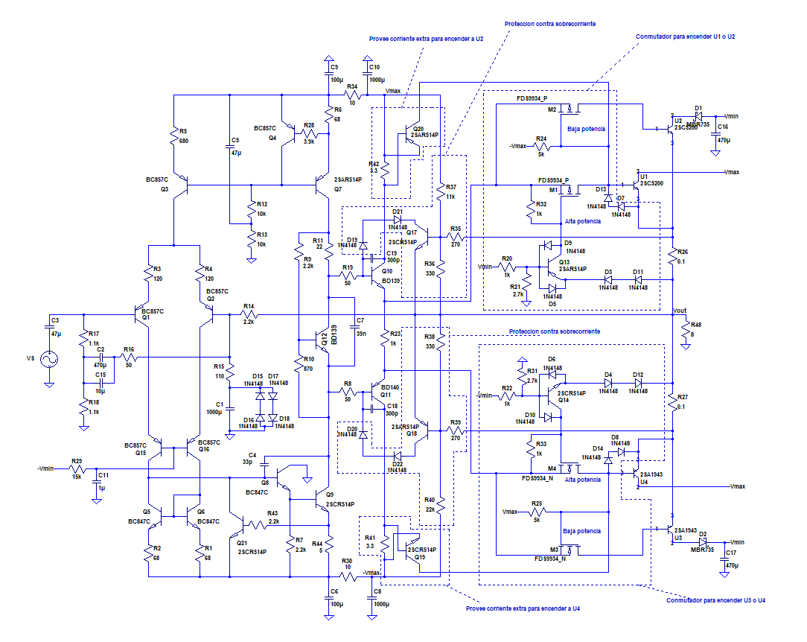
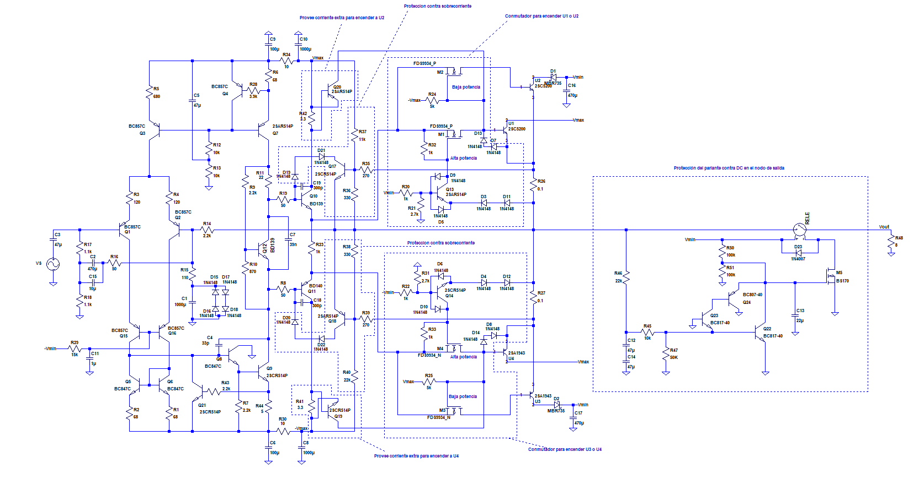
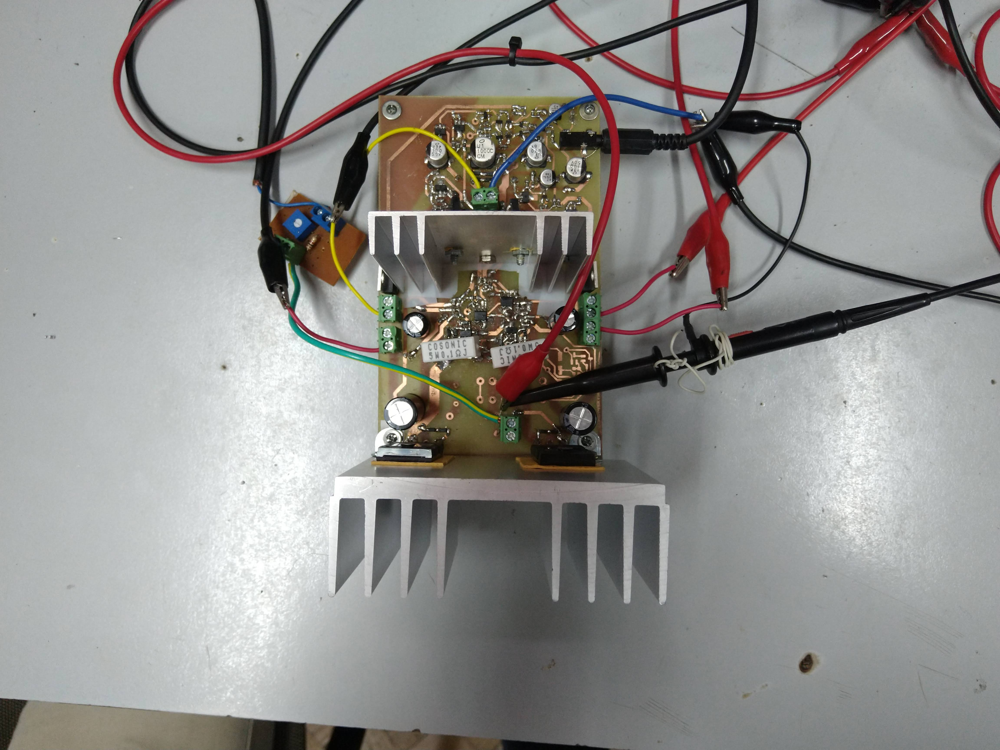
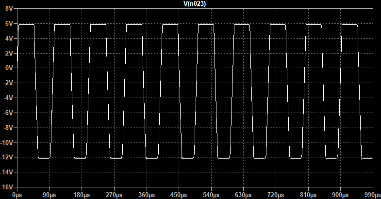
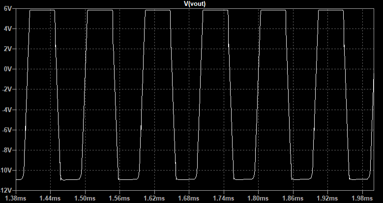

### Mediciones 19/7/19

#### Resumen

Para comenzar se realizaron mediciones de distorsión armónica con el amlpificador del mismo circuito que el de las mediciones del día 19/7/19, pero incluyendo capacitores de 330pF cortocircuitando juntura base-colector de los drivers. Esto se realizó ya que, tanto en la práctica como por simulación, este mecanismo demostró evitar oscilaciones no intencionadas en el circuito que ocurrían al entrarse en zona de conmutación de la etapa de potencia con excursiones en el nodo de salida superiores a los 20Vpp.

A continuación se muestra un esquema con dichos capacitores:

Luego, se procedió a agregar las protecciones por sobrecorriente de la etapa de salida y se realizaron nuevamente mediciones de distorsión. El esquema del circuito sobre el que se medió es:

Por último, se soldó al PCB la protección de DC y se corroboró que su funcionamiento fuera el apropiado, quedando el esquema circuital del siguiente modo:

#### Banco de trabajo

- Instrumental:
  - Osciloscopio: Siglent SDS 1102CML.
  - Fuentes de tensión: Protomax DC Power Supply HY3005D-3.
  - PC con software SprectaPLUS-SC para poder medir la distorsión a la salida del amplificador.
  - Generador de señales: se usó la salida de line-out de la propia PC.

Las mediciones de distorsión fueron realizadas enteramente con una carga de 8ohm.

Se introdujo a la entrada del amplificador la señal proveniente de la salida de line-out de la PC. Por otra parte,  la salida del amplificador fue conectada al puerto de line-in de la PC, colocó de por medio en paralelo un atenuador compuesto por un preset de 100ohm en serie con un resistor fijo de 1kohm (5% de tolerancia). La entrada de line-in fue conectada al nodo entre el preset de 100 ohm (cuyo otro terminal se encontraba puesto a tierra) y la resistencia de 1kohm. Dicho atenuador fue utilizado para que a grandes excursiones de salida no se saturase la entrada de line-in de la PC.

Se incluye una foto del amplificador durante la medición, si la protección de DC: 

Y una foto del amplificador con la protección de DC colocada:

AGREGAR_FOTO

#### Mediciones
A continuación se incluyen los resultados de las mediciones de distorsión para los casos sin limitadores y con limitadores. 

##### Sin limitadores
Los valores obtenidos fueron los más bajos que se logró conseguir luego de variar algunos valores del circuito como su compensación y los resistores que se conectan al gate de los MOSFET  M1 y M3.

Los porcentajes de "potencia a la carga" tabulados son con respecto a la potencia máxima otorgable. 

- Con una señal de 1kHz:

| Potencia a la carga | THD |
| --- | --- |
| 10% | 0.008% |
| 50% | 0.022% |
| 90% | 0.022% |

- Con una señal de 10kHz:

| Potencia a la carga | THD |
| --- | --- |
| 10% | 0.028% |
| 50% | 0.031% |
| 90% | 0.024% |

##### Con limitadores
Como se puede observar en la foto incluida en la sección Resumen, los limitadores se modificaron agregando un diodo extra entre la base de los drivers y el colector de los transistores de protección. Esto se realizó ya que ello impide la activación de los limitadores en el semiciclo de señal opuesto a su correspondiente lado del circuito (es decir, si la protección es de los transistores Q14 y Q16, que entonces no se active durante el semiciclo negativo de señal). De este modo se consiguió evitar que la distorsión aumentarse por el efecto de corrientes no intencionadas circulando por los limitadores. Por otra parte, al resistor R40 se le dió el valor de 22k ya que de ser más bajo (11 o 15 kohm por ejemplo), la distorsión se incrementaba. De todos modos, esto no afecta el carácter protector contra sobrecorriente, y la corriente límite se mantiene por dentro de la SOA para el caso de un cortocircuito (o una carga baja) en el nodo de salida.

Los valores de distorsión obtenidos fueron los siguientes:

- Con una señal de 1kHz:

| Potencia a la carga | THD |
| --- | --- |
| 10% | 0.009% |
| 50% | 0.02% |
| 90% | 0.024% |

AGREGAR CAPTURAS DE LA PANTALLA DE LA PC

- Con una señal de 10kHz:

| Potencia a la carga | THD |
| --- | --- |
| 10% | 0.023% |
| 50% | 0.032% |
| 90% | 0.03% |

AGREGAR CAPTURAS DE LA PANTALLA DE LA PC

Con estos valores se cumplen los objetivos de distorsión deseados en las especificaciones iniciales del amplificador.

##### Corroboración de la funcionalidad de los limitadores
Al hacer una simulación con una entrada de 1,1V al amplificador y una carga de 1ohm, con R40 = 22kohm se obtuvo la siguiente respuesta:

Con lo cual la corriente para el semiciclo negativo limita aproximadamente en los 12A. Esto es menor que los 17A máximos que toleran los transistores, y se encuentran dentro de la SOA ya que la excursión es baja en relación con el máximo obtenible.

Una posible mejora que reduciría ligeramente la corriente máxima a la salida sería conectar el nodo de emisor del transistor de protección Q21 del siguiente modo:

Esto, simulado en LTSpice, reporta la siguiente forma de onda a la salida que, después de un transistorio, converge a una excursión de salida algo menor a la anterior. Además, esto permite reducir la corrente que debe circular por la VAS par que Q21 se active, lo que protege al transistor Q9 de disipar demasiada potencia cuando se activa la protección por sobrecorriente de la etapa de salida.

##### Con protección contra DC en el nodo se salida
Al colocar la protección de DC se logró que el amplificador funcionara sin que el relé se activase para todo el rango de frecuencias audibles a amplitud máxima. 

Se realizaron mediciones para observar cual era la frecuencia mínima con máxima excursión de salida a la cual el relé se activaba, evitando el paso de corriente a la carga. Esto ocurrió para aproximadamente 13Hz. A continuación se incluye una captura de la pantalla del osciloscopio donde se observa que efectivamente hay tensión sobre la carga de 8ohm con una frecuencia de 12,7Hz y una amplitud pico a pico de 44V.

