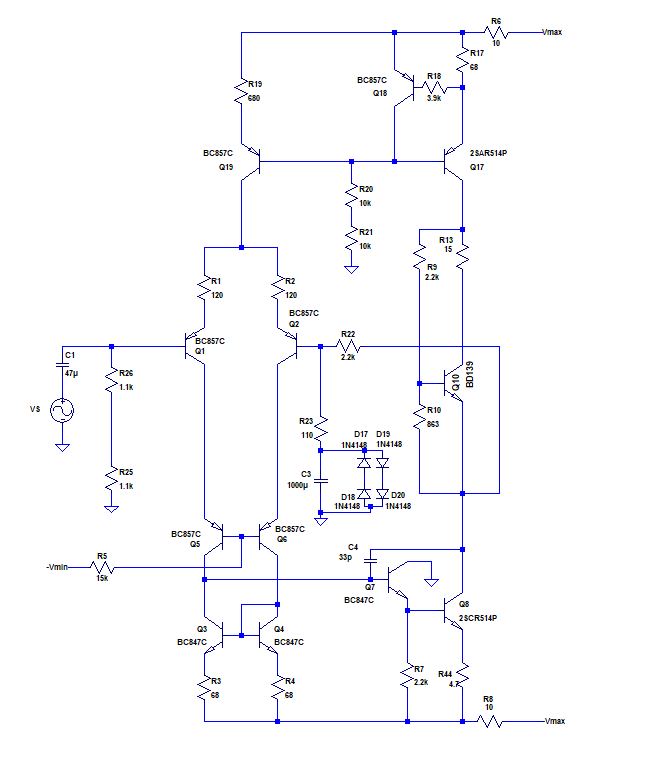
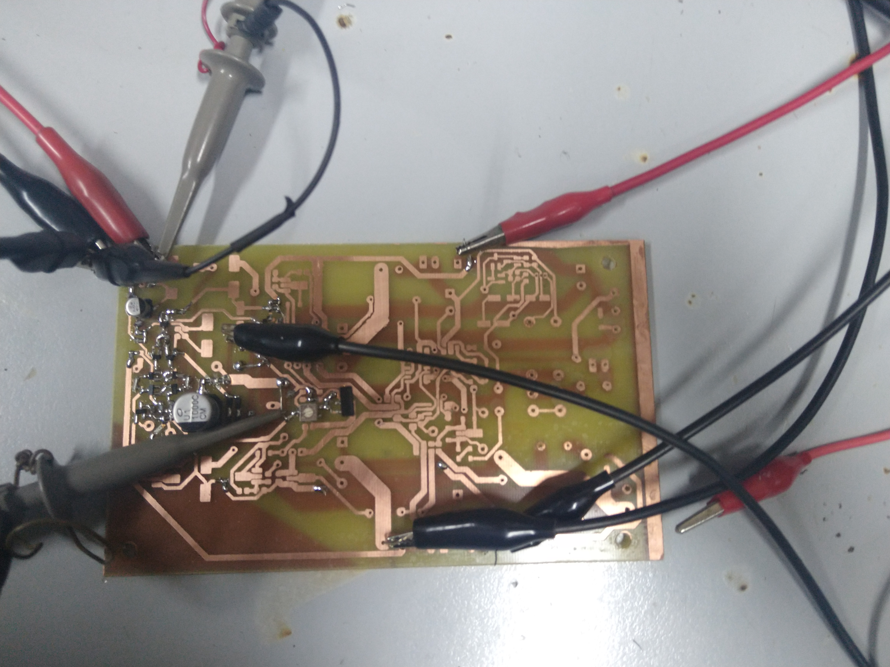
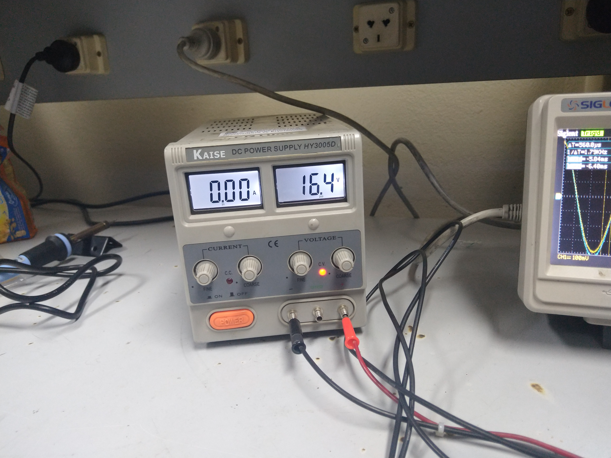
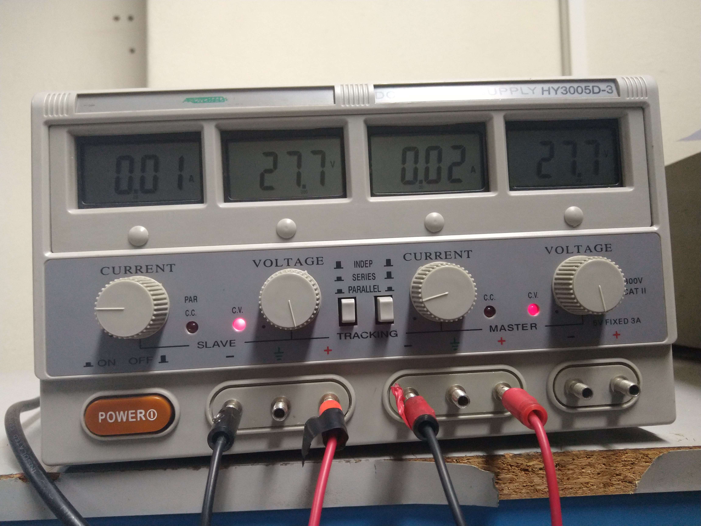

### Mediciones 5/7/19

- Progreso en el armado: se realizó el armado de la etapa etapa diferencial de entrada del amplificador, la VAS y el multiplicador de Vbe.  Se añadió temporalmente una realimentación para estabilizar la tensión en el nodo de colector de Q8 (el que conecta el transistor de la VAS que genera la amplificación de señal con el multiplicador de Vbe). Dicha realimentación no incorpora el "bootstrap" para incrementar la impedancia de entrada en señal (compuesto por C2, C15 y R24).

  A continuación, se muestra un esquema del circuito armado:

  

  Y otra de la placa armada:

- Funcionamiento: se logró polarizar correctamente ambas etapas y se probó la respuesta a una entrada armónica. La señal amplificada que se obtuvo demostró una ganancia ligeramente menor a la estimada teóricamente.

###### Banco de trabajo

- Instrumental:
  - Multímetro: Sonel CMM-40.
  - Osciloscopio: Siglent SDS 1102CML.
  - Fuente de tensión baja: Kaise DC Power Supply HY3005D.
  - Fuente de tensión alta (fuente doble para proveer Vmax y -Vmax): Protomax DC Power Supply HY3005D-3.

A continuación, se muestra una imagen del banco de trabajo:

La fuente de tensión baja (para alimentar el cascode) fue configurada en -16,4V. 

Imagen de la fuente:

Las fuente de tensión altas fueron 27,4V y 27,7V respectivamente.

Imagen de la fuente doble:

###### Mediciones

Se midieron las corrientes en los resistores de degeneración de emisor  de los transistores de entrada de la etapa diferencial (R1 y R2) y se obtuvo:

V_r1 = 54,1 mV

V_r2 = 53,35 mV

Si considerar el error de los dispositivos de medición, y suponiendo que R1 y R2 son idealmente de 120ohm, esto implica que las corrientes del par diferencial son:

I1 = 0.45mA

I2 = 0.44mA

Los cuales poseen un error de menos del 10% con respecto a los valores simulados. 

Por otro lado, se midió la respuesta a una señal senoidal a la entrada con los parámetros: Vpico_pico = 780mV y f = 181Hz. A la salida se consiguió una señal de 16.24 V_pico_pico, lo cual implica una ganancia de Av = 20,8 entre la entrada y la salida. Esta ganancia es menor a los 22,8 teóricos, pero se espera que se incremente una vez que se agregue el "bootstrap" (ya que este disminuye ligeramente el factor de realimentación). A continuación de muestra una captura del osciloscopio (entrada = CH1, señal color amarillo; salida = CH2, señal color azul):

