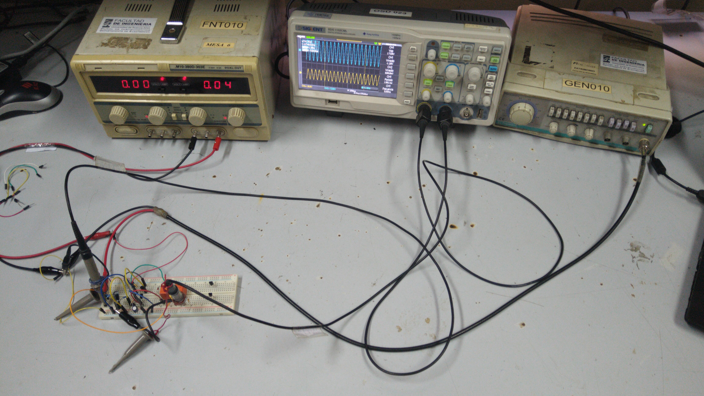
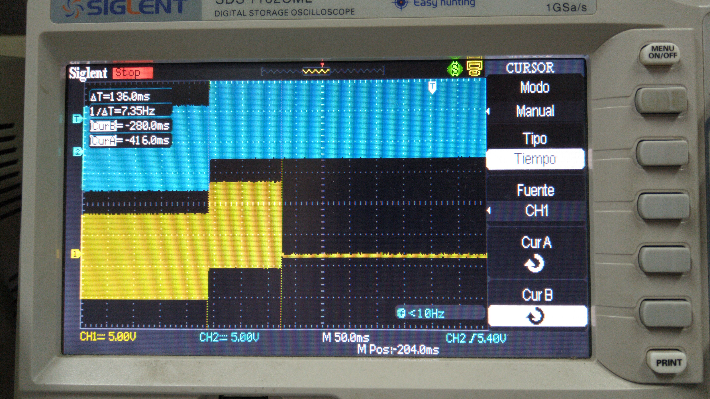
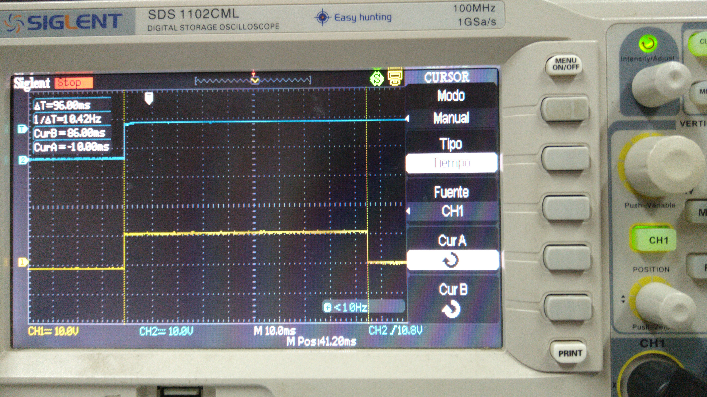
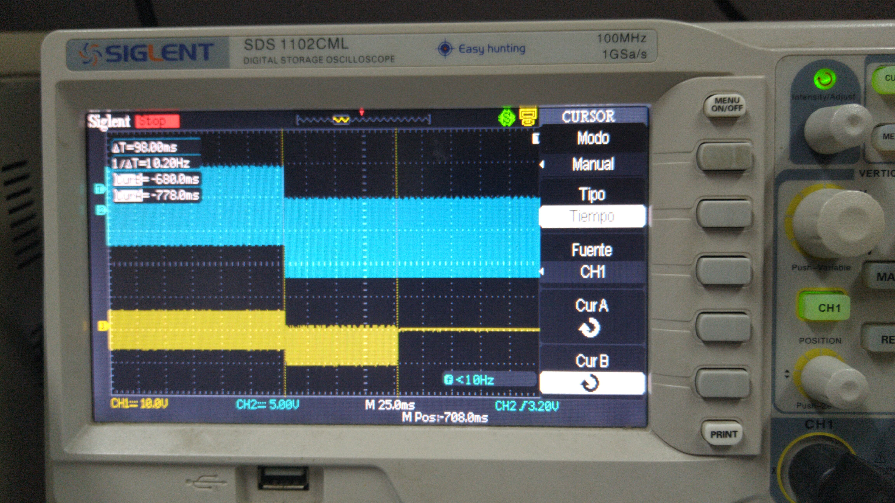
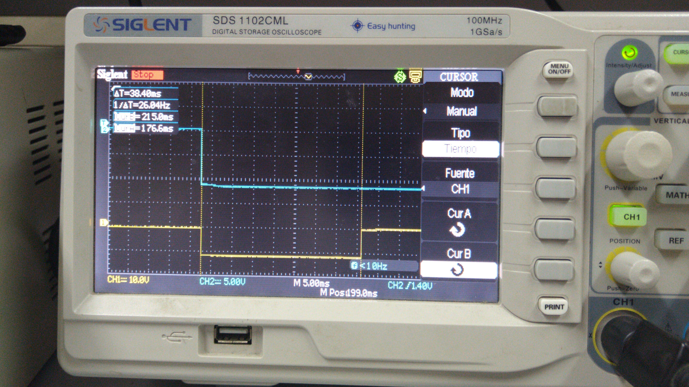

## Caracterización de la proteccion contra DC en el nodo de salida

Se procedió a caracterizar la protección contra DC en el nodo de salida.
El esquema del circuito armado fue el siguiente:

Se utilizó una resistencia de 100kohm como carga para el limitador y se colocó un diodo entre los contactos que activan/desactivan el relé para evitar sobrepicos de tensión ocasionados por el inductor de este último.
 
A continuación, se muestra una foto del circuito elaborado en una placa de prototipado:

### Banco de trabajo

- Instrumental:
 - Generador de funciones: Topward Function Generator 8140.
 - Osciloscopio: Siglent SDC1102CML.
 - Fuente de tensión: M10-380D-303E.

Se incluye una foto del banco de trabajo:

### Mediciones
Se realizaron 4 tipos de mediciones tanto colocando un valor de DC positivo a la entrada del limitador como negativo. Las 4 mediciones fueron:

- Determinación del tiempo de respuesta (tiempo tomado por el relé en abrirse y no dejar pasar señal a la carga) con una señal senoidal con valor medio distinto de 0.
- Determinación del tiempo de respuesta con un escalón.
- Valor mínimo de DC a la entrada del limitador para que este se active.
- Frecuencia mínima a la que se activa el limitador.

#### Mediciones para DC > 0 en el nodo de salida

##### Determinación del tiempo de respuesta con una señal senoidal con valor medio distinto de 0.
Se introdujo a la entrada una señal senoidal de 14Vpp y 1kHz de frecuencia. Luego, se le agregó abruptamente un valor de continua de 5V y se observó en el osciloscopio la señal sobre la resistencia de 100kohm. A continuación se incluye una captura del osciloscopio, donde la señal azul es la entrada, mientras que la amarilla es la salida:

Midiendo el ancho del pulso en la señal amarilla (la elevación que experimenta en su valor medio antes de extinguirse las oscilaciones; correspondiente al tiempo que se demora la protección en actuar), se obtuvo que este fue de 136ms. Este valor es un 13% mayor al hallado por simulación.

##### Determinación del tiempo de respuesta con un escalón.
Se introdujo a la entrada de la proteccipón un escalón de tensión cuyo valor inicial era aproximadamente 0V y su valor final aproximadamente 12V.

Nuevamente se midio la duración del pulso de tensión creado sobre la resistencia de 100kohm y se observó el tiempo de respuesta de la protección:

El tiempo medido fue 96ms.

Si bien hubiera sido apropiado probar con un escalón de 30V de valor final ya que este es el valor máximo de tensión de DC que podría haber en la salida del amplificador en caso de dañarse, no se pudo llevar a cabo esta medición debido a que no se contó con un generador que pudiera proveer tal amplitud. Sin embargo, se puede observar que, a medida que a amplitud en la entrada del limitador aumenta, el tiempo de respuesta se reduce. En consecuencia, el tiempo tomado por el limitador para actuar con una tensión en su entrada de 30V sería de al menos 96ms.

##### Mínimo valor de continua de activación
Se introdujo a la entrada una señal senoidal de 17Vpp y 200Hz de frecuencia. Luego, se pocedió a incrementar su valor de DC desde 0 hasta que la protección se activase. Esto ocurrió para un valor de DC de 1,01V.

##### Frecuencia mínima de activación
Se introdujo una señal senoidal de 23,2Vpp (valor máximo obtenible con el generador disponible) y se redujo la frecuencia hasta hacer que la protección de activara. Esto sucedió para una frecuencia de 5Hz. Esto resultó ser apropiado porque indica que el umbral de activación por frecuencia se encuentra por debajo de las señales de audio. 

Sin embargo, no fue posible realizar la prueba 60Vpp, aproximadamente la mayor amplitud a la salida que fue producir el amplificador.

Si se compara esto con la simulación realizada en [Mediciones_parametros_simulacion.md](../simulaciones_amplificador/Mediciones_parametros_simulacion.md), donde se obtuvo una frecuencia de corte de aproximadamente 6Hz a una entrada de 24Vpp, se observa que los resultados obtenidos en la práctica son similares. Esto da un buen indicio de que, a una amplitud de 60Vpp, se conseguiría una frecuencia de corte similar a la estipulada por la simulación, de 15Hz.

#### Mediciones para DC < 0 en el nodo de salida
Se repitieron las mismas mediciones que para el caso donde el valor de DC era mayor a 0. 
 
##### Determinación del tiempo de respuesta con una señal senoidal con valor medio distinto de 0
En esta ocasión, el valor medio introducido fue de -5V. El tiempo de respuesta obtenido fue de 96ms:

##### Determinación del tiempo de respuesta con un escalón.
Ahora el valor final del escalón fue de -12V. El tiempo de respuesta medido fue: 38,4ms:

##### Mínimo valor de continua de activación
Repitiendo el mismo procedimiento que para cuando el valor de DC era mayor a cero, se obtuvo que ahora el mínimo valor de continua negativo para producir a activación del relé fue de -0,7V.  Esto explica por qué los tiempos de respuesta resultaron ser menores para un valor de continua negativo que uno positivo, ya que el umbral de activación es menor para el primer caso que para el segundo.

##### Frecuencia mínima de activación
Colocando ahora una señal senoidal de 23,2Vpp a la salida, se llegó a que la frecuencia a la cual se activa la protección de es, como máximo, 6Hz. Nuevamente, el valor obtenido fue satisfactorio por los mismos motivos que aplicando un valor de DC positivo.
