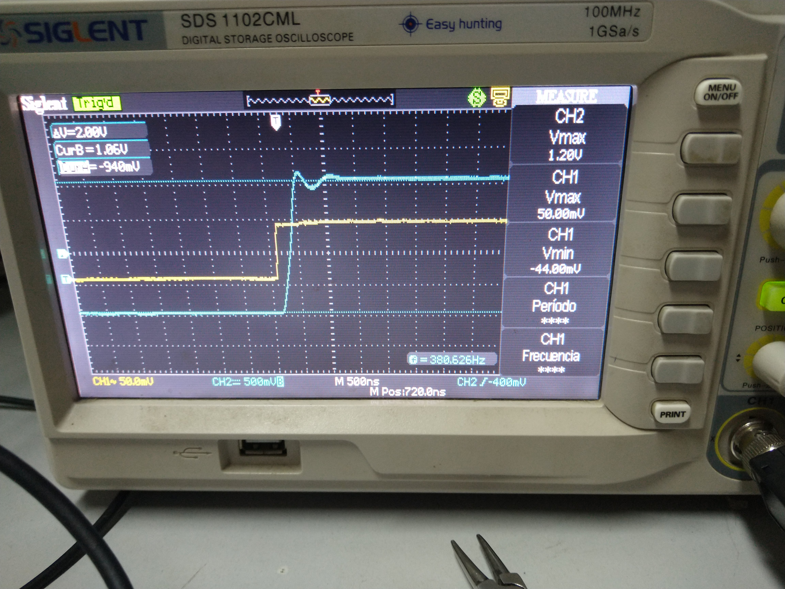

## Mediciones finales del amplificador
En este archivo se incluyen las mediciones finales llevadas a cabo para caracterizar el amplificador.

#### Polarización
Se midieron las corrientes y tensiones de polarización con su respectivo error. Dichas mediciones fueron realizadas con un multímetro Proskit MT-1707 con una incertidumbre de 0,5% + 3 dígitos para las mediciones de tensión continua y 0,5% + 3 dígitos para las de alterna. 

###### Corrientes
| Referencia | Teórico [mA] | Simulado [mA] | Medido [mA] | Error del valor medido [mA] |
| ---- | ---- | ---- | ---- | ---- |
| Ivas/Icq17  | 10,2 | 9,5 | 9 | 0,05 |
| Icola/Icq19 | 1 | 0,98 | 0,87 | 0,005 |
| Icq1 | 0,5 | 0,49 | 0,43 | 0,005 |
| Icq2 | 0,5 | 0,49 | 0,43 | 0,005 |
| Icq3 | 0,5 | 0,49 | 0,37 | 0,006 |
| Icq4 | 0,5 | 0,48 | 0,41 | 0,006 |
| Icq18 | 1,4 | 1,4 | 1,44 | 0,009 |
| Ieq7 | 0,3 | 0,34 | 0,30 | 0,003 |
| Ir14 | 1 | 1,1 | 1,08 | 0,009 |
| IcU1 | 10 | 9,4 | 20 | 0,2  |
| IcU3 | 10 | 9,4 | 20 | 0,2 |

###### Tensiones
| Referencia | Teórico [V] | Simulado [V] | Medido [mA] | Error del valor medido [mA] |
| ---- | ---- | ---- | ---- | ---- |
| Vo | 0 | 0,2m | 0,3m |  |
| VbeQ18 | -0,7 | -0,64 | -0,61 | 0,003 |
| VbeQ17 | -0,7 | -0,62 | -0,56 | 0,003 |
| VbeQ19 | -0,7 | -0,6 | -0,57 | 0,003 |
| VbeQ7 | 0,7 | 0,59 | 0,56 | 0,003 |
| VbeQ8 | 0,7 | 0,63 | 0,58 | 0,003 |
| VbeQ10 | 0,7 | 0,63 | 0,61 | 0,003 |
| VbeQ12 | 0,65 | 0,57 | 0,55 | 0,003 |
| VbeQ11 | -0,65 | -0,57 | 0,57 | 0,003 |
| VbeU1 | 0,5 | 0,56 | 0,54 | 0,003 |
| VbeU3 | -0,5 | -0,54 | -0,54 | 0,003 |

#### Potencia máxima de salida
Se introdujo una señal armónica de 1kHz a la entrada del amplificador y se la aumentó hasta obvervar en el osciloscopio que la señal de salida sufriera un achatamiento producto de una limitación en la excursión. 
La tensioń pico fue medida con un tester Proskit MT1707 de incertidumbre 0.8% + 3 dígitos. 
Esto ocurrió para:

 

Por lo tanto, la potencia máxima obenible sobre una carga de 8ohm s:

 

A continuación se muestra una captura de la meódicin de la potencia máxima obtenible sobre la carga:

 

#### Sensibilidad
Se buscó hallar la tensión de entrada tal que se obtuviera la potencia nominal especificada para una carga de 8ohm. Siendo la potencia nominal igual a 45W, la tensión de entrada obtenida para conseguir dicha potencia fue de:

 

Este valor fue medido con un osciloscopio RIGOL DS1302CA.

Dicho valor transformado a valor eficaz implica que:

 

#### Distorsión armónica
Esta medición fue realizada utilzando el programa SpectraPLUS-RT para PC. Se generó una señal de salida desde el "line out" de la PC, la cual fue introducida a la entrada del aplificador por medio de un cable allado conconectores de 3.5mm. Por otra parte, se hizo pasar a la señal de salida del amplificador a través de un divisor resistivo variable generado con un preset, el cual permitía que las amplitudes de salida de hasta 28V pudieran ser dirigidas a la entrada "line in" de la PC, con el fin de que la distorsión de las señales fuera calculada por el programa SpectraPLUS.

Las mediciones se realizaron con una carga de 8ohm en el amplificador.

Con una armónica de 1kHz:

| Porcentaje de la potencia máxima | Distorsión |
| ---- | -------- |
| 10% | 0,009% |
| 50% | 0,020% |
| 90% | 0,024% |

Con una armónica de 10kHz:

| Porcentaje de la potencia máxima | Distorsión |
| ---- | -------- |
| 10% | 0,023% |
| 50% | 0,032% |
| 90% | 0,030% |

El piso de distorsión medido con SpectraPLUS-RT conectando el line out de la PC a su propio line in fue de 0,006%.

#### Linealidad
Se midió la variación de ganancia del amplificador con la amplitud de la señal de entrada para una frecuencia fija de 1kHz. Las mediciones fueron realizadas con una carga de 8ohm.

El equipo utilizado fue un osciloscopio RIGOL DS1302CA.

A constinuación de muestra una tabla con los resultados y su incertidumbre: 

E(x) reprenta la incertidumbre del parámetro x.

| Vin[V] | E(Vni) | Vo | E(Vo) | Ganancia | E(ganancia) |
| ---- | -------- | --------- | --------- | --------- | --------- |
| 0,13 | 0,004 | 3,1 | 0,04 | 24 | 1 |
| 0,26 | 0,004 | 6,2 | 0,04 | 24 | 0,5 |
| 0,39 | 0,008 | 9,4 | 0,04 | 24 | 0,6 |
| 0,52 | 0,004 | 12,8 | 0,2  | 24,6 | 0,6 |
| 0,65 | 0,004 | 16 | 0,2 | 24,7 | 0,5 |
| 0,78 | 0,008 | 19,6 | 0,2 | 25 | 0,5 |
| 0,92 | 0,02 | 22 | 0,4 | 24 | 1 |
| 1,1 | 0,1 | 26 | 0,4 | 24 | 2,5 |

#### Ancho de banda
Se conectó una señal a la entrada del amplificador y se fue variando su frecuencia para observar el cambio en la ganancia. La medición fue realizada con una carga de 8ohm conectada a la salida.
Las mediciones se realizaron con un osciloscopio RIGOL1302CA de 300MHz de ancho de banda.

Los resultados se muestran en la tabla a continuación:

| Frecuencia[Hz] | Vout[V] | Vin[mV] | Ganancia |
| ---- | -------- | --------- | ---- |
| 2 | 1,1 | 60 | 18,3  |
| 20 | 1,1 | 58 | 19 |
| 200 | 1,1 | 55 | 20 |
| 500 | 1,1 | 55 | 20 |
| 600 | 1,1 | 55 | 20 |
| 1k | 1,1 | 57 | 20 |
| 2k | 1,1 | 55 | 20 |
| 5k | 1,1 | 55 | 20 |
| 10k | 1,1 | 55 | 20 |
| 15k | 1,1 | 55 | 20 |
| 20k | 1,1 | 55 | 20 |
| 30k | 1,1 | 55 | 20 |
| 50k | 1,1 | 46 | 24 |
| 100k | 1,2 | 58 | 21 |
| 200k | 1,4 | 86 | 16 |

Por otra parte, se buscaron las frecuencias de corte inferior y superior observando los puntos donde se producía un desfase de 45° entre la señal de entrada y la de salida. Ambas mediciones se hicieron con el modo de captura del osciloscopio como promediador de 32 muestras.

Por último, la ganancia resultó ser aproximadamente de 20 para estas mediciones, lo que la hace menor a los valores medidos para linealidad y los estimados teóricamente y por simulación, aunque aproximadamente constante a lo largo del todo el ancho de banda. Se atribuye esto a un error sistemático de medición, que aun así permite conocer el alcance del ancho de banda del amplificador.

##### Frecuencia de corte baja
No se llegó a observar la frecuencia de corte inferior debido a que el relé de la protección contra DC actuaba y desconectaba a la carga del amplificador. Sin embargo, se llegó a observar que a 2Hz todavía no se producía la rotación de fase de 45°. Esto es suficiente como para afirma que la frecuencia de corte inferior se halla por debajo de los 20Hz, que es lo que se desea.

Foto de la pantalla del osciloscopio con una señal de 2Hz:

 

##### Frecuencia de corte alta
Dado que conseguir amplitudes menores con el generador de entrada no era posible, para frecuencias mayores a los 200kHz se comenzó a notar el efecto del slew rate. Es por esto que resultó dificil observar la frecuencia donde se daba el desfase de 45° con claridad. Sin embargo, esta se estimó en 550kHz, según como se ve en la imagen:

 

En la tabla agregada más arriba en esta sección se han removido los casos mayores a 200kHz debido a que la deformación en la señal de salida impedía obtener valores coeherentes de ganancia.

#### Slew rate
Se colocó una señal cuadrada a la entrada del amplificador y se observó la señal de salida. Debido a que el ancho de banda de potencia se encuentra limitado por el slew rate, por encima de cierta frecuencia de la cuadrada (con una amplitud lo suficientemente grande) se podrá ver que su pendiente a la salida es constante y de un valor que permite conocer el slew rate.

Las mediciones se realizaron con una carga de 8ohm y una señal de entrada de 20kHz. El osciloscopio empleado fue un RIGOL1302CA de 300MHz de ancho de banda.

Para una amplitud de entrada de 300mVpp (de forma que el amplificador no comutase) se obtuvieron los iguientes valores de slew rate:

-  
-  

Medicion del SR+ sin conmutar:
 

 

Medicion del SR- sin conmutar:
 

 

Y con una amplitud de entrada de 1,85Vpp (de modo que el amplificador sí conmutase):

-  
-  

Medicion del SR+ conmutando:
 

 

Medicion del SR- sin conmutando:
 

 

En las imagenes se ve que la comutación complica la adopción de un criterio para definir cual es el slew rate. Es por esto que resulta complicado adoptar un criterio para determinar la incertidumbre de la medición, por lo que se interpreta a los valores obtenidos solamente como una aproximacioń al verdadero valor del slew rate.

#### Ancho de banda de potencia
De los valores medidos del slew rate se extrae, por el mismo método que el utilizado en los cálculos teóricos del amplificador, que el ancho de anda de resolución en conmutación y fuera de conmutación es:

- Sin conmutación:  
- En conmutación:  

Donde para cada caso se ha utilizado el peor slew rate, que en ambos resultó ser el del flanco ascendente. Además, se ha aproximado a la excursión máxima del amplificador como de 30V (aunque se ha concluido de las mediciones que esta no supera los 28V).

Notar que para el ancho de banda de potencia en conmutación no se ha reportado una incertidumbre por el hecho de que tampoco pudo hacérselo con seguridad en el apartadoa de SR. Finalmente, la incertidumbre para el caso sin conmutación resulta ser elevada y se deriva de la propagación de errores que se realizó. Sin embargo, dado que se llevaron a cabo varias mediciones del slew rate a lo largo del armado y puesta a prueba del amplificador, se confía en que el ancho de banda de potencia sea mayor a 40kHz.

#### Impedancia de entrada
Para medir la impedancia de entrada (que en adelante trataremos como resistencia de entrada debido a que se supondrá para los cálculos que esta es real) del amplificador se conectó en serie entre el generador de señal y la entrada en sí una resistencia de 9,9kohm como se muestra en la siguiente imagen:

 

Se utilizó dicho valor de resistencia ya que se encuentra en el mismo orden de magnitud que se espera que tenga la resistencia de entrada.

Colocando una armónica dentro del rango de frecuencias audibles como señal de entrada y comparando su valor pico o RMS con el de la misma armónica observada en el nodo entre la entrada del amplificador y la resistencia de 9,9kohm es posible despejar el valor de la resistencia de entrada de la siguiente forma:

 

La mediciones de las tensiones se realizaron con un multímetro Proskit MT1707 True RMS con una incertidumbre de 0.8% + 3 dígitos. A continuación se muestra una tabla con la resistencia de entrada medida entre 100Hz y 20kHz. No se logró alcanzar valores más bajos en frecuencia debido a que el generador experimentaba problemas para proveer una amplitud constante.

E(X) representa la incertidumbre del paŕametro X.

| Frecuencia[Hz] | Vin[mV] |  E[Vin][mV] | Vn[mV] | E[Vn][mV] | Rin[kohm] | E(Rin)[kohm] |
| ---- | -------- | ---- | --------- | ---- | --------- | ---- |
| 100 | 103 | 2 | 76 | 2 | 27 | 5 |
| 200 | 101 | 2 | 77 | 2 | 34 | 5 |
| 300 | 101 | 2 | 76 | 2 | 30 | 5 |
| 400 | 101 | 2 | 74 | 2 | 27 | 5 |
| 500 | 100 | 2 | 73 | 2 | 26 | 5 |
| 1k | 96 | 2 | 69 | 2 | 25 | 5 |
| 2k | 102 | 2 | 73 | 2 | 25 | 5 |
| 3k | 100 | 2 | 70 | 2 | 23 | 5 |
| 5k | 103 | 2 | 73 | 2 | 24 | 5 |
| 8k | 103 | 2 | 73 | 2 | 24 | 5 |
| 10k | 103 | 2 | 73 | 2 | 24 | 5 |
| 15k | 103 | 2 | 72 | 2 | 23 | 5 |
| 18k | 103 | 2 | 73 | 2 | 23 | 5 |
| 20k | 102 | 2 | 71 | 2 | 22 | 5 |

Se ve que la incertidumbre en las mediciones es grande producto de la cancelación que se da en el denominador de la expresión que se mostró anteriormente para realizar los cálculos.

#### Impedancia de salida

La medición de la impedancia de salida del amplificador consistió en suponer que este se comporta a su salida como el siguiente equivalente:

Donde Vg es función de señal de entrada del amplificador y Zo es su impedancia de impedancia de salida, la cual se desea hallar. En la imagen se han incluido resistencias para representar a las impedancias ya que para la medición se asumirá que estas son reales.  Al colocar una carga ZL se obtiene la situación:

Donde la tensión de salida Vo queda expresada por el divisor de tensión:

Y de allí puede despejarse la impedancia de salida como:

Colocando una señal armónica de entrada de amplitud determinada en el amplificador y dejando abierta su salida (sin carga), en el nodo de salida se mide tensión Vg (para esa dada tensión de entrada) ya que no hay corriente por la malla de la primera figura. Luego, con la misma señal de entrada del amplificador y colocando una carga ZL de forma de cerrar la malla en el nodo de salida se mide la tensión Vo para esa dada carga. Asumiendo que Vg se mantuvo igual para el segundo caso, se puede despejar Zo de la segunda ecuación. Para esta medición se supuso, además, que la impedancia de salida del amplificador es real.

Las condiciones de la medición fueron:

- Amplitud de entrada del amplificador 250mV
- Frecuencia de la señal de entrada: 1kHz.
- Carga de 9ohm medida con multímetro Proskit MT1707. La incertidumbre del multímetro para esta medición es de 0.8% + 3 dígitos, entonces:

El instrumento utilizado para medir las tensiones fue un multímetro Proskit MT1707 y se midieron tensiones RMS. Los resultados fueron, sin considerar en un principio sus incertidumbres:

Vg = 3,939V

Vo = 3,934V

Los cual, con una carga de 9ohm da un valor de impedancia de salida Zo = 11mohm.

Sin embargo, la incertidumbre del multímetro para el rango utilizado fue de 0.8% + 3 dígitos. Esto implica que la incerteza para Vg y Vo fue aproximadamente de:

Lo cual es un orden mayor a la diferencia obtenida entre Vg y Vo, por lo que el error haría que la medición no fuera representativa. Para suplir esto se calculó el peor caso (la impedancia de salida más grande) de un intervalo de confianza, donde Vg y ZL fueran lo más grande posible dentro de sus rangos de incertidumbre y Vo lo más pequeña posible. De esta forma, se llega a que el peor caso de la impedancia de salida es 0,18ohm = 180mohm.

#### Factor de amortiguamiento

El factor de amortiguamiento viene dado por:

Con el valor medio de la impedancia de salida obtenido en el apartado anterior y su cota máxima se llega a los siguientes valores de factor de amortiguamiento para cargas de 4ohm y 8 ohm:

|      |F_amort_med | F_amort_max |
| ---- | -------- | --------- |
| 8ohm | 727      | 44        |
| 4ohm | 364      | 22        |

#### Overshoot de respuesta al escalón
Se introdujo una señal cuadrada a la entrada del amplificador tal que a la salida se produjeran escalones de 2V aproximadamente con el fin de observar el overshoot y el ringing ocasionados. A continuación se muestra una captura de la medición:

 
 
En la imagen se observa que el sobrepico es de 200mV aproximadamente, lo que denota un overshoot del 10%. A su vez, se llega a observar un poco más de un ciclo y medio de oscilación (ringing) sobre la cuadrada. Esto lleva a concluir que el margen de fase se ha de encontrar cercano a 60° pero algo menor, ya que dicha condición exige un overshoot del 10% y un solo ciclo completo de oscilación.

#### Eficiencia
Se conectaron multimetros en modo amperímetro en la salida de las fuentes de +30V y +12V, mientras que se midió la amplitud RMS de salida con un osciloscopio. De esta forma, variando la amplitud de salida se fue relevando la eficiencia para distintos valores de excursión.
La potencia entregada por cada fuente de puede calcular como:

 

Y la potencia entregada a la carga se calcula como:

 

Teniendo en cuenta que hay dos fuentes de cada valor de tensión (una positiva y otra negativa), y asumiendo que ambas entregan la misma corriente, se tiene que la potencia total entregada por todas las fuentes es:

) 

Y la eficiencia se calculó finalmente como:

 

A continuación se muestran fotos del banco de trabajo con los dos multímetros:

 

 

Finalmente, los valores relevados fueron:

| V_carga_rms [V] | I_avg_12V [A] | I_avg_30V [A] | P_fuentes [W] | E(P_fuentes) [W] | Eficiencia |
| ---- | -------- | --------- | --------- | --------- | --------- |
| 3,0 | 0,08 | 0,03 | 3,7 | 1 | 26% | 
| 4,0 | 0,10 | 0,03 | 4,2 | 1 | 41% |
| 5,0 | 0,12 | 0,03 | 4,7 | 1 | 57% |
| 6,5 | 0,32 | 0,03 | 5,4 | 1 | 56%  |
| 7,0 | 0,34 | 0,03 | 5,6 | 1 | 55% |
| 8,3 | 0,10 | 0,21 | 15,0 | 3 | 49% |
| 10,0 | 0,08 | 0,33 | 21,7 | 3 | 49% |
| 11,1 | 0,08 | 0,40 | 25,9 | 3 | 51% |
| 14,8 | 0,06 | 0,60 | 37,4 | 3 | 63% |
| 17,2 | 0,05 | 0,73 | 45,2 | 3 | 70% |
| 19,0 | 0,05 | 0,81 | 49,8 | 3 | 77% |

La carga para todas las mediciones fue de 9,3ohm.
E(x) representa la incertidumbre del parámetro X.

Para las mediciones donde la tensión RMS sobre la carga era 6,5 y 7V se midió la corriente utilizando el display de la fuente de la laboratorio (UNI-T  UTP3315TFL) ya que los multímetros reportaban valores medios de corriente que derivaban en que la eficiencia calculada fuera superior al 80% y 90% en cada caso respectivamente; lo que no tenía sentido ya que la eficiencia máxima que se puede alcanzar en un clase B (que es como se comporta el amplificador al no estar conmutando, como con 6,5V y 7V RMS a la salida) es 78%. El hecho de utilizar el display de la fuente incrementó considerablemente la incertidumbre. Sin embargo, sa una noción de como la eficiencia del amplificador aumenta a medida que la amplitud de salida se acerca hacia el umbral de conmutación (carca de 7V RMS), para luego disminuir por la activación de las fuente de 30V. A continuación, a medida que se sigue aumentando la tensión de salida, la eficiencia vuelve a aumentar, ya que la corriente que proveen las fuentes de 12V comienza a ser despreciable frente a las de 30V, y la eficiencia se comienza a asemejar a la de un clase B nuevamente.

Se ve que la eficiencia máxima que alcanza el amplificador es 77%, ocurriendo para la máxima excursión de salida como es de esperarse.

Finalmente, para todas las mediciones de corriente mayores a 0,1A se asumió que la incertidumbre de las mediciones era de 0,05A producto de las incertidumbre de utilizar la escala de 10A del los multímetros. Para menores valores de corriente se despreció la incertidumbre porque predominaba la de la corriente de la otra fuente. Con este criterio se calculó la incertidumbre de la potencia provista por las fuentes.

#### PSNR
Para la medir la PSNR del amplificador se utilizò la documentación recomendada: [Medición de Rechazo de Ruido de la Fuente](mediciones_finales/Medición_de_Rechazo_de_Ruido_de_la_Fuente.pdf). La idea es colocar un generador de _ripple_ y sumarlo a la alimentación positiva del amplificador. El circuito se observa a continuación:
 
De esta manera se tiene una alimentación de +30V con rizado. 
En la siguiente figura se observa el resultado de la medición:
 
Ambos canales son acoplados en alterna. La amplitud de rizado máxima lograda es de 1Vpp a 10Hz, debido a los capacitores de _bypass_ del circuito del amplificador.  Debido a esto, la amplitud en la salida es de menos de 1mVpp. El rango minimo del oscilloscopio usado (Siglent SDS 1102CML) es de 2mV. Por ende, el valor calculado cuanta con mucha dispersión, pero sirve para marcar una cota. 
Según lo medido, se calcula la PSNR como:
)
Con esto se obtiene:

Esto es màs bien una cota inferior de la PSNR, ya que con mejores instrumentos se podría medir con mas detalle el valor del _ripple_ a la salida.