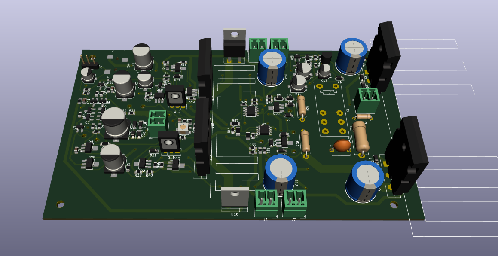

## Diseño del PCB del amplificador

En la carpeta [proyecto_kicad](./proyecto_kicad) se encuentran los archivos del proyecto en Kicad donde se diseñó el PCB del amplificador al mes de junio de 2019. Se incluyen las bibliotecas de componentes y "footprints" necesarios. Para visualizar correctamente el proyecto es suficiente con descargar la carpeta completa y ejecutar los archivos localizados allí adentro.

Por otra parte, en la carpeta [proyecto_kicad_modificado](./proyecto_kicad_modificado) se encuentra el proyecto de Kicad donde se han ido incluyendo las modificaciones hechas sobre el prototipo en un PCB rediseñado. El objetivo es que este sea una segunda resivisión del amplificador.

El diseño del PCB del amplificador fue realizado queriendo conservar el eje de simetría del amplificador con el fin facilitar su análisis. 

Los transistores de potencia que funcionan alimentados con +12V y -12V se encuentran colocados en la parte central de la placa, asociados a un mismo disipador (identificado por las líneas azules en el centro de placa en la captura que se observa más abajo) que el del multiplicador de Vbe para evitar un embalamiento térmico. Por otra parte, los transistores de potencia alimentados con +30V y -30V se situan  la derecha de la placa, asociados al disipador de mayores dimensiones. 

En entre unos y otros transistores de potencia se han colocado los conmutadores, cuyos transistores MOSFET son los integrados que se pueden observar en el PCB. A pesar de introducir mayores complejidades en el diseño del PCB, se han utilizado transistores MOSFET complementarios integrados con el fin de evitar distorsión por el hecho de que los NMOS y PMOS tuvieran distintas características e introdujeran asimetrías en el comportamiento de los conmutadores para el semiciclo positivo con respecto al negativo y viceversa.

La protección contra DC, incluyendo el relé, se encuentra a la derecha de los conmutadores y a la izquierda de los transistores de potencia que funcionan con +30V y -30V.

A la izquierda de la placa se encuentra el par diferencial, estando a su derecha la VAS.

En cuanto a los conectores, arriba a la izquierda se encuentra en puerto de audio de 3,5mm junto con con 3 pines para conectar un generador de funciones. En eje horizontal de placa y del lado izquierdo del disipador pequeño se encuentra una bornera utilizada para la conexión a tierra. Luego, sobre el eje vertical, arriba y abajo de la placa se encuentran las borneras de alimentación por las cuales ingresan +12V y +30V (arriba), y -12V y -30V (abajo). Finalmente, entre los transistores de potencia conectados a +30V y -30V se encuentra la bornera de salida de señal a el parlante. 

A continuación, de muestra una captura del PCB realizado en Kicad:

Y una vista 3D:

