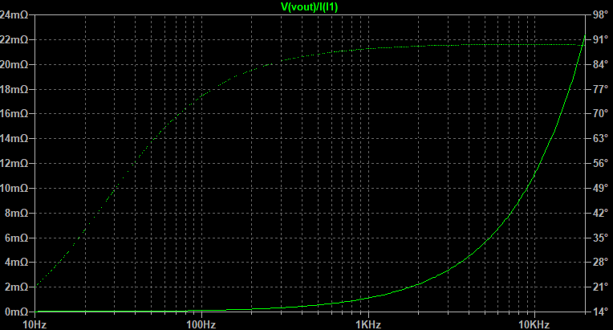
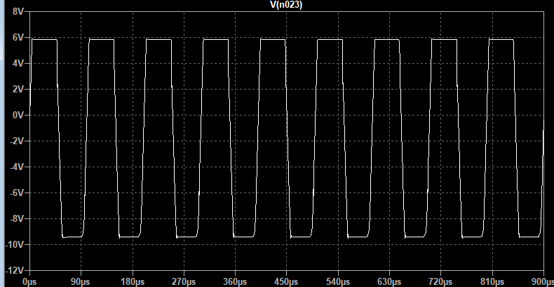
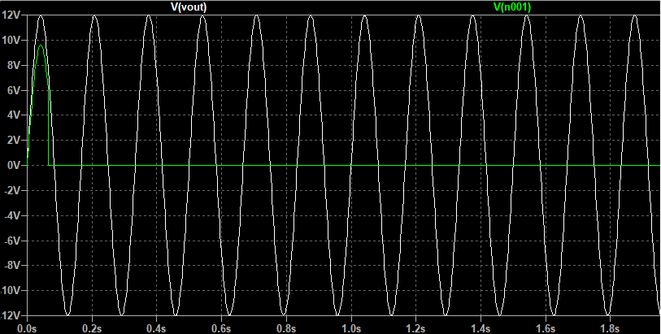
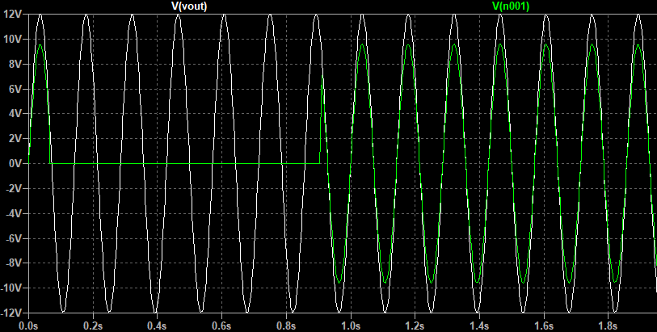
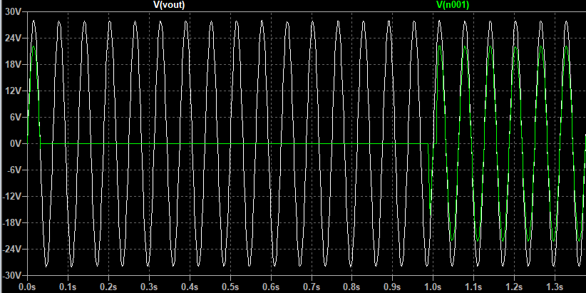
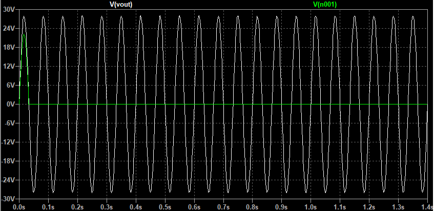
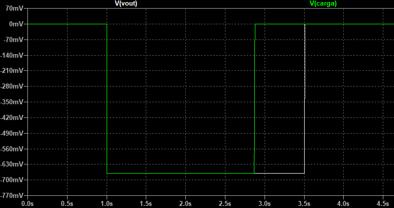

## Mediciones de parámetros

En este archivo se presentan los valores/caracterización de los siguientes parámetros del amplificador obtenidos mediante la simulación por LTSpice:

- Valores de reposo
- Resistencia de entrada
- Resistencia de salida/ factor de amortiguamiento
- Ganancia de lazo/Margen de fase
- Respuesta en frecuencia (ancho de banda y ganancia a lazo cerrado)
- Limitación de corriente
- Protección contra DC
- Ancho de banda de potencia/"slew rate": este parámetro no se puede medir por seguridad ya que la conmutación de la llaves en la etapa de salida incrementa la distorsión a frecuencias mucho menores a aquellas a las que deberían verse los efectos de una limitada velocidad de crecimiento. Sin embargo, se proveen los cálculos teóricos para realizar una estimación del "slew rate" y el ancho de banda de potencia.
- PSNR
- Tensiones máximas a la salida para cargas de 4 y 8ohm.
- Corriente máxima a la salida para una carga de 4 ohm.
- Máxima potencia disipada en los transistores.
- Eficiencia máxima

En cada sección se incluye una imagen del circuito utilizado en el simulador para obtener los parámetros. Para poder observar los esquema con mayor resolución, puede hacerse clic en ellos y ser redireccionado al archivo en tamaño original alojado en este repositorio. 

##### Valores de reposo
A continuación se realiza una comparación entre los valores teóricos supuestos para las corrientes y tensiones más relevantes del circuito, y aquellos obtenidos por simulación. 

###### Corrientes
| Referencia | Valor teórico [mA] | Valor simulado [mA] |
| ---- | ---- | ---- |
| Ivas/Icq17  | 10,2 | 9,5 |
| Icola/Icq19 | 1 | 0,98 |
| Icq1 | 0,5 | 0,49 |
| Icq2 | 0,5 | 0,49 |
| Icq3 | 0,5 | 0,49 |
| Icq4 | 0,5 | 0,48 |
| Icq18 | 1,4 | 1,4 |
| Ieq7 | 0,3 | 0,34 |
| Ir14 | 1 | 1,1 |
| IcU1 | 10 | 9,4 |
| IcU3 | 10 | 9,4 |

Nota: en realidad, en la simulación, Icq1-Icq2 = 1uA.

###### Tensiones
| Referencia | Valor teórico [V] | Valor simulado [V] |
| ---- | ---- | ---- |
| Vo | 0 | 0,2m |
| VbeQ18 | -0,7 | -0,64 |
| VbeQ17 | -0,7 | -0,62 |
| VbeQ19 | -0,7 | 0,6 |
| VbeQ7 | 0,7 | 0,59 |
| VbeQ8 | 0,7 | 0,63 |
| VbeQ10 | 0,7 | 0,63 |
| VbeQ12 | 0,65 | 0,57 |
| VbeQ11 | -0,65 | -0,57 |
| VbeU1 | 0,5 | 0,56 |
| VbeU3 | -0,5 | 0,54 |

##### Resistencia de entrada

Se observa que la resistencia de entrada supera en todo el rango de frecuencias medias al valor de 25kohm, que el establecido como especificación para el amplificador.

El circuito utilizado para llevar a cabo la simulación fue:

##### Resistencia de salida

Resistencia de salida con carga de 8ohm*

Factor de amortiguamiento máximo: 8ohm/22mohm = 363.

*Resistencia de salida con carga de 4ohm* 

Factor de amortiguamiento máximo: 4ohm/22mohm = 181.

El circuito utilizado para llevar a cabo la simulación fue:

##### Ganancia de lazo/Margen de fase

Medición con carga de 8ohm

Frecuencia de corte a lazo abierto: 17Hz.

Ganancia a lazo abierto: 57,4K.

Margen de fase: 81°.

El circuito empleado para llevar a cabo la simulación fue:

##### Respuesta en frecuencia

Ganancia a lazo cerrado: 22,8.

Frecuencia de corte inferior: 830mHz.

Frecuencia de corte superior: 1,46MHz.

El circuito utilizado para la medición fue:

##### Limitación de corriente

En base a la simulación "test_proteccion_sobrecorriente.asc" se obtuvieron las combinaciones de tensiones y corrientes a la salida para las cuales actúa la protección de sobrecorriente.  A continuación se muestra una imagen del circuito utilizado:

*Semiciclo positivo*

El análisis realizado en esta subsección es solamente válido para el semiciclo positivo de señal ya que, como se verá luego, las condiciones de activación de la protección para el semiciclo negativo son distintas.

En la imagen previa, V1 representa la diferencia de potencial colector-emisor del transistor de potencia de salida, mientras que IR es equivalente a la corriente de colector de dicho transistor. Se variaron los valores de IR y V1 con el fin de obtener la recta IR-V1 para la cual se produce la activación de los limitadores por sobrecorriente. Los resultados presentan en una tabla a continuación. En dicha tabla, Iactivacion representa la corriente por R4 (el resistor de linealización de emisor de la etapa de salida) para la cual se da la activación total de  la protección, es decir, por el colector de Q1 circulan 10mA (la corriente de reposo de la VAS), estando este transistor en modo activo directo. Por otra parte, Iincipiente representa la corriente que debe circular por R4 para que la protección comience a activarse (a conducir). Como criterio para esto último se ha adoptado que la corriente de colector de Q1 sea de 100uA (dos órdenes menor a la corriente de reposo de la VAS) para asegurarse de que no se produzcan activaciones inesperadas en la práctica. En la tabla a continuacion se presentan los resultados simulados:

| V1[V] | Iactivacion[A] | Iincipiente[A] |
| ----- | --------- | --------- |
| 2     | 11.5      | 8.9       |
| 5     | 10.8      | 8.1       |
| 10    | 9.6       | 7.5       |
| 15    | 8.3       | 5.6       |
| 20    | 7.1       | 4.3       |
| 25    | 5.8       | 3         |
| 30    | 4.7       | 2         |

Por otra parte, se realizó un gráfico donde se observa que las rectas de tanto Iactivacion vs V1 como Iincipiente vs V1 quedan comprendidas dentro de la SOA (para valores de DC, es decir, no pulsados) del transistor de potencia, como a su vez por encima de la recta de corriente consumida por una carga de 3ohm dependiendo de la excursión de salida según simulación. Se ha considerado una carga de 3ohm ya que uno de los objetivos de diseño ha sido preparar al amplificador para tolerar a esta como la carga máxima. A continuación se muestra el gráfico:

Se puede observar que la curva de acticación total limita con el extremo de la región de la SOA para tensiones Vce mayores a los 20V. Sin embargo, debido a que el transistor de potencia conectado a Vmin por su colector se enciende para tensiones de salida menores de 12V y aquel conectado a Vmax lo hace para tensiones de salida mayores a 12V, la Vce del primero estando activado nunca será mayor a 12V, mientras que la Vce del segundo nunca superará los 18V. En consecuencia, la región en el limite de la SOA nunca será alcanzada. De todos modos, para evitar un mayor estrés en los transistores por corrientes demasiado altas para bajas Vce, se decidió no incrementar la recta de activación (que se hubiera realizado variando R1, R2 y R3). Por otra parte, se observa que la recta de activación incipiente cruza la recta de la corriente consumida por una carga de 3ohm para valores de excursión superiores a los 25V. Esto implica que los limitadores se activarán ligeramente para esta circunstancia. A continuación se muestra una simulación para este caso:

La señal blanca representa la tensión de salida, mientras que I(D21) es la corriente en el diodo (que se ha incluido en el amplificador final) que se encuentra conectado al colector del transitor de la protección.

Se puede observar como se producen picos de corriente de aproximadamente 150uA en el semiciclo positivo de saldia para esta situación. De todos modos, estos picos de corriente resultan ser mucho menores a la corriente requerida por la VAS para alimentar a los drivers (del orden de 1mA). Por lo tanto, estos picos no afectan al correcto funcionamiento del amplificador. 

Finalmente, con la resistencia R1 es posible regular la pendiente de la recta de activación de la protección, conservando su ordenada al origen. A menor valor de R1, mayor será la pendiente. Haciendo uso de esta propiedad, se podría haber variado esta resistencia para reducir las corrientes máximas a la salida en la región donde Vce es mayor a 15V. Sim embargo, para excursiones de salida mayores a los 12V, las conmutaciones de la etapa de salida producen picos de tensión que derivan en diferencias de potencial Vbe y Vce de Q1 mayores a las esperardas en un amplificador ideal. Dichas diferencias inducen la activación de la protección por cortos períodos de tiempo y no pueden ser eliminadas. Empero, a menor umbral de activación de la protección (menor recta de activación) dichos picos de corriente serán mayores. En consecuencia, al disminuir R1 se reducen las corrientes máxima obtenibles a la salida (protegiendo aun más a los transistores de saldida), pero se generan mayores picos de consumo de la corriente de la VAS. En esta línea, en la anterior imagen presentada se puede ver como, independientemente de los incrementos de corriente de forma cuasi-senoidal en el semiciclo positivo (relacionados con el umbral de activación incipiente de los limitadores como se presentó previamente), existen picos de duranción de microsegundos de mayor valor. Para esta configuración de los limitadores, a máxima excursión de salida, con 3ohm de carga y una frecuencia de 20kHz, dichos picos alcanzan el valor de 270uA. Fue entonces que, para evitar el aumento de dichos picos, se decidió no reducir R1. A continuación se incluye una captura de la simulación de este último caso:

*Semiciclo negativo*

Como se describe en [descripcion_detallada_amplificador.md](descripcion_detallada_amplificador.md), en el semiciclo negativo, al activarse la protección de Q22, circula por su colector una corriente del orden de los 100mA debido a que esta es incorporada por la VAS. La limitación para la corriente que esta puede incorporar está dada por R44, que para dada corriente activa a Q25, quien a su vez le quita corriente a la entrada de la VAS y limita la excursión de salida.

En la simulación, si se coloca una carga de 1ohm y se introduce a la entrada del amplificador una señal de 1,1V se obtiene una señal cuadrada en el nodo de salida cuyos extremos están dados por las corrientes a las que actuan los limitadores. Con R44 = 5ohm se obtiene a la salida:

Con lo que la limitación de corriente para el semiciclo negativo de encuentra en los 9,5A. Este valor es mayor que para el semicilo positivo, que ronda los 6A. Empero, debido a lo mismo que se expuso para el semiciclo positivo, como los transistores de potencia de salida tendrán una no mayor en módulo a 20V (porque solo actuan para una región de la excursión de salida), una corriente de 9,5A se encuentra dentro de la SOA, aunque en su límite. Por esto es que se decidió no alterar los valores de las resistencias que se conectan a la base de Q22. 

##### Protección contra DC
El circuito utilizado para llevar a cabo la caracterización de la protección contra DC fue el siguiente:

Vale tener en cuenta que todas las pruebas fueron realizadas con una tensión de DC > 0, salvo que se aclare lo contrario.

*Velocidad de respuesta medida con una tensión a la salida de 25V*

Tiempo hasta que se abre el relé: 27ms.

*Velocidad de respuesta medida con una tensión a la salida de 5V*

Tiempo hasta que se abre el relé: 120ms.

*Mínima tensión a la que actúa la llave*

Mínima tensión medida: 0,9V de continua a la salida.

*Frecuencia a partir de la cual se activa la llave*

Dado que el filtro pasa bajos de la llave deja de atenuar a frecuencias bajas, esto conllevará que esta se active a partir de una dada frecuencia de señal de entrada (lo cual también ocurrirá para todas las frecuencias menores a esta). Es consecuentemente de interés que dicha frecuencia se encuentre por debajo del espectro audible para no correr el riesgo de que se produzca la activación de la llave cuando el dispositivo se encuentra reproduciendo música.

Se realizaron simulaciones para determinar la frecuencia antes mencionada con dos valores distintos de amplitud a la salida 12V (excursión media) y 28V (excursión completa). Es esperable que la frecuencia de corte sea más alta cuanto mayor la amplitud de salida, ya que, para un dado porcentaje de atenuación creado por el filtro, en un caso llegará una mayor tensión a los transistores que deciden la activación de la protección que en el otro. Por lo tanto, el relé se activará a una frecuencia mayor con 28V de ammplitud que con 12V.

Los resultados de las simulaciones fueron los siguientes:

- Frecuencia de corte de la llave para una componente de DC de 12V:

Donde Vout es la tensión en la salida del amplificador (pero la entrada de la protección) y V(n001) la tensión en el nodo de al carga.

La frecuencia de V(n001) es de 6Hz, de modo que se puede ver que la frecuencia de corte tiene aproximadamente este valor. Esto se sabe porque el nodo de la resistencia de carga se encuentra puesto a tierra después de un transitorio inicial, es decir, no circula corriente por la carga; mientras que el nodo que conecta a las resistencias R28 y R27 sí posee tensión. A frecuencias mayores, Vout efectivamente presentaba la tensión, denotando que la protección no se activaba:

Esta última simulación se corresponde con una frecuencia de 7Hz, donde se ve que la protección no actúa.

- Frecuencia de corte de la llave para una componente de DC de 28V:

Se observa que, para una amplitud de 30V, la protección actua con una frecuencia de 15Hz aproximadamente. Sin embargo, con una de 16Hz ya no lo hace:

En consecuencia, las protección de DC actúa a frecuencias no audibles, lo que se considerá que no afectará el normal funcionamiento del amplificador.

*Mínima tensión de continua negativa con la que actua la protección*

Por último, se repitió la simulación de la mínima tensión a la que actua la protección pero con una tensión de DC negativa. El resultado fue que esta se activa para tensiones de entrada mayores a los 0,67V, como se puede ver a continuación: 

Se introdujo un pulso de tensión negativa a la entrada (Vout) y se observó que la tensión en la carga (Vcarga) caía antes de que el pulso a la entrada finalizara. 

Esto da como resultado que el umbral de activación para el caso negativo es menor que para el positivo. Dado que las contantes de tiempo del circuito son aproximadamente las mismas para el caso en el que se activa el sistema por DC negativa que aquel en el que lo hace por DC positiva, se concluye que es de esperarse que todos los otros parámetros medidos sean mejores para con DC negativa que positiva. Esto se corroboró luego en la práctica, como se puede ver en el documento [caracterizacion_proteccion_DC.md](../mediciones_amplificador/caracterizacion_proteccion_DC.md).

##### Ancho de banda de potencia/"slew rate"

La simulación de la respuesta del circuito a una señal cuadrada de entrada para la determinación de SR+ se muestra a continuación:

Se observa que la pendiente obtenida es de aproximadamente 26V/us, algo menor al calculado teóricamente, por la presencia de capacidades parásitas de los transistores. Con este valor se obtiene un ancho de banda de potencia de 150kHz.

Por otra parte, para SR-:

Donde se observa que la pendiente en la región central (no afectada ni por las conmutaciones ni por la velocidad en señal del circuito) es de aproximadamente 60V/us. De este modo, se confirma que el ancho de potencia está determinado por SR+.

El circuito utilizado para la medición fue:

##### PSNR

*Alimentación Vmax (30V)*

*Alimentación -Vmax (-30V)*

*Alimentación Vmin (12V)*

*Alimentación -Vmin (-12V)*

Para la simulación de la PSNR con respecto a las distintas fuentes de alimentación se utilizó el siguiente esquema: 

Donde se colocaron generadores sinusoidales en serie con las fuentes y se realizó la división entre la señal observada a la salida y la del generador en sí. Para la medición de la PSNR con respecto a cada fuente, solo su respectivo generador sinusoidal fue activo. En el caso de la PSNR con respecto a -Vmax (la peor al compararla con la del resto de las fuentes) se realizó una simulación extra colocando una resistencia de 1ohm en serie con el generador para representar a los cables no ideales que se conectarán a la placa en la práctica. De este modo, el capacitor de C8 (de 1000uF) actua como filtro llevando la cota superior de la PSNR de -76dB a -79dB con respecto a -Vmax.

##### Tensiones pico máximas a la salida

*Carga de 8ohm*

Vo_max =  27,8V.

*Carga de 4ohm*

Vo_max = 27,1 V.

##### Corriente pico máxima a la salida para una carga de 4 ohm

Io_max = 6,8 A.

##### Potencia máxima entregada a la carga

De los datos simulados para la máxima tensión pico obtenible a la salida se llega a que la máxima potencia entregable (no nominal) a la carga es:

- Con carga de 8ohm: 48 W.
- Con carga de 4ohm: 91 W.

##### Potencia disipada en los transistores

###### Transistores alimentados con las tensiones más altas en módulo (+30V y -30V)

Se varió la excursión de salida y se calculó la potencia media por medio de la simulación [amplificador_potencia.asc](amplificador_potencia.asc) para obtener:

| V_out [V] | Pot_transistores [W] |
| --------- | -------------------- |
| 19        | 16,7                 |
| 20        | 16,9                 |
| 21        | 16,8                 |
| 22        | 16,6                 |
| 25        | 14,9                 |
| 27        | 13,9                 |

Dado que esperable que la potencia disipada sea menor a valores de V_out menores a 19V (porque los transistores se encienden en una porción menor del semiciclo) y mayores a 27V (debido a que el amplificador tiende a un funcionamiento en clase B), se tiene que la potencia máxima dispada en los transistores será aproximadamente 17W.

Pot_max_alta_tension = 17 W.

###### Transistores alimentados con las tensiones más altas en módulo (+12V y -12V)

Se realizó el mismo procedimiento para los transistores alimentados con las tensiones de módulo más bajo y se obtuvieron los siguientes valores cuando la etapa de salida no conmuta (|V_out | < 12V):

| V_out [V] | Pot_transistores [W] |
| --------- | -------------------- |
| 5,5       | 3,2                  |
| 6         | 3,3                  |
| 7         | 3,3                  |
| 7,3       | 3,3                  |
| 7,6       | 3,3                  |
| 9         | 3                    |

Se ve que la máxima potencia disipada se alcanza para aproximadamente 7.6V de excursión, lo cual se condice con el valor de máxima potencia disipada en los transistores de un clase B alimentado con 12 V (a 64% de la excursión máxima).

Cuando la etapa de salida conmuta se tiene que los transistores alimentados con +12V y -12V disiparán menos que sin conmutar ya que se encienden durante una parte menor del semiciclo. 

En consecuencia, la potencia máxima disipada en los transistores alimentados con las tensiones más bajas es aproximadamente 3,3 W.

##### Eficiencia a máxima excursión
Se colocó una señal de entrada tal que se obtuviera la máxima excursión posible a la salida y se realizó la misma medición de las corrientes y tensiones relevantes que en las mediciones realizadas sobre el prototipo construido del amplificador (ver el archivo correspondiente de las mediciones). De esta forma, se obtuvo una eficiencia máxima de 75% a máxima excursión.
