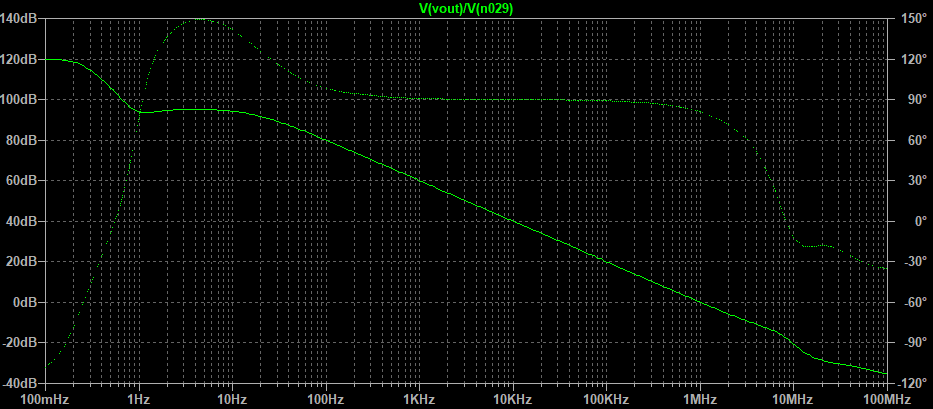
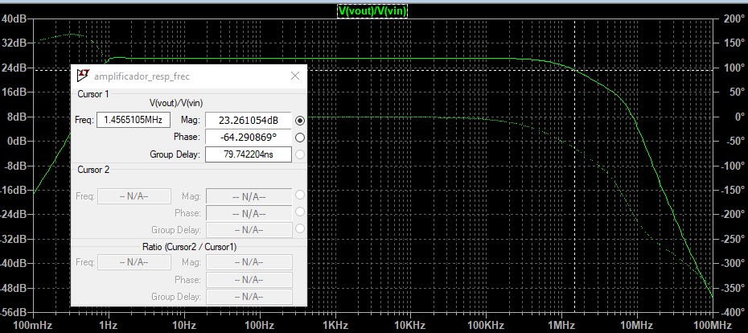
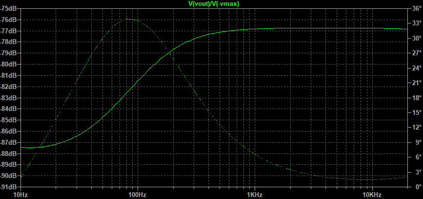
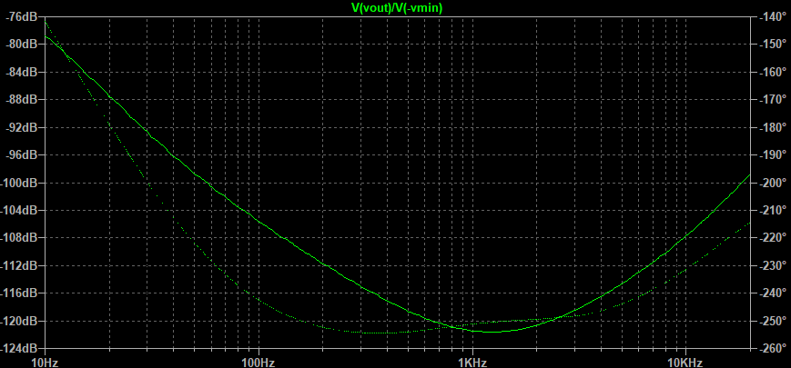

## Mediciones de parámetros

En este archivo se presentan los valores/caracterización de los siguientes parámetros del amplificador obtenidos mediante la simulación por LTSpice:

- Resistencia de entrada
- Resistencia de salida/ factor de amortiguamiento
- Ganancia de lazo/Margen de fase
- Respuesta en frecuencia (ancho de banda y ganancia a lazo cerrado)
- Limitación de corriente
- Protección contra DC
- Ancho de banda de potencia/"slew rate": este parámetro no se puede medir por seguridad ya que la conmutación de la llaves en la etapa de salida incrementa la distorsión a frecuencias mucho menores a aquellas a las que deberían verse los efectos de una limitada velocidad de crecimiento. Sin embargo, se proveen los cálculos teóricos para realizar una estimación del "slew rate" y el ancho de banda de potencia.
- PSNR
- Tensiones máximas a la salida para cargas de 4 y 8ohm.
- Corriente máxima a la salida para una carga de 4 ohm.
- Máxima potencia disipada en los transistores.

En cada sección se incluye una imagen del circuito utilizado en el simulador para obtener los parámetros. Para poder observar los esquema con mayor resolución, puede hacerse clic en ellos y ser redireccionado al archivo en tamaño original alojado en este repositorio. 

##### Resistencia de entrada

Se observa que la resistencia de entrada supera en todo el rango de frecuencias medias al valor de 25kohm, que el establecido como especificación para el amplificador.

El circuito utilizado para llevar a cabo la simulación fue:

##### Resistencia de salida

Resistencia de salida con carga de 8ohm*

Factor de amortiguamiento máximo: 8ohm/22mohm = 363 

*Resistencia de salida con carga de 4ohm* 

Factor de amortiguamiento máximo: 4ohm/22mohm = 181

El circuito utilizado para llevar a cabo la simulación fue:

##### Ganancia de lazo/Margen de fase

Medición con carga de 8ohm

Frecuencia de corte a lazo abierto: 17Hz

Ganancia a lazo abierto: 57.4K

Margen de fase: 81°

El circuito empleado para llevar a cabo la simulación fue:

##### Respuesta en frecuencia

Ganancia a lazo cerrado: 22.8

Frecuencia de corte inferior: 830mHz

Frecuencia de corte superior: 1.46MHz

El circuito utilizado para la medición fue:

##### Limitación de corriente

En base a la simulación "test_proteccion_sobrecorriente.asc" se obtuvieron las combinaciones de tensiones y corrientes a la salida para las cuales actúa la protección de sobrecorriente.  A continuación se muestra una imagen del circuito utilizado:

V1 representa la diferencia de potencial colector-emisor del transistor de potencia de salida, mientras que IR es equivalente a la corriente de colector de dicho transistor. Se variaron los valores de IR y V1 con el fin de obtener la recta IR-V1 para la cual se produce la activación de los limitadores por sobrecorriente. Los resultados presentan en una tabla a continuación. En dicha tabla, Icorte es la corriente a la que actúa la protección (el transistor comienza a conducir), mientras que Icarga es la corriente que tendría una carga de 3ohm para ese valor de V1 suponiendo que el amplificador fuera ideal y pudiera proveerla.

| V1[V] | Icorte[A] | Icarga[A] |
| ----- | --------- | --------- |
| 2     | 12        | 9.3       |
| 4     | 11        | 9         |
| 6     | 11        | 8.4       |
| 8     | 10        | 8         |
| 10    | 10        | 8         |
| 15    | 9         | 7         |
| 20    | 8         | 6         |
| 25    | 7         | 8         |
| 28    | 7         | 4.3       |
| 30    | 6         | 4         |

Se puede observar que siempre se cumple que Icarga < Icorte, cosa que deber suceder para evitar disparos no intencionados del limitador.

Por otro lado, la curva Vce y Ic de los transistores de potencia queda comprendida dentro de la zona de operación segura (SOA).

##### Protección contra DC

*Velocidad de respuesta medida con una tensión a la salida de 25*

Tiempo hasta que se abre el relé: 27ms

*Velocidad de respuesta medida con una tensión a la salida de 5V*

Tiempo hasta que se abre el relé: 120ms

*Mínima tensión a la que actúa la llave*

Mínima tensión medida: 0.9V de continua a la salida

El circuito utilizado para llevar a cabo la caracterización de la protección contra DC fue el siguiente:

##### Ancho de banda de potencia/"slew rate"

En el semiciclo positivo de señal se tiene que la velocidad de crecimiento viene dada por (despreciando las capacidades parásitas sobre todo de Q7):

SR+ = I_cola_diferencial*1E-6/C4 = 1mA * 1E-6/ 33pF = 30V/us

Donde  I_cola_diferencial es la corriente por R19.

Por otra parte, dada la topología del circuito,  se espera que la velocidad de decrecimiento (SR-) sea similar o superior a la de crecimiento. De esta forma, el ancho de banda potencia es:

BW_pot = SR+ / (Vo_max * 2 * pi) = 170kHz

donde se tomó Vo_max = 27.8

La simulación de la respuesta del circuito a una señal cuadrada de entrada para la determinación de SR+ se muestra a continuación:

Se observa que la pendiente obtenida es de aproximadamente 26V/us, algo menor a lo calculado previamente por la presencia de capacidades parásitas de los transistores. Con este valor se obtiene un ancho de banda de potencia de 150kHz.

Por otra parte, para SR-:

Donde se observa que la pendiente en la región central (no afectada ni por las conmutaciones ni por la velocidad en señal del circuito) es de aproximadamente 60V/us. De este modo, se confirma que el ancho de potencia está determinado por SR+.

El circuito utilizado para la medición fue:

##### PSNR

*Alimentación Vmax (30V)*

*Alimentación -Vmax (-30V)*

*Alimentación Vmin (12V)*

*Alimentación -Vmin (-12V)*

Para la simulación de la PSNR con respecto a las distintas fuentes de alimentación se utilizó el siguiente esquema: 

Donde se colocaron generadores sinusoidales en serie con las fuentes y se realizó la división entre la señal observada a la salida y la del generador en sí. Para la medición de la PSNR con respecto a cada fuente, solo su respectivo generador sinusoidal fue activo. En el caso de la PSNR con respecto a -Vmax (la peor al compararla con la del resto de las fuentes) se realizó una simulación extra colocando una resistencia de 1ohm en serie con el generador para representar a los cables no ideales que se conectarán a la placa en la práctica. De este modo, el capacitor de C8 (de 1000uF) actua como filtro llevando la cota superior de la PSNR de -76dB a -79dB con respecto a -Vmax.

##### Tensiones pico máximas a la salida

*Carga de 8ohm*

Vo_max =  27.8V

*Carga de 4ohm*

Vo_max = 27.1 V

##### Corriente pico máxima a la salida para una carga de 4 ohm

Io_max = 6.8 A

##### Potencia máxima entregada a la carga

De los datos simulados para la máxima tensión pico obtenible a la salida se llega a que la máxima potencia entregable (no nominal) a la carga es:

- Con carga de 8ohm: 48 W
- Con carga de 4ohm: 91 W

##### Potencia disipada en los transistores

###### Transistores alimentados con las tensiones más altas en módulo (+30V y -30V)

Se varió la excursión de salida y se calculó la potencia media por medio de la simulación [amplificador_potencia.asc](amplificador_potencia.asc) para obtener:

| V_out [V] | Pot_transistores [W] |
| --------- | -------------------- |
| 19        | 16,7                 |
| 20        | 16,9                 |
| 21        | 16,8                 |
| 22        | 16,6                 |
| 25        | 14,9                 |
| 27        | 13,9                 |

Dado que esperable que la potencia disipada sea menor a valores de V_out menores a 19V (porque los transistores se encienden en una porción menor del semiciclo) y mayores a 27V (debido a que el amplificador tiende a un funcionamiento en clase B), se tiene que la potencia máxima dispada en los transistores será aproximadamente 17W.

Pot_max_alta_tension = 17 W

###### Transistores alimentados con las tensiones más altas en módulo (+12V y -12V)

Se realizó el mismo procedimiento para los transistores alimentados con las tensiones de módulo más bajo y se obtuvieron los siguientes valores cuando la etapa de salida no conmuta (|V_out | < 12V):

| V_out [V] | Pot_transistores [W] |
| --------- | -------------------- |
| 5,5       | 3,2                  |
| 6         | 3,3                  |
| 7         | 3,3                  |
| 7,3       | 3,3                  |
| 7,6       | 3,3                  |
| 9         | 3                    |

Se ve que la máxima potencia disipada se alcanza para aproximadamente 7.6V de excursión, lo cual se condice con el valor de máxima potencia disipada en los transistores de un clase B alimentado con 12 V (a 64% de la excursión máxima).

Cuando la etapa de salida conmuta se tiene que los transistores alimentados con +12V y -12V disiparán menos que sin conmutar ya que se encienden durante una parte menor del semiciclo. 

En consecuencia, la potencia máxima disipada en los transistores alimentados con las tensiones más bajas es aproximadamente 3,3 W.

