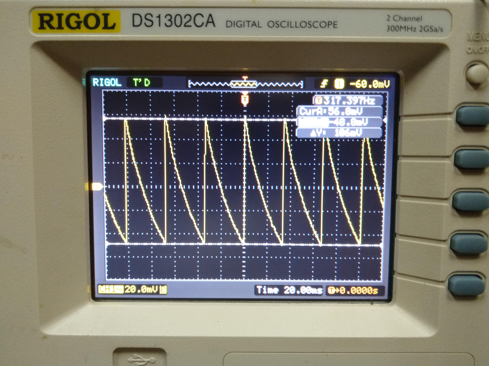
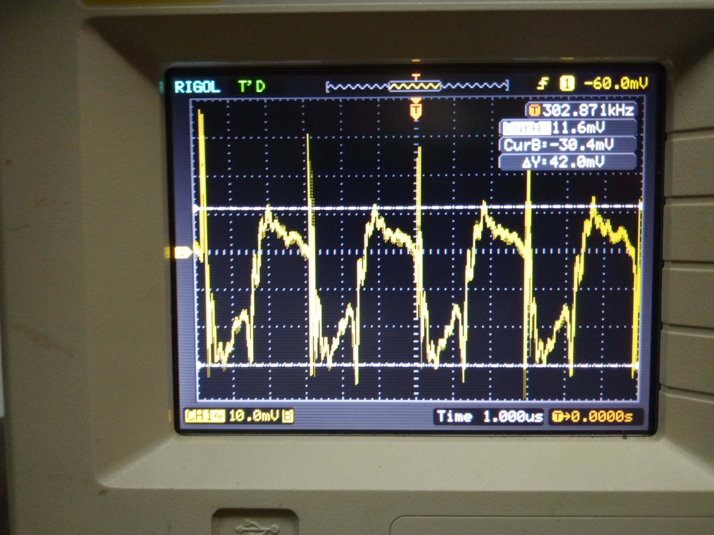
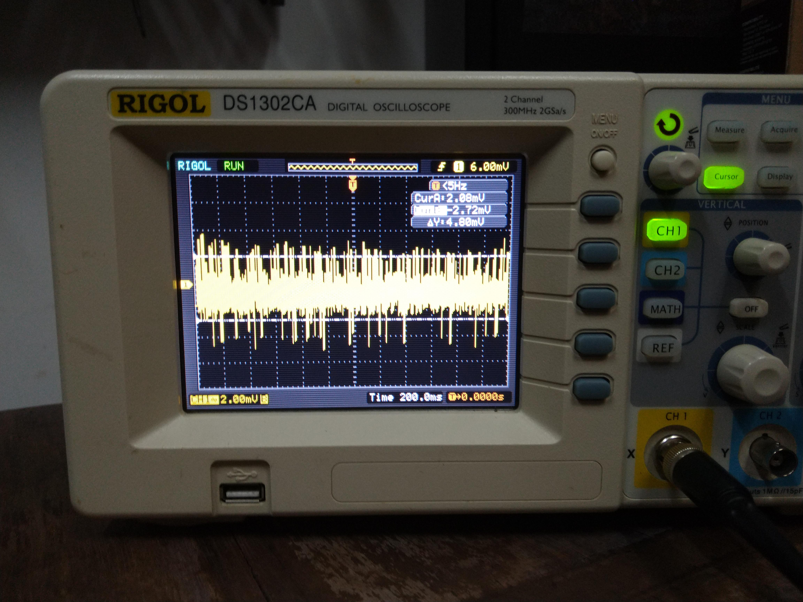
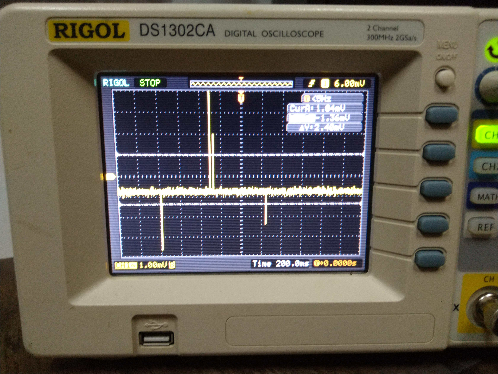

## Registro de las mediciones realizadas durante el diseño de la fuente conmutadora

En esta carpeta se incluye un registro de las mediciones realizadas durante el armado de la fuente conmutadora, identificadas por fecha según el progreso realizado. Las fechas de las mediciones fueron las siguientes:

- [5/7/19](Mediciones_supply_5_7_19.md)
- [15/7/19](Mediciones_supply_15_7_19.md)

## Mediciones finales

### Regulación de linea
Se midió la salida de la fuente para distintos valores de alimentación. Las mediciones fueron realizadas con un multímetro UNI-T UT39B, con una incertidumbre de 0,5% + 3 dígitos.
Se obtuvieron los siguientes resultados:

| V_in | E(V_in) | V_out | E(V_out) |
| --- | --- | --- | --- |
| 29,9V | 0,5V | 12,00V | 0,1V  |
| 24,9V | 0,4V | 11,96V | 0,1V |
| 19,9V | 0,4V |  11,88V  | 0,1V |
| 16,9V | 0,4V |  11,83V | 0,1V |
| 12,98V | 0,1V |  11,83V | 0,1V |

Donde E(X) denota la incertidumbre del parámetro X.

Realizando el cálculo de la regulación de linea con la primer y la tercer fila de la tabla (ya que si se usara la segunda diferencia de los valores obtenidos caería dentro de la incertidumbre de medición) se obtiene:

 

No se reporta la incertidumbre del porcertaje de ripple ya que este resulta demasiado grande en comparación con el valor medio calculado.

### Regulación de carga
Se midió la tensión media de salida con una carga de 9,3ohm y con la salida en vacío. Las mediciones se llevaron a cabo con un multímetro UNI-T UT39B, con una incertidumbre de 0,5% + 3 dígitos. 
Con una tensión de alimentación de 30V se obtuvo:

- Sin carga:  
- Con carga:   

Se tuvo entonces una diferencia en la tensión media de salida de:

 

No se reporta una incertidumbre ya que esta mayor que el valor medido en sí. Entonces, el resultado obtenido solo representa una impresión de como se comporta la fuente conmutada en cuanto a su regulación de carga.

### Ripple
Se realizaron dos pruebas: en la primera se midió el ripple a la salida en vacio, es decir, sin carga. Las mediciones se realizaron con un osciloscopio RIGOL DS1302CA, con punta X10, filtro de 20MHz y modo de adquisición promediador en 8.

 

Se obtuvo un ripple de  .

Luego, se midió el ripple con una carga de 8ohm.

 

Se obtuvo un ripple de  .

### Eficiencia
Condición de medición: R_out=10.1ohm 25W

| V_in | I_in | V_out | I_out | Eff |
| --- | --- | --- | --- | --- |
| 29V | 0.59A | 11.98V | 1.19A | 83% |
| 20V | 0.83A | 12.1V  | 1.2A  | 87% |
| 15V | 1.1A  | 12.27V | 1.21A | 90% |
| 13V | 1.25A | 12.3V  | 1.22A | 92% |

### Emisiones
Se probó medir a simple vista y comparar las emisiones de la fuente cuando se encontraba cargada con 8ohm o sin ella. Para ello se conectó la punta del osciloscopio con si misma para formar una antena y se la acerco a 5cm del transistor de la fuente aproximadamente. Los resultados obtenidos fueron los siguientes:

Para emisiones con carga:

 

Para emisiones con carga:

 

Se ve que las emisiones son mucho mayores en el primer caso ya que el consumo de corriente de la fuente es mucho menor. En consecuencia, el integrado que controla a la switching entra en un modo donde deja intervalos de tiempo en los que no conmuta, ya que no es necesario cargar al capacitor de salida. Por esto es que en la segunda imagen se obvservan pulsos espaciados, y no continuos como en la primer foto.

### Frecuencia de operación
Se realizaron varias mediciones y se observó que, con carga, la frecuencia de operación variaba entre aproximadamente 300kHz y 350kHz. Por ejemplo, en la imagen del ripple con carga que se mostró anteriormente, este era de 320kHz. Por otra parte, para mediciones sin carga, la fuente disminuye su frecuencia de operación ya que la corriente que se le pide a la salida es muy baja. Como se puede ver en la captura del ripple sin carga, esta frecuencia ronda los 300Hz.

Los valores de las frecuencias fueron obtenidos utilizando el contador interno de un osciloscopio RIGOL DS1302CA 
