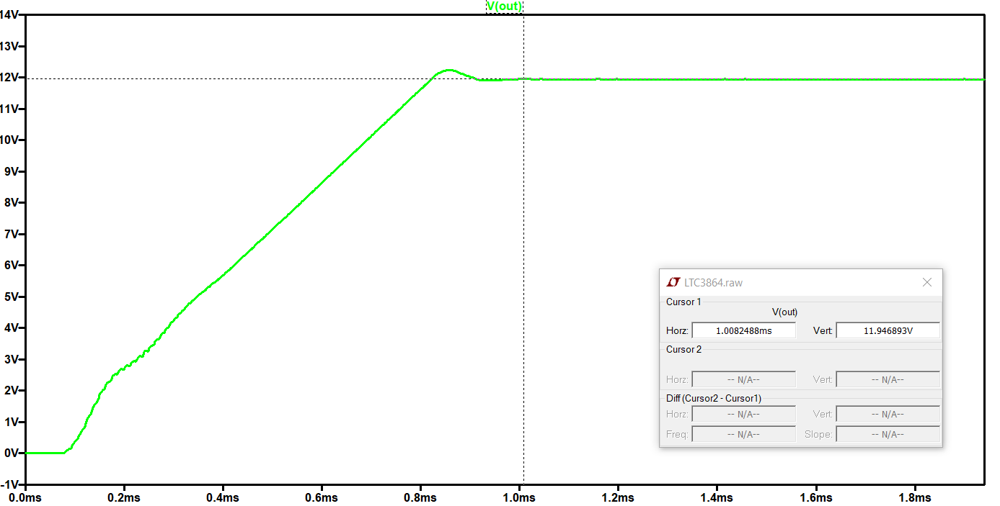

## Mediciones de parámetros

Se realiza la simulación para Vin=28V, Vout=15V, RL=4Ω y se grafica Vout en función del timepo:

Se observa una tensión de salida de 15V, con un tiempo de *soft-start* de 1ms. 

Se aumenta en el sector estable de Vout y se mide el ripple de salida:

Para la siguiente simulación se colocó una carga de 0.001Ω (cortocircuito) y se grsficó la corriente de salida:

Se observa que la corriente de salida es de Iout=5.5A

Luego se mide la eficiencia del circuito con lel metodo explicado por *LTSpice* para este tipo de circuito ([link](https://www.analog.com/en/technical-articles/ltspice-using-meas-and-step-commands-to-calculate-efficiency.html)). Se obtienen los siguientes resultados:

